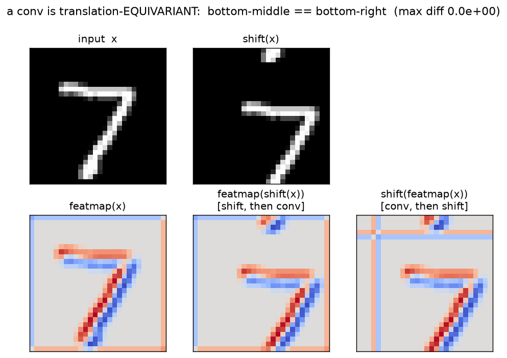
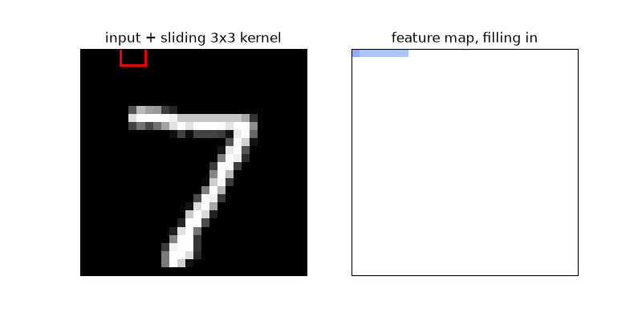

# CNN — Layer 1: why a convolution beats a flatten + MLP

The first idea in the CNN track. This layer argues **one** thing: on an image, a convolution has
structure that a flatten-then-dense layer throws away. Everything below is a *measurement* of that.
Verify the numbers yourself with `../cnn.py` (`exp_1_why_conv`); regenerate the images with
`python figs.py`.

> Open this in the Markdown preview (`Cmd/Ctrl+Shift+V`) so the picture and the GIF show inline.

---

## 0. The thing we're arguing against: flatten + dense

Our denoiser so far is an **MLP**: it starts with `x = x.flatten(1)`, taking a `(B, 1, 28, 28)`
image and laying the pixels into a `(B, 784)` vector. Row-major, so the pixel at row `r`, col `c`
lands at index:

```
i = r·28 + c
```

Then a dense layer computes `y = W @ x_flat` with `W` of shape `(768, 784)`. The weight `W[h, i]`
is the connection from hidden unit `h` to **pixel index `i`**. Two consequences, and they're the
whole point:

- **Index = absolute position.** `W[h, i]` is tied to one fixed pixel location. The layer has no
  idea that index `i` (pixel `(r,c)`) and index `i+1` (pixel `(r,c+1)`) are physical neighbors —
  you could randomly **permute all 784 indices**, retrain, and get the identical model. Spatial
  adjacency is simply not represented.
- **Every position gets its own independent weights.** Nothing learned at one location is shared
  with any other.

Part (A) and Part (B) below each expose one cost of this.

---

## 1. Part (A), first half — a shift wrecks the flattened vector

Take a clean `7`. Shift it down-and-right by 4px. To your eye it's the *same digit*. But the ink
that sat at index `i = r·28 + c` moves to:

```
(r+4)·28 + (c+4) = i + 4·28 + 4 = i + 116
```

Every ink pixel jumps ~116 slots in the vector. The original and shifted vectors have their ink in
almost **disjoint coordinate sets**. That's what the cosine measures:

```python
a = x01.flatten();  b = x01_shift.flatten()
cos_pix = (a @ b) / (a.norm() * b.norm())     # ≈ 0.08
```

**Ground-up, what is `a @ b`?** It's `Σᵢ aᵢ·bᵢ`. Because we mapped to `[0,1]` (background 0, ink 1),
a term is nonzero only where **both** images have ink — so `a @ b` literally *counts pixels where
the original ink and the shifted ink overlap*. The shift moved the ink off itself, so that count is
tiny → cosine `0.08`.

**Why remap to `[0,1]` first?** In the native `[-1,1]`, background is `−1`, and two background
pixels contribute `(−1)·(−1) = +1` to the dot product. There are hundreds of shared background
pixels, so the cosine would be dominated by "we both agree it's black here" and read artificially
high — hiding the point. Mapping ink→1, background→0 makes the dot product count **only ink
overlap**, which is what "same digit, same place?" actually means.

**Takeaway:** to a dense layer that learned "ink at these indices ⇒ 7", the shifted 7 is a
near-new input. It gets **no free ride** from the shift; it must relearn the digit at every
position. That's the disease. The cure is the convolution.

---

## 2. The convolution op itself (needed for the rest)

`F.conv2d(x, kernel, padding=1)` slides **one** small kernel over the image. At each output
location `p = (y, x)`:

```
out[y,x] = Σ over the 3×3 window of  kernel[i,j] · input[y+i, x+j]
```

`padding=1` puts a 1-pixel border of zeros around the input so a 3×3 window fits at the edges and
the output stays 28×28. Two things to internalize:

- **The same kernel weights are used at every `(y,x)`** — that's *weight sharing*, one detector
  applied everywhere.
- **The output at `p` depends only on the input in a small window around `p`** — that's *locality*.

The specific kernel we use is a **diagonal edge detector**:

```
[-1, -1,  0]
[-1,  0,  1]      its 9 weights sum to 0
[ 0,  1,  1]
```

**Sum-to-zero** means a flat region (all background, or the solid interior of a stroke) gives ~0
response — the `+` weights and `−` weights cancel. Only where brightness *changes* (a stroke edge)
does it fire. That's why the feature-map panels light up the **outline** of the 7.

> **Interview aside (cross-correlation).** `F.conv2d` does **not** flip the kernel — it's
> technically *cross-correlation*, not textbook convolution. For a *learned* kernel it's irrelevant
> (the net just learns the flipped version). It only matters here because we hand-set the kernel and
> want it to mean what we drew.

---

## 3. Part (A), second half — translation EQUIVARIANCE (the exact 0)

The claim the code verifies:

```
featmap( shift(x) )  ==  shift( featmap(x) )
```

Let `S` = shift operator, `C` = correlate-with-kernel. Equivariance is `C(S x) = S(C x)`. Here's
the **whole proof** — three lines, and it's *why* convs are special:

```
Def:   (C x)[p]  = Σⱼ k[j] · x[p + j]        # same kernel k at every p
       (S x)[q]  = x[q − s]                   # shift by s

C(S x)[p] = Σⱼ k[j] · (S x)[p+j]
          = Σⱼ k[j] · x[p + j − s]

S(C x)[p] = (C x)[p − s]
          = Σⱼ k[j] · x[p − s + j]

⇒  C(S x)[p] = S(C x)[p]      identical, term by term.
```

It works **only** because `C` uses the same `k` everywhere and depends purely on the *relative*
offset `j`. Slide the picture, slide the answer — exactly.

In code:

```python
fmap          = F.conv2d(x, kernel, padding=1)                 # C(x)
fmap_of_shift = F.conv2d(x_shift, kernel, padding=1)           # C(S x)
shift_of_fmap = torch.roll(fmap, shifts=(shift, shift), ...)   # S(C x)
diff = (fmap_of_shift - shift_of_fmap)[interior].abs().max()   # = 0.00e+00
```

```
max | featmap(shift(x)) − shift(featmap(x)) |  =  0.0     (on the interior)
```

Two implementation details that make it *exactly* 0:

- **Why `torch.roll`, not a zero-pad shift?** The proof assumes an infinite / wrapping grid. `roll`
  is **circular** (what falls off one edge reappears on the other), which matches the proof exactly.
  A non-wrapping shift would differ at the boundary.
- **Why crop to the interior?** `roll` wraps a 4px band around the border (you can see faint wrap
  lines in the picture). Inside that margin the two ways of wrapping don't correspond, so the code
  crops a border of width `shift+1` and compares only the interior — where it's exactly 0.



**How to read the picture:**
- Top row: the input `7`, and the same `7` shifted.
- **Bottom-middle** = shift *then* convolve (`S(C x)`). **Bottom-right** = convolve *then* shift
  (`C(S x)`).
- The **digit region is pixel-identical** between the two → that *is* the identity above.

### The deep point behind the 0

A convolution **IS** a linear map — it's just a dense matrix with a very special structure (the same
kernel tiled across a huge, mostly-zero matrix). It's precisely the **shift-equivariant subclass**
of linear maps. So **conv ⊂ dense**: a dense layer *could* represent this conv, but only by learning
all 602k weights into that exact tiled pattern, and only if training showed it every shift. The conv
**hard-codes** the structure in ~160 weights. That hard-coding is the **inductive bias**.

---

## 4. One kernel, reused everywhere (weight sharing)

The reason equivariance holds is that the **same** 3×3 kernel is applied at every position. Watch it
walk across the digit — the feature map fills in pixel by pixel, all from *one* tiny detector:



The same stroke detector fires wherever the stroke goes. Nothing is position-specific.

---

## 5. Part (B) — the parameter count

Weight sharing isn't just elegant, it's **cheap**. Count the parameters in the *first layer*:

| First layer | Formula | Params |
|---|---|---|
| **Dense** `784 → 768` | `784·768 + 768` | **602,880** |
| **Conv** `1→16`, 3×3 | `16·1·3·3 + 16` | **160** |

```
dense 784 → 768   :  768·784 + 768  = 602,880   # one independent weight per (pixel, hidden) pair
conv  1 → 16, 3×3 :   16·1·9  + 16  =     160   # one 3×3 kernel per output channel
                                                 ~3,700× fewer parameters
```

The conv's 160 weights are reused at all `28×28 = 784` positions (the weight sharing). The dense
layer, by contrast, learns a separate weight for every (pixel, unit) pair — and it *grows with image
size*, while the conv's kernel count is size-independent. Fewer params **and** — from §3 — the right
bias baked in for free.

---

## Summary

| | flatten + MLP | convolution |
|---|---|---|
| locality (neighbors) | ✗ destroyed by flatten (index = position) | ✓ 3×3 window |
| translation | ✗ relearn each position (cosine 0.08) | ✓ equivariant, proven exact (§3) |
| weight sharing | ✗ every pixel independent | ✓ one kernel everywhere (§4) |
| first-layer params | 602,880 | 160 (§5) |

**One-sentence compression:** a flatten+dense layer ties every weight to an *absolute* pixel, so a
4px shift is a brand-new input (cosine 0.08) it must relearn with 600k position-specific weights; a
conv slides one *shared* 160-weight kernel, so a shift just shifts the output (proven exactly), which
is why it needs far fewer weights and generalizes across position.

That's why **every** image model — including the U-Net we'll swap in for the MLP denoiser — is built
from convs. Next: the convolution **op** itself (cross-correlation, edge kernels, the output-size
formula) → `02_conv_op.md`.

---

*Numbers: `python ../cnn.py`. Figures: `python figs.py`.*
