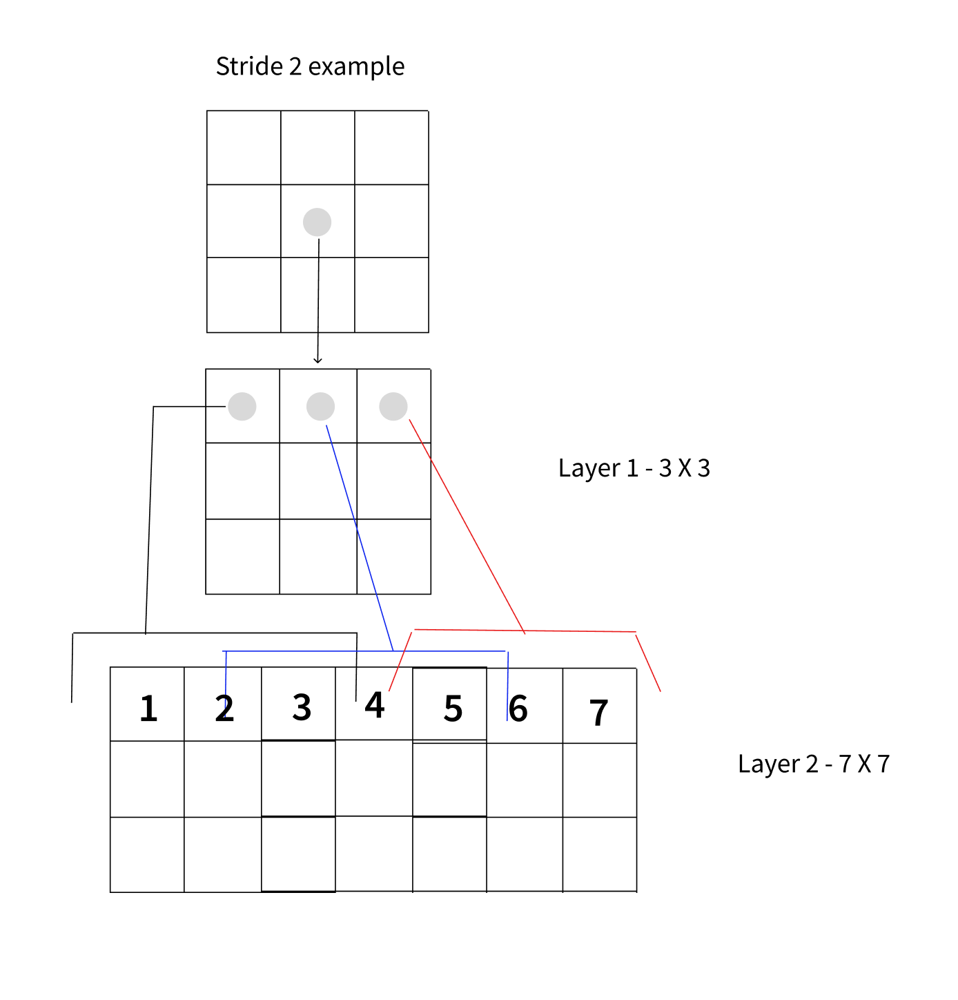

# CNN — Layer 4: downsampling — the resolution pyramid (`28 → 14 → 7`)

Layer 3 stacked stride-1 convs: the map stayed `28×28` and the receptive field crept up by `k−1 = 2`
per layer. To make one cell "see" a whole `28×28` digit that way you'd need ~14 layers — slow and
expensive. This layer adds the move every real CNN makes instead: periodically **downsample** with a
stride-2 conv, building a **resolution pyramid** `28 → 14 → 7`. Downsampling does three things at
once — shrinks the map, *multiplies* receptive-field growth, and makes growing the channel count
affordable. Verify every number with `../cnn.py` (`exp_4_downsample`). Console-only, so the payoffs
below are measurements you run and read.

---

## 1. The mechanism: a stride-2 conv halves H and W

There's nothing new in the op — it's the Layer-2 output-size formula with `stride = 2`:

```
out = floor( (in + 2p − k) / s ) + 1        # for k3, s2, p1  ->  out = ceil(in/2)
28 -> floor((28+2−3)/2)+1 = 14
14 -> floor((14+2−3)/2)+1 = 7
```

So one stride-2 `k3` conv turns a `28×28` map into `14×14`; another turns it into `7×7`. At the same
time we **grow channels** — the universal CNN shape is *resolution down, channels up*:

```python
conv1 = nn.Conv2d(1,  16, kernel_size=3, stride=2, padding=1)   # 28 -> 14
conv2 = nn.Conv2d(16, 32, kernel_size=3, stride=2, padding=1)   # 14 -> 7
```

```
(1, 1, 28, 28)  --conv(1->16, s2)-->  (1, 16, 14, 14)  --conv(16->32, s2)-->  (1, 32, 7, 7)
```

Params (from the Layer-3 count `Cout·(Cin·kH·kW) + Cout`):

```
conv1: 16·(1·3·3) + 16  =   160
conv2: 32·(16·3·3) + 32 = 4,640
```

That's the whole pyramid. The two questions worth answering are **why bother** — and there are two
answers: receptive field, and cost.

---

## 2. Why (part 1): stride *multiplies* receptive-field growth

Recall the receptive-field recurrence from Layer 3, now with the stride term made explicit:

```
RF_1 = k
RF_L = RF_{L-1} + (k − 1) · ∏_{i<L} s_i         # product of the strides of all EARLIER layers
```

The `∏ s_i` is the whole story. With stride-1 everywhere that product is always 1, so each layer adds
a flat `k−1 = 2` — the slow crawl. But **once you've downsampled, every later `(k−1)` step is worth
`stride` input pixels**, because the map underneath it has been subsampled. The reach compounds.

Picture one 2nd-layer cell reading three windows of the input. At stride 1 the windows step by 1
(span 5); at stride 2 they step by 2 and overlap by one pixel at the bold cells (span 7):



Trace a pure stride-2 stack:

```
RF_1 = 3
RF_2 = 3 + 2·2  = 7      (stride product before layer 2 is 2)
RF_3 = 7 + 2·4  = 15     (stride product before layer 3 is 4)
RF_4 = 15 + 2·8 = 31     (four layers already exceed 28 -> covers the whole digit)
```

### Measure it: which input pixels does a cell actually depend on?

You don't have to trust the recurrence. `exp_4` measures the RF **in input pixels, exactly**, with an
autograd trick: pick one central output cell, backprop to the input, and the input pixels with
**nonzero gradient** are precisely the ones that cell depends on — regardless of stride.

```python
xin = torch.zeros(1,1,S,S, requires_grad=True)
y = xin
for _ in range(n_layers):
    y = F.conv2d(y, ones_kernel, stride=stride, padding=1)
y[0,0, c, c].backward()               # one central output cell
mask = xin.grad[0,0].abs() > 0        # <- input pixels it depends on = the receptive field
```

```
layers |  stride-1 RF  |  stride-2 RF
   1    |       3       |       3
   2    |       5       |       7
   3    |       7       |      15
```

Same depth, and stride-2's window is already more than double stride-1's by layer 3 — and the gap
keeps widening. **The punchline:** to reach `RF ≥ 28` (see the whole digit) you'd need ~14 stride-1
convs, but only ~4 stride-2 stages (`3 → 7 → 15 → 31`). Stride is *how* a small-kernel net comes to
see a whole image.

> In a real net you interleave: a couple of stride-1 convs (build features + a little RF) at each
> resolution, then a stride-2 downsample. The stride-1 convs add their `2`s, and every downsample
> multiplies all *future* additions — which is why `28 → 14 → 7` with a few convs per stage easily
> reaches full-digit coverage.

---

## 3. Why (part 2): downsampling keeps the footprint bounded — so channels can grow

Growing channels is what gives late layers the capacity to represent complex parts (loops, junctions)
rather than just edges. Naively, more channels = a bigger, more expensive tensor. Downsampling pays
for it. The **activation footprint** of a map is `C · H · W` (how many numbers it holds), and each
stride-2 stage cuts positions by `4×` (`H/2 · W/2`):

```
input         1·28·28 =   784 values   (input)
after conv1  16·14·14 =  3136 values   ×4.00 vs prev     <- first layer LIFTS features (1 -> 16 ch)
after conv2  32·7·7   =  1568 values   ×0.50 vs prev     <- steady state: 2× channels, 1/4 area
```

Read the ratios. The first layer is a one-time lift (1 → 16 channels on the full `28×28`). After that,
the steady-state trade is **channels ×2, area ×1/4 ⇒ footprint ×1/2** every downsample stage. So you
double the feature richness *and the tensor still shrinks*. The same `4×` cut applies to the conv's
FLOPs (work ≈ `out_positions · Cout · Cin · k²`), which is exactly what makes the deep, wide *late*
layers affordable.

That's the trade the whole pyramid is built on: **spend spatial resolution to buy channel depth**, at
bounded cost.

---

## 4. Strided conv vs. max-pool (why we use a learned downsampler)

Two ways to halve `H, W`: a **stride-2 conv** (used here) or a **max-pool**. Both produce the same
`ceil(in/2)` spatial size. The difference: max-pool is a *fixed* rule (take the max of each `2×2`) with
no parameters; a stride-2 conv **learns** how to summarize each region, and fuses the channel mixing
and the downsampling into one op. Modern architectures default to learned strided downsampling (and,
in transformers, learned "patchify" convs), so that's what this track uses. Max-pool still shows up,
but the learned downsampler is the SOTA default and the one to reach for.

---

## Summary

| piece | what it is | the payoff you run |
|---|---|---|
| pyramid | stride-2 `k3` conv halves `H,W`; channels grow | `28→14→7`, shapes `(1,16,14,14)→(1,32,7,7)` |
| receptive field | `RF_L = RF_{L-1} + (k−1)·∏ s_i`; stride multiplies reach | measured `3/5/7` (s1) vs `3/7/15` (s2) |
| cost | each stage cuts positions `4×`, so `2×` channels ⇒ `1/2` footprint | `784 → 3136(×4) → 1568(×0.5)` |
| downsampler | learned stride-2 conv (SOTA) over fixed max-pool | same size, but trained |

**One-sentence compression:** a stride-2 conv halves `H,W` (`28→14→7`) while channels grow, and it
earns its place twice — the stride *multiplies* receptive-field growth (`~4` stride-2 stages cover a
`28`-px digit vs `~14` stride-1 convs), and the `4×` drop in positions makes doubling the channels
*cheaper*, not costlier — the universal "resolution down, channels up" pyramid.

Next (Layer 5): the **head + loss** — global-average-pool the final `7×7` map to a `C`-vector, a
`Linear → 10` logits, cross-entropy; untrained loss `≈ ln 10`, and overfitting one batch to `0` as a
wiring test → `05_head_and_loss.md`.

---

*Numbers: `python ../cnn.py` (`exp_4_downsample`).*
