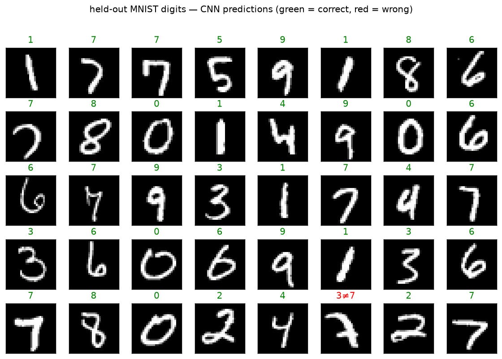

# CNN · exp 1 — the whole game

Top-down: before we take anything apart, let's build a **real CNN, train it, and watch it read
digits**. By the end of this page you have a working ~99% MNIST classifier and a rough mental map of
its parts. *Why* each part is shaped the way it is — that's exp_2 onward, each opening one box of
*this exact model*. Run it with `python ../cnn.py` (`exp_1_whole_game`).

---

## The model in one breath

```python
class SmallCNN(nn.Module):
    def __init__(self, n_classes=10):
        self.features = nn.Sequential(
            nn.Conv2d(1, 16, 3, padding=1),          nn.ReLU(),   # 28x28, find local patterns
            nn.Conv2d(16, 32, 3, stride=2, padding=1), nn.ReLU(), # 28->14, channels 16->32
            nn.Conv2d(32, 64, 3, stride=2, padding=1), nn.ReLU(), # 14->7,  channels 32->64
        )
        self.head = nn.Sequential(
            nn.Flatten(),                # (B,64,7,7) -> (B,3136)
            nn.Linear(64*7*7, n_classes) # -> (B,10) class scores
        )
    def forward(self, x):
        return self.head(self.features(x))
```

Rough narration, no rigor yet — just enough to not be a black box:

- **`features`** turns raw pixels into feature maps. Each `Conv2d` slides small learnable filters
  over the image to detect local patterns (edges → strokes → parts). The `stride=2` convs **halve
  the spatial size** (28 → 14 → 7) while we **double the channels** (16 → 32 → 64): coarser in space,
  richer per location. Out comes a small `64 × 7 × 7` grid of feature vectors.
- **`head`** flattens that grid into one `3136`-vector and a `Linear` maps it to **10 class scores**.
- **`ReLU`** is the nonlinearity between convs (more on why it's load-bearing in exp_4).

That's it — `raw pixels → features → 10 scores`.

---

## Watch it learn

Train on all 60k MNIST images, cross-entropy loss, Adam, 5 epochs. Test accuracy after each epoch:

```-
before training : test acc 13.05%   (~chance, 10 classes)
epoch 1         : train loss 0.2691   test acc 97.20%
epoch 2         : train loss 0.0752   test acc 98.08%
epoch 3         : train loss 0.0532   test acc 98.49%
epoch 4         : train loss 0.0414   test acc 98.71%
epoch 5         : train loss 0.0341   test acc 98.71%
```

From ~chance to **~99% in a few seconds** — a real digit reader in **54,666 params**. The
convolutional structure is doing a lot of work with very few weights; *why* is the whole rest of the
walkthrough.

---

## Does a *bigger* dense net do better? (no)

Tempting counter-argument: the CNN is tiny — maybe a plain dense net with **more** capacity would do
just as well. So we train one head-to-head — same data, same optimizer, same 5 epochs: a
`flatten → 768 → 10` MLP. Its **first layer alone** (`784×768 + 768 = 602,880`) already dwarfs the
*entire* CNN, and the whole MLP is **610,570 params — ~11× the CNN**.

```-
MLP  610,570 params : test acc 96.88%
CNN   54,666 params : test acc 98.71%
```

~11× the weights, and it still reads digits **worse**. So the CNN's edge isn't size — it's the right
**bias for images** (locality + translation equivariance), built into the architecture rather than
paid for in parameters. *Why* a conv has that bias and a flatten+dense throws it away is exactly what
**exp_3** opens.

---

## Read held-out digits

The payoff — the model's predictions on 40 test digits it never trained on (green = correct,
red = wrong):



39/40 here. The one miss is a genuinely ambiguous `7` scrawled with a heavy horizontal bar that reads
`3`-ish — the kind of error a person could make too. Good enough to trust that the machine works.

---

## The map (what we open next)

You now have a working model and a rough picture. Every experiment below picks **one box you just
ran** and explains why it's built that way — measured, not asserted:

| next | opens | the question |
|---|---|---|
| exp_2 | `Conv2d` inside `features` | what does a conv actually *compute*? (build one from scratch) |
| exp_3 | conv vs the MLP we had | why not just flatten + dense? (locality, translation equivariance) |
| exp_4 | `conv → relu → conv` | why depth, and why the ReLU between them is load-bearing |
| exp_5 | `stride=2`, ×2 channels | why downsample — more reach in fewer layers, bounded cost |
| exp_6 | `flatten → Linear` head | is flatten the right head? (vs global-average-pool) + wiring checks |

Next: **exp_2 — open `features`: what is a `Conv2d`, really?**

---

*Numbers + figure: `python ../cnn.py` (`exp_1_whole_game`).*
