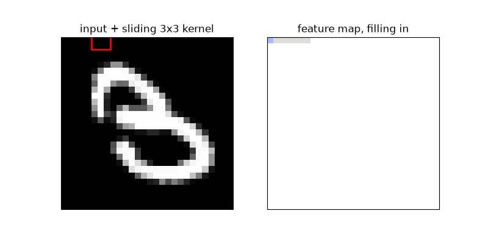
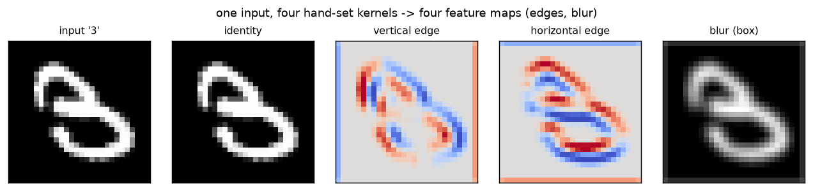

# CNN · exp 2 — open `features`: what a `Conv2d` really computes

In exp_1 you ran a model whose first box was `features = [Conv2d → ReLU] × 3`. We treated `Conv2d` as
magic. It isn't. This page opens *one* conv three ways: **(a)** rebuild it from scratch and match
PyTorch, **(b)** hand-set kernels so you can *see* what a conv detects, **(c)** the size formula that
produced exp_1's `28 → 14 → 7`. Run it with `python ../cnn.py` (`exp_2_open_features`).

---

## 1. A conv is a sliding window multiply-and-sum

A conv layer maps input `(N, Cin, H, W)` with weight `(Cout, Cin, kH, kW)` to `(N, Cout, Ho, Wo)`.
Output channel `o` slides its own kernel over the (padded) input; **each output cell is one windowed
multiply-and-sum**:

```
out[o, i, j] = Σ over the kH×kW×Cin window of  kernel[o] · input_window
```

That's the *entire* operation — three loops (out-channel, row, col), each cell a dot product. The
from-scratch version lives in [custom/naive_conv2d.py](../../../custom/naive_conv2d.py):

```python
for o in range(Cout):            # each output channel = its own detector
    for i in range(Hout):        # slide down
        for j in range(Wout):    # slide across
            window = x[:, :, i*s:i*s+kH, j*s:j*s+kW]     # (N, Cin, kH, kW)
            out[:, o, i, j] = (window * weight[o]).sum(dim=(1,2,3))
```

And it matches PyTorch exactly:

```
ONE cell by hand (top-left):  (window * kernel).sum() = -0.7064
F.conv2d[0,0,0,0]                                     = -0.7064
whole map: max|naive_conv2d - F.conv2d| = 4.77e-07     -> our 3 loops ARE F.conv2d
```

Two structural facts fall out of that loop, and they're the whole reason convs beat dense layers
(exp_3):

- **Weight sharing** — the *same* `weight[o]` is used at every `(i, j)`. One detector, applied
  everywhere.
- **Locality** — `out[o,i,j]` depends only on a small `kH×kW` window, not the whole image.

Watch weight sharing happen: *one* 3×3 kernel walks across the digit and the feature map fills in
pixel by pixel — the same detector fires wherever the stroke goes, nothing is position-specific.



> The kernel index and the input index move in the *same* direction — so this is technically
> cross-**correlation**, not textbook convolution (which flips the kernel). Every framework does this
> and calls it "conv." It only matters when you *hand-set* a kernel (next); a *learned* kernel just
> learns whichever orientation it needs.

---

## 2. Hand-set kernels → see what a conv detects

A trained conv *learns* its kernels. To build intuition, we **set** four `3×3` kernels by hand and
fire them at a real `3` (with `padding=1`, keeping 28×28):

```
identity          vertical edge     horizontal edge    blur (box)
copies input      Sobel-x: L↔R      Sobel-y: U↕D       local average
                  change            change             smooths

 0  0  0          -1  0  1          -1 -2 -1          1/9 1/9 1/9
 0  1  0          -2  0  2           0  0  0          1/9 1/9 1/9
 0  0  0          -1  0  1           1  2  1          1/9 1/9 1/9
```



- **identity** returns the digit untouched — proof the op does what we think.
- The two **Sobel** kernels sum to zero, so they read ~0 on flat regions (background, stroke
  interiors) and **spike on edges**: vertical-edge traces the left/right borders of strokes,
  horizontal-edge the top/bottom ones. Red/blue = the two edge directions (signed output, centered
  at 0).
- **blur** averages each `3×3` neighborhood, softening the digit.

Why edge kernels fire only on edges: a sum-to-zero kernel cancels over any constant patch, so nonzero
output requires a *change* in brightness under the window. **A CNN's whole job is to learn kernels
like these — thousands of them — instead of us hand-drawing four.** That's the only difference between
this and `features`.

---

## 3. The output-size formula (where `28 → 14 → 7` came from)

Each conv's output size, per axis:

```
out = floor( (in + 2p − k) / s ) + 1
```

A window needs `k` columns; padding adds `2p`; stride `s` takes every `s`-th start. Plug in the three
convs from exp_1's `features` and you get the pyramid you already watched:

```
stem  k3,s1,p1:  28 -> 28   (F.conv2d gives 28)     padding = k//2 keeps size
down1 k3,s2,p1:  28 -> 14   (F.conv2d gives 14)     stride 2 halves it
down2 k3,s2,p1:  14 ->  7   (F.conv2d gives  7)
```

So `28 → 14 → 7` wasn't arbitrary — it's this formula applied twice. *Why* halve at all (and grow
channels while doing it) is exp_5.

---

## Recap

| part | claim | payoff |
|---|---|---|
| the op | a conv = sliding window multiply-and-sum (weight sharing + locality) | `naive_conv2d` matches `F.conv2d` to 5e-7 |
| feature maps | hand-set edge kernels trace strokes; a CNN *learns* such kernels | the 4-kernel figure |
| output size | `floor((in+2p−k)/s)+1` | reproduces exp_1's `28 → 14 → 7` |

Next: **exp_3 — why conv at all?** We had a flatten+MLP already; this shows what the conv's weight
sharing and locality buy that a dense layer throws away (translation equivariance + a huge param cut).

---

*Numbers + figure: `python ../cnn.py` (`exp_2_open_features`).*
