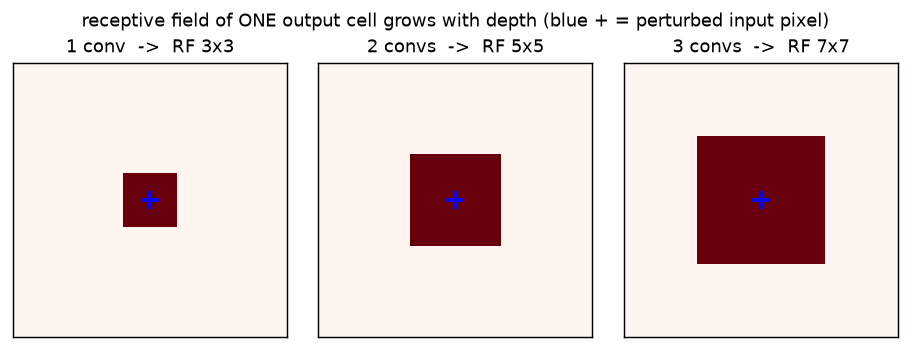
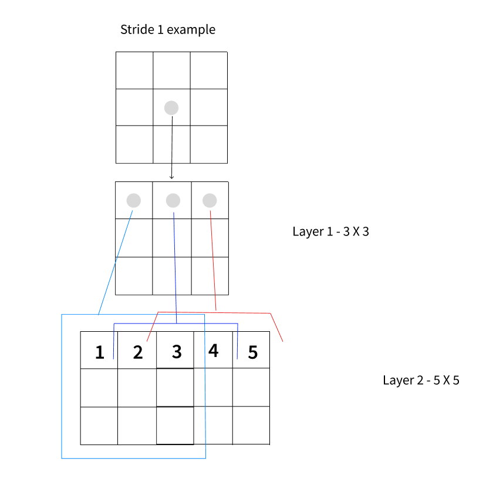

# CNN · exp 4 — why `conv → relu → conv`?

exp_1's `features` didn't stack bare convs — it stacked `conv → relu → conv → relu → …`. Two
questions hide in that pattern, and both have measured answers: **(A)** why stack convs at all
(depth grows the *receptive field*), and **(B)** why put a ReLU *between* them (without it, a stack
of convs collapses back into a single conv — depth buys nothing). Run it with `python cnn.py`
(`exp_4_stack_and_relu`).

---

## 1. Why stack — depth grows the receptive field

A single `3×3` conv output sees a `3×3` patch of its input. Put a second `3×3` conv on top: each of
*its* outputs sees a `3×3` patch of the first map, and each of those cells already spans `3×3` of the
original — so it sees `5×5` of the **original image**. Depth widens the window **without bigger
kernels**:

```
RF_L = 1 + L·(k − 1)        (k=3, stride 1: +2 per layer  →  3, 5, 7, …)
```

We don't assert this — we **measure** it. Perturb *one* input pixel, run `L` stacked convs (with
all-ones kernels so contributions can't cancel), and count how many output pixels move:

```
1 conv : moved block 3x3     (RF = 1 + 1·2 = 3)
2 convs: moved block 5x5     (RF = 1 + 2·2 = 5)
3 convs: moved block 7x7     (RF = 1 + 3·2 = 7)
```



The blue `+` is the single perturbed input pixel; the dark square is every output cell it can reach.
It grows `3×3 → 5×5 → 7×7` — one cell more of context per layer, per side. (Stride-1 growth is slow;
exp_5's stride-2 downsampling is what makes it *explode* so late layers see the whole `28×28` digit
without dozens of layers.)



---

## 2. Why the ReLU — without it the stack collapses to one conv

Here's the trap. A convolution is a **linear** map. Compose two linear maps and you get… a single
linear map. So two stacked convs *with no activation between them* are exactly **one** conv with a
bigger kernel — the depth bought nothing.

**Proof by impulse response.** Any linear shift-invariant map is fully described by its response to a
single spike (`delta`). Feed a delta through the 2-conv linear stack; the response is a `5×5` kernel
`keq`. Then `conv(x, keq)` — *one* conv — reproduces the whole stack:

```python
delta = zeros(9,9); delta[4,4] = 1
imp = linear_stack(delta)[2:7, 2:7]     # 5x5 impulse response
keq = flip(imp)                          # F.conv2d is cross-correlation → flip back to a kernel

max| linear_stack(x) − conv(x, keq) |  =  1.4e-06     # i.e. 0 — they're the same map
```

> **Why flip?** `F.conv2d` is cross-*correlation* (exp_2), so its impulse response comes out kernel-
> flipped. Flip it back and `keq` is a genuine kernel that reproduces the stack under `F.conv2d`.

**The cure, tested.** Drop a ReLU between the two convs and check superposition — the defining
property of a linear map, `f(x₁+x₂) = f(x₁)+f(x₂)`:

```
linear stack residual = 2.0e-06   (linear: holds — so it IS some single conv)
ReLU   stack residual = 2.913     (broken: NOT equal to any single conv)
```

Once superposition fails, the stack **cannot** equal any single conv, no matter the kernel. That
broken linearity is the whole point: the ReLU is what lets stacked layers compose
`edges → strokes → parts` instead of collapsing back into one edge detector.

Why ReLU specifically (`max(0, ·)`)? It's the modern default — cheap, no saturation, gradients that
don't vanish the way `sigmoid`/`tanh` do. Any nonlinearity breaks the collapse; ReLU is the one that
also trains well.

---

## Recap

| part | claim | payoff |
|---|---|---|
| stacking | depth grows the receptive field, `RF = 1 + L(k−1)` | measured `3×3 → 5×5 → 7×7` (§1) |
| linear collapse | two convs, no activation = **one** bigger conv | `conv(x, keq)` reproduces the stack to `1e-6` (§2) |
| the ReLU | a nonlinearity breaks the collapse | superposition residual `0 → 2.9` with a ReLU inserted (§2) |

**One-sentence compression:** stacking convs widens the receptive field one `(k−1)` step per layer,
but a stack of *linear* convs is algebraically just one bigger conv — the ReLU between them breaks
that superposition, which is the only reason depth adds capacity instead of a fancier kernel.

Next: **exp_5 — why `stride=2` (H/2, W/2) and ×2 channels?** Stride-2 downsampling makes the
receptive field cover more input pixels in *fewer* layers, and "resolution down, channels up" keeps
compute bounded while features get richer — the `28 → 14 → 7` pyramid you watched in exp_1.

---

*Numbers + figure: `python cnn.py` (`exp_4_stack_and_relu`).*
