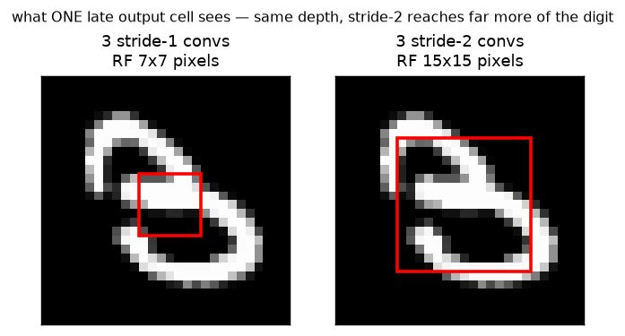

# CNN · exp 5 — why `stride=2` (H/2, W/2) and ×2 channels?

exp_4 stacked stride-1 convs: the map stays `28×28` and the receptive field creeps up by `k−1 = 2`
per layer — you'd need ~14 layers for one cell to see a whole digit. exp_1 didn't do that. Two of its
convs used `stride=2`, **halving** `H,W` (`28 → 14 → 7`) while **doubling** channels (`16 → 32 → 64`).
This page measures the three things that buys. Run it with `python cnn.py` (`exp_5_downsample`).

---

## 1. The resolution pyramid (`28 → 14 → 7`)

A `stride=2`, `k3`, `p1` conv outputs `ceil(in/2)` — the exp_2 size formula with `s=2`. exp_1's
`features` is a stride-1 stem followed by two stride-2 downsamples, doubling channels at each:

```
(1, 1, 28, 28)
  --stem  (1→16,  s1)-->  (1, 16, 28, 28)
  --down1 (16→32, s2)-->  (1, 32, 14, 14)
  --down2 (32→64, s2)-->  (1, 64,  7,  7)
```

Spatial `28 → 28 → 14 → 7`, channels `1 → 16 → 32 → 64`. This *is* the pyramid you watched in exp_1
— now we know why each arrow is there.

---

## 2. Stride makes the receptive field *explode*

The receptive-field recurrence, from exp_4, with the stride term made explicit:

```
RF_L = RF_{L−1} + (k − 1) · ∏(strides of earlier layers)
```

The key word is **product**: once you've downsampled by 2, every later `(k−1)` step is worth *2 input
pixels*, and after two downsamples, *4*. So RF compounds instead of adding. We measure it **exactly**
with autograd — pick one central output cell, backprop to the input, and the input pixels with
nonzero gradient are precisely the ones it depends on:

```
layers |  stride-1 RF  |  stride-2 RF
   1    |       3       |       3
   2    |       5       |       7
   3    |       7       |      15
```

Stride-1 crawls `3 → 5 → 7`; stride-2 leaps `3 → 7 → 15` (and `→ 31` at layer 4). ~14 stride-1 convs
to reach `RF 28`; only ~4 stride-2.



Same depth — **3 convs** — but the stride-2 cell's `15×15` window covers half the digit where the
stride-1 cell's `7×7` sees a sliver. *That's* what stride buys: reach, cheaply.

---

## 3. Channels grow *for free* — the footprint stays bounded

If bigger reach were the whole story we'd just stack more stride-1 convs. The other half is
**compute**. Each stride-2 stage quarters the number of positions (`H·W → H/2·W/2`), so **doubling**
the channel count still shrinks the activation footprint `C·H·W`:

```
input         1·28·28 =   784 values
stem  1→16   16·28·28 = 12544 values   ×16.00   (the one expensive, full-res layer)
down1 16→32  32·14·14 =  6272 values   ×0.50    channels ×2, area ×1/4  ⇒  ×1/2
down2 32→64  64· 7· 7 =  3136 values   ×0.50
```

Each downsample multiplies the footprint by `2 · (1/4) = 1/2` — and conv FLOPs drop ~4× per stage
too. So the network can afford to get **richer per cell** (more channels = more distinct detectors)
exactly where it got **coarser in space**. That's the universal CNN shape:

> **resolution down, channels up.**

---

## Recap

| part | claim | payoff |
|---|---|---|
| pyramid | stride-2 `k3` conv halves H,W (`ceil(in/2)`) | `28 → 14 → 7`, exp_1's exact stack (§1) |
| receptive field | stride *multiplies* every later step | `3/5/7` (s1) vs `3/7/15` (s2), by autograd (§2) |
| channels | area ÷4 lets channels ×2 for half the footprint | `C·H·W` ×1/2 per downsample (§3) |

**One-sentence compression:** a stride-2 conv halves the resolution, which makes the receptive field
compound (so a few layers see the whole digit instead of ~14) *and* quarters the positions (so
doubling channels still halves the footprint) — reach and richness, both cheap, which is why every
CNN funnels resolution down while fanning channels up.

Next: **exp_6 — the head + loss.** Turn the final `64×7×7` map into 10 class scores: `flatten → Linear`
vs global-average-pool, cross-entropy, and two wiring checks (untrained loss ≈ `ln 10`, overfit one
batch → 0).

---

*Numbers + figure: `python cnn.py` (`exp_5_downsample`).*
