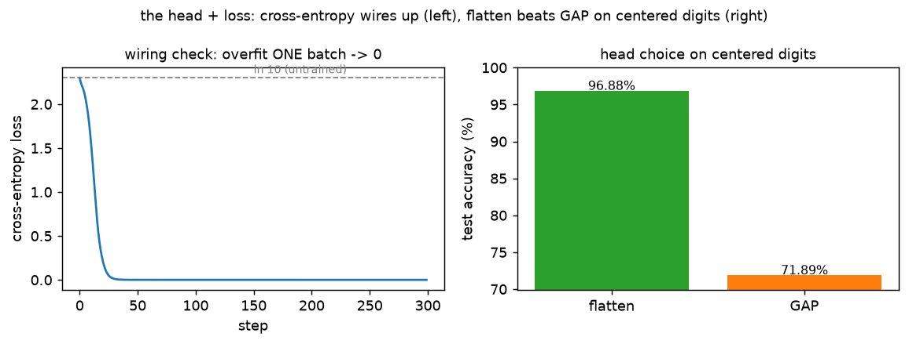

# CNN · exp 6 — the `head` + loss: `flatten → Linear`, and is it the right head?

exp_1's `features` handed us a `(B, 64, 7, 7)` grid; the `head` turned it into 10 class scores with
`flatten → Linear`, and the loss was cross-entropy. This is the **last box**. Three things, all
measured. Run it with `python cnn.py` (`exp_6_head_and_loss`).

---

## 1. Two heads — what each keeps

The final grid is `(B, 64, 7, 7)`: 64 feature channels, each a `7×7` map of *where that feature
fired*. Two ways to collapse it to 10 scores:

```
flatten → Linear : read the whole grid as one 3136-vector → Linear(3136, 10)   31,370 weights
                   keeps WHERE each feature fired — position is preserved.
GAP     → Linear : average each channel's 7×7 map → 64-vector → Linear(64, 10)     650 weights
                   keeps only HOW MUCH each feature fired anywhere — position averaged away.
```

GAP isn't a special op — it's literally a mean over the spatial dims, just kept as a `1×1` "image"
(which is why the head is `AdaptiveAvgPool2d(1)` **then** `Flatten`). Same numbers either way:

```python
f = torch.randn(2, 64, 7, 7)
a = nn.AdaptiveAvgPool2d(1)(f).flatten(1)   # (2, 64, 7, 7) -> (2, 64, 1, 1) -> (2, 64)
b = f.mean(dim=(2, 3))                       # (2, 64, 7, 7) -> (2, 64)
(a - b).abs().max()   # ~0 (float noise)
```

`AdaptiveAvgPool2d(k)` is just the general form — it pools to any `k×k` grid regardless of input
size; at `k=1` it's exactly this global mean.

Global-average-pool is the **standard** head on big images (ResNet, etc.): when the object can sit
anywhere in the frame, averaging over position gives you translation *invariance*, which is exactly
what you want. But MNIST digits are **centered** — *where* a stroke sits is a genuine cue (a
horizontal bar near the top vs. the middle helps separate a `7` from a `2`). So here, throwing
position away should hurt. Same trunk, same init, 3 epochs on 20k images, **only the head differs:**

```
flatten → Linear : test acc 96.89%   (keeps position)
GAP     → Linear : test acc 72.08%   (position averaged away)
```



A ~25-point gap — GAP is *not* a free swap on centered digits. The lesson isn't "GAP is bad"; it's
that a head encodes an assumption. GAP assumes *position shouldn't matter*; flatten assumes *it
should*. Match the head to the data.

---

## 2. The loss — cross-entropy = `−log(softmax)`

The loss is one line: softmax the 10 logits into probabilities, take the negative log of the
probability at the **true** class.

```
CE(logits, y) = −log( softmax(logits)[y] )
```

That's all `F.cross_entropy` does. And it gives a free **wiring check**:

> **Check 1 — untrained loss ≈ `ln 10`.** A fresh net's logits are ~arbitrary, so softmax is roughly
> *uniform* over 10 classes → probability `~1/10` at the true class → loss `~ −ln(1/10) = ln 10 ≈
> 2.303`. Measured: `2.299`. If an untrained net's loss came out far from `ln(#classes)`, the softmax
> / label wiring is wrong before you've trained a single step.

---

## 3. The other wiring check — overfit one batch

> **Check 2 — memorize ONE batch.** A correctly wired model + loss + optimizer *must* be able to
> drive the loss to ~0 on a single small batch (it can just memorize it). Take 64 images, run 300
> Adam steps on only those:
>
> ```
> step   0  loss 2.301   (≈ ln 10)
> step 300  loss 0.0000   (batch acc 100%)
> ```

The loss collapses to zero (left panel of the figure) — gradients flow end to end and the head/loss
are wired right. This is the **first** thing to run on any new model: if it *can't* overfit one
batch, don't bother training on the full set — something (a detached tensor, a frozen layer, a
label mismatch) is broken.

---

## Recap

| part | claim | payoff |
|---|---|---|
| head | flatten keeps position, GAP averages it away | 96.9% vs 72.1% on centered digits (§1) |
| loss | cross-entropy = `−log(softmax)` | untrained loss `2.30 ≈ ln 10` (§2) |
| wiring | model+loss+opt can memorize one batch | loss `→ 0.0000`, batch acc 100% (§3) |

**One-sentence compression:** the head is a *choice* — `flatten` keeps position (a real cue on
centered digits, so it beats GAP here) while GAP's translation-invariance is what you'd want on
big images — and cross-entropy is just `−log(softmax)`, cheap enough to double as two sanity checks
(untrained loss ≈ `ln 10`, and a one-batch overfit to 0) that catch a miswired net before you waste
a training run.

Next: **exp_7 — assemble the clean model** in `new/cnn/` and note which pieces (conv trunk,
downsampling, the resolution-down/channels-up shape) carry straight into the U-Net we'll build for
diffusion.

---

*Numbers + figure: `python cnn.py` (`exp_6_head_and_loss`).*
