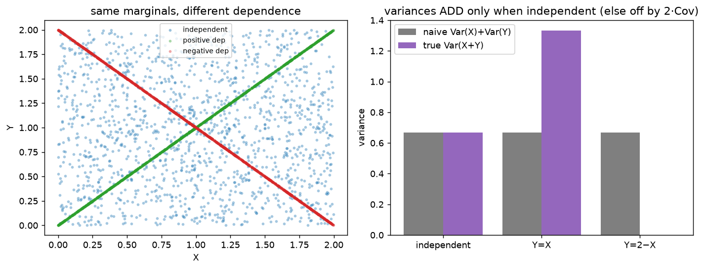
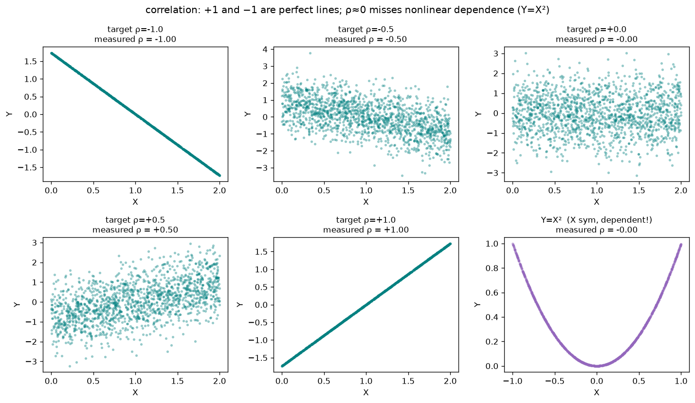
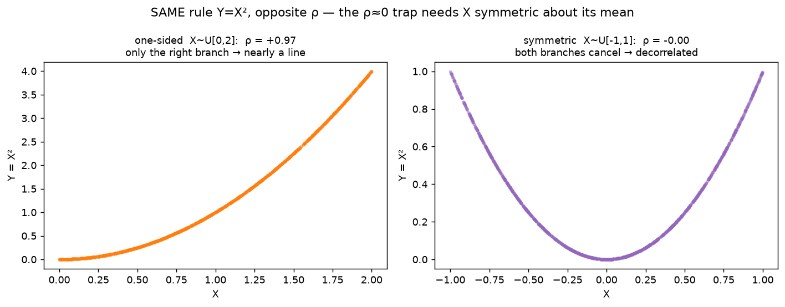

# Section 1 — Mean & variance under linear operations

A **foundations** primer (see [roadmap.md](../../roadmap.md)). Before the three Gaussian facts make
sense, we need the plumbing underneath them: how the **mean** and **variance** of a random variable
behave when you _scale_ it, _shift_ it, or _add_ two together. None of this is Gaussian-specific —
it holds for **any** distribution. Section 2 then specializes to the Gaussian.

This note grows one `exp_*` at a time. Run with `python linear_ops.py`.

---

## exp_1 — the MEAN under scaling and shifting

### What the mean _is_

A **random variable** `X` is a quantity whose value is uncertain — each draw gives a different
number (a dice roll, a pixel's noise, a sample from a bell curve). The **mean** (or **expectation**)
`E[X]` is the _average value over infinitely many draws_ — the **balance point** of the
distribution, where the samples center.

In code, "infinitely many draws" becomes "a lot of draws": `X.mean()` over 500k samples ≈ `E[X]`.
We use `X ~ Uniform[0,2]` — a flat distribution between 0 and 2, deliberately **not** a Gaussian —
to make clear these rules aren't a Gaussian-only thing. Its balance point is `1.0`:

```
  E[X]   true 1.0   measured 1.0012
```

### Rule 1 — scaling: `E[a·X] = a·E[X]`

Multiply every draw by `a`, and the average is multiplied by `a` too. Intuitively, stretching the
whole distribution by `a` drags its balance point along by the same factor.

```
  E[a·X]   with a=3:   a·E[X] = 3·1 = 3.0    measured 3.0036
```

### Rule 2 — shifting: `E[X+d] = E[X] + d`

Add a constant `d` to every draw, and the average moves by exactly `d` — the whole distribution
slides over by `d`, balance point included.

```
  E[X+d]   with d=5:   E[X]+d = 1+5 = 6.0    measured 6.0012
```

### Combined — affine: `E[a·X + d] = a·E[X] + d`

Scaling and shifting together just compose:

```
  E[a·X+d]   a·E[X]+d = 3·1+5 = 8.0    measured 8.0036
```

### The takeaway: the mean is _linear_


Sweeping `a` and plotting `E[a·X]` gives a **straight line through the origin** with slope `E[X]`.
That's the whole point: **the mean moves linearly** — scale by `a` → mean `×a`; shift by `d` → mean
`+d`. No surprises.

> ⚠️ **The variance does _not_ behave this way.** Scaling by `a` multiplies the variance by `a²`
> (not `a`) — a _parabola_, not a line. That single asymmetry (mean `×a`, variance `×a²`) is the
> reason diffusion's coefficients are **square roots**: to make signal-power + noise-power add to 1,
> you must put `√ᾱ` and `√(1-ᾱ)` on the amplitudes. We measure the `a²` law next.

---

---

## exp_2 — the VARIANCE under scaling and shifting

### What the variance _is_

The **variance** measures **spread** — how far, typically, the samples land from the mean:

```
  Var(X) = E[ (X - E[X])² ]  =  the average SQUARED distance from the mean
```

We square the distances (so `+` and `−` deviations don't cancel, and big deviations count extra),
then average. The **standard deviation** `std = √Var` puts that spread back in the original units.
For `X ~ Uniform[0,2]` the true variance is `(2-0)²/12 = 1/3 ≈ 0.3333`:

```
  Var(X)  true 0.3333   measured 0.3335   std 0.5775
```

### Rule 1 — scaling: `Var(a·X) = a²·Var(X)`

Here's the twist that makes this whole section matter. Scaling by `a` multiplies the variance by
**`a²`, not `a`**. Why: every sample's _distance from the mean_ gets scaled by `a`, and variance
**squares** those distances — so the factor comes out squared.

```
  Var(2·X)    a²·Var(X) = 4·0.3333 = 1.3332    measured 1.3340
  Var(3·X)    a²·Var(X) = 9·0.3333 = 2.9997    measured 3.0014
  Var(-2·X)   a²·Var(X) = 4·0.3333 = 1.3332    measured 1.3340   ← same as +2: the sign is gone
```

Because `a²` is always positive, `Var(-2·X) = Var(2·X)`: the **std scales by `|a|`** (spread has no
direction).

### Rule 2 — shifting: `Var(X+d) = Var(X)`

Adding a constant slides _every_ sample by the same `d`, so distances-from-the-mean don't change —
the spread is untouched.

```
  Var(X+5)   Var(X) = 0.3333   measured 0.3335
```

### The takeaway: mean and variance react _differently_ to the same operation


**Left:** scale X by 1, 2, 3 and the histogram box visibly **widens** (and flattens) — the spread
grows. **Right:** plotting each statistic against the knob `a`, the **variance is a parabola** (`a²`)
while the **mean is a line** (`a`).

|              | scale by `a`      | shift by `d` |
| ------------ | ----------------- | ------------ |
| **mean**     | `×a` (linear)     | `+d`         |
| **variance** | `×a²` (quadratic) | unchanged    |
| **std**      | `×\|a\|`          | unchanged    |

> **This is _the_ fact behind diffusion's √.** When you mix signal and noise as `√ᾱ·x0 + √(1-ᾱ)·ε`,
> the variances are `(√ᾱ)²·Var(x0) + (√(1-ᾱ))²·Var(ε) = ᾱ·Var(x0) + (1-ᾱ)·Var(ε)`. The `²` from the
> variance law cancels the `√` on the amplitude, leaving clean weights `ᾱ` and `1-ᾱ` that sum to 1.
> Put `a` and `1-a` on the amplitudes instead and you'd get `a²+(1-a)²`, which sags below 1. (This is
> "fact A" — variance scales by `a²` — the first of the three the closed form leans on.)

---

---

## exp_3 — SUMS: linearity of expectation

So far one variable at a time. Now **add two** (with weights `a`, `b`). The mean splits cleanly:

```
  E[a·X + b·Y]  =  a·E[X] + b·E[Y]
```

The average of a combination is the combination of the averages.

### The remarkable part: dependence doesn't matter

This holds **always** — even when `X` and `Y` are strongly related. We test it two ways: an
**independent** pair, and a **dependent** pair `Y = X²` (Y is completely determined by X):

```
  case                     |  measured E[aX+bY] |  aE[X]+bE[Y]
  -------------------------+--------------------+-------------
  independent (Y~U[0,4])   |      -3.9969       |   -3.9969
  DEPENDENT   (Y = X²)     |      -2.0052       |   -2.0052        (a=2, b=-3)
```


**Left:** `Y = X²` is an obvious curve — X and Y are tightly linked, about as dependent as it gets.
**Right:** measured `E[aX+bY]` equals predicted `aE[X]+bE[Y]` in _both_ cases. Averaging is linear
and simply **never looks at how X and Y relate** — so means always split over a sum.

> ⚠️ **This is where mean and variance part ways.** The _variance_ of a sum is **not** so forgiving:
> `Var(X+Y) = Var(X) + Var(Y) + 2·Cov(X,Y)`, and that covariance term only vanishes when `X ⟂ Y`.
> So: **means always add; variances only add when independent.** That's exp_4 — and "independent"
> being load-bearing there is exactly "fact B" behind the diffusion closed form.

---

---

## exp_4 — the VARIANCE of a sum + covariance

The mean split cleanly over a sum for _any_ pair (exp_3). The **variance does not** — it carries a
cross term the mean never had:

```
  Var(X + Y) = Var(X) + Var(Y) + 2·Cov(X,Y)
```

### The new ingredient: covariance

**Covariance** measures how X and Y move _together_:

```
  Cov(X,Y) = E[(X − E[X])(Y − E[Y])] = E[XY] − E[X]E[Y]
```

- `> 0` — they rise together (when X is above its mean, Y tends to be too)
- `< 0` — they move oppositely (X up ↔ Y down)
- `= 0` — unrelated. **Independent ⇒ Cov = 0** (the converse isn't guaranteed, but independence is
  enough), and then the cross term vanishes and **variances simply add**.

### Isolating the cross term: same marginals, different dependence

To prove the gap is _purely_ the covariance, we use three `Y`'s that all have the **same marginal**
as X (each is `Uniform[0,2]`, so identical mean and variance) — only their _dependence on X_ differs:

| `Y`              | dependence         | Cov(X,Y)  |
| ---------------- | ------------------ | --------- |
| `Y_ind ~ U[0,2]` | independent        | `≈ 0`     |
| `Y = X`          | perfectly positive | `+Var(X)` |
| `Y = 2 − X`      | perfectly negative | `−Var(X)` |

**Where those Cov values come from** — both drop straight out of the definition
`Cov(A,B) = E[(A−E[A])(B−E[B])]`:

_`Y = X`_ — substitute `B = A = X`:

```
  Cov(X, X) = E[(X − E[X])(X − E[X])]
            = E[(X − E[X])²]
            = Var(X)                 ← literally the definition of variance
```

A variable's covariance **with itself is its variance** — same expression, nothing to compute.

_`Y = 2 − X`_ — needs two easy properties of covariance, each **proved from the definition** below.

**Property (1): constants don't co-vary — `Cov(X, Y + c) = Cov(X, Y)`.**
First, the mean of `Y + c` shifts by `c` (linearity of expectation, exp_3): `E[Y + c] = E[Y] + c`.

Substitute that into the covariance definition:

```
  Cov(X, Y + c) = E[ (X − E[X]) · ( (Y + c) − E[Y + c] ) ]
                = E[ (X − E[X]) · ( Y + c − (E[Y] + c) ) ]
                = E[ (X − E[X]) · ( Y − E[Y] ) ]
                = Cov(X, Y)
```

Adding a constant slides `Y` bodily but doesn't change how it _varies around its own centre_, so it
can't change the co-variation.

**Property (2): scalars pull out — `Cov(X, a·Y) = a·Cov(X, Y)`.**
First, `E[a·Y] = a·E[Y]`. Then:

```
  Cov(X, a·Y) = E[ (X − E[X]) · ( a·Y − E[a·Y] ) ]
              = E[ (X − E[X]) · ( a·Y − a·E[Y] ) ]
              = E[ (X − E[X]) · a·( Y − E[Y] ) ]             ← factored out a
              = a · E[ (X − E[X])( Y − E[Y] ) ]              ← constant a leaves the expectation
              = a · Cov(X, Y)
```

The last step uses `E[a·Z] = a·E[Z]` again (this time with `Z = (X−EX)(Y−EY)`): a constant factor
always slides out of an expectation.

**Now apply both** to `Y = 2 − X = (−1)·X + 2`:

```
  Cov(X, 2 − X) = Cov(X, −X + 2)
                = Cov(X, −X)         (drop the +2 constant, property 1)
                = −1 · Cov(X, X)     (pull out the −1, property 2)
                = −Var(X)            (Cov(X,X) = Var(X))
```

These are the **extreme** covariances two variables with these marginals can have — normalized (exp_5)
they're `ρ = ±1`, the perfect lines. Now the measured variances:

```
  case                     | Cov(X,Y) | Var(X)+Var(Y) | measured Var(X+Y)
  -------------------------+----------+---------------+------------------
  independent   (Y⟂X)      |   0.0014 |        0.6665 |            0.6692
  positive dep  (Y=X)      |   0.3335 |        0.6670 |            1.3340
  negative dep  (Y=2−X)    |  -0.3335 |        0.6670 |            0.0000
```

- **independent** → `Cov≈0` → naive add = truth. Variances add. ✅
- **`Y=X`** → `Cov=Var(X)` → `Var(X+X)=Var(2X)=4·Var(X)`, exactly **double** the naive `2·Var(X)` —
  the extra `2·Cov` piece.
- **`Y=2−X`** → `Cov=−Var(X)` → `X+Y = 2`, a constant, so `Var = 0`: the spreads **cancel**.

Same marginals throughout — the _only_ thing that changed was the dependence, and it swung the sum's
variance from `0` to `4·Var(X)`.



**Left:** the three shapes — independent is a blob, `Y=X` an up-line, `Y=2−X` a down-line — all
filling the _same_ square (same marginals). **Right:** the naive `Var(X)+Var(Y)` matches the true
`Var(X+Y)` **only** for the independent pair; it's off by `2·Cov` otherwise.

> **This is "fact B" behind the diffusion closed form.** The forward step mixes signal and noise as
> `√ᾱ·x0 + √(1−ᾱ)·ε`, and the noise `ε` is drawn **independently** of `x0`. So `Cov = 0`, the cross
> term drops, and the variances add cleanly:
> `Var = ᾱ·Var(x0) + (1−ᾱ)·Var(ε)`. If signal and noise were correlated, a `2·Cov` term would spoil
> the variance-preserving bookkeeping (`ᾱ + (1−ᾱ) = 1`). _Independence is load-bearing._ (The
> general weighted form is `Var(aX+bY) = a²Var(X) + b²Var(Y) + 2ab·Cov(X,Y)` — here `a=b=1`.)

---

---

## exp_5 — correlation: covariance, normalized

Covariance (exp_4) has a readability problem: it carries the **units and spread** of X and Y, so its
raw size means nothing on an absolute scale — `Cov` in meters ≠ `Cov` in centimetres for the same
relationship. **Correlation** fixes this by dividing out each variable's own std:

```
              Cov(X, Y)
  ρ(X, Y) = ─────────────      (measure X and Y in units of their own std, then covary)
             σ_X · σ_Y
```

The result is **dimensionless** and **always in `[−1, +1]`**:

```
  ρ = +1   perfect positive line (Y = aX+b, a>0)   |   ρ =  0   no LINEAR co-movement
  ρ = −1   perfect negative line (a<0)             |  0<|ρ|<1   a loose tendency
```

### Dialing ρ, and confirming the bound

We _construct_ a target ρ by mixing signal and independent noise, `Y = ρ·X_z + √(1−ρ²)·Z` (with `X_z`
the standardized X and `Z⟂X` standard normal). Then `Cov(X_z,Y)=ρ` and `Var(Y)=1`, so the correlation
_is_ the dial — and the measurement confirms it, never leaving `[−1,1]`:

```
   target ρ | measured ρ
  ----------+-----------
      -1.0  |   -1.000
      -0.5  |   -0.500
       0.0  |   -0.000
      +0.5  |   +0.499
      +1.0  |   +1.000
```

**Why the `[−1,1]` bound is hard** — it falls out of "variance can't be negative." With z-scores
`U,V` (variance 1 each, `Cov(U,V)=ρ`):

```
  Var(U + V) = 1 + 1 + 2ρ = 2 + 2ρ ≥ 0   ⇒   ρ ≥ −1
  Var(U − V) = 1 + 1 − 2ρ = 2 − 2ρ ≥ 0   ⇒   ρ ≤ +1
```

and `ρ=±1` is reached **exactly** when one of those variances hits `0` — i.e. `U±V` is a constant,
meaning X and Y lie on a perfect straight line. That's why `Y=X` (`ρ=+1`) and `Y=2−X` (`ρ=−1`) from
exp*4 were the \_extreme* covariances available.

### Two traps the figure makes visible



- **`ρ=±1` means an exact line, not just "strongly related."** The scatters tighten from a fuzzy
  cloud to a razor line as `|ρ|→1`.
- **`ρ=0` does NOT mean independent — only no _linear_ co-movement.** The `Y=X²` panel (with X
  **symmetric** about 0, `U[−1,1]`) is a perfect parabola — Y is _fully determined_ by X — yet
  `ρ≈0`, because the up-branch and down-branch cancel. Correlation is **blind to nonlinear
  structure**.

**The symmetry is load-bearing** — decorrelation is _not_ a property of `X²` itself:



Same rule `Y=X²`, two supports for X. On a **one-sided** `X~U[0,2]` you only get the parabola's
_right branch_ — which is nearly a straight line — so `ρ≈+0.97` (it _looks_ linear!). Only when X is
**symmetric about its mean** (`U[−1,1]`) do both branches appear and cancel, giving `ρ≈0`. So "`X²`
is uncorrelated with X" is a statement about the _symmetry of X_, not about squaring.

> **Why this matters for diffusion:** independence gives `ρ=0`, but `ρ=0` alone is a _weaker_
> guarantee. When we insist the noise `ε` is **independent** of `x0` (not merely uncorrelated), we
> get the full "variances add, cross term vanishes" of exp*4 \_and* — once everything is Gaussian
> (Section 2) — uncorrelated actually _does_ upgrade to independent. Correlation is the linear
> shadow of the dependence covariance already measures.

---

## Section 1 recap — the three linear-op facts

| operation    | mean                   | variance                                                    |
| ------------ | ---------------------- | ----------------------------------------------------------- |
| scale by `a` | `×a` (line)            | `×a²` (parabola) — **fact A**                               |
| shift by `d` | `+d`                   | unchanged                                                   |
| sum `X+Y`    | **always** `E[X]+E[Y]` | `Var(X)+Var(Y)+2Cov`; adds **iff independent** — **fact B** |

These are exactly the two facts the diffusion forward collapse leans on (the third — _sum of
independent Gaussians is Gaussian_ — is Gaussian-specific and comes in **Section 2**).

---

## What's next

**Section 2 — the Gaussian family** (`walkthroughs/gaussian_family.py`): specialize from "any
distribution" to the normal. The bell curve and `N(0,1)`, the **reparameterization** `X = μ + σ·ε`,
affine-of-a-Gaussian-stays-Gaussian, and the **closure** fact (sum of independent Gaussians is
Gaussian) that completes the trio.

---

_Numbers + figures: `python linear_ops.py` (`exp_1_mean`, `exp_2_variance`, `exp_3_linearity`,
`exp_4_variance_of_sums`, `exp_5_correlation`)._
