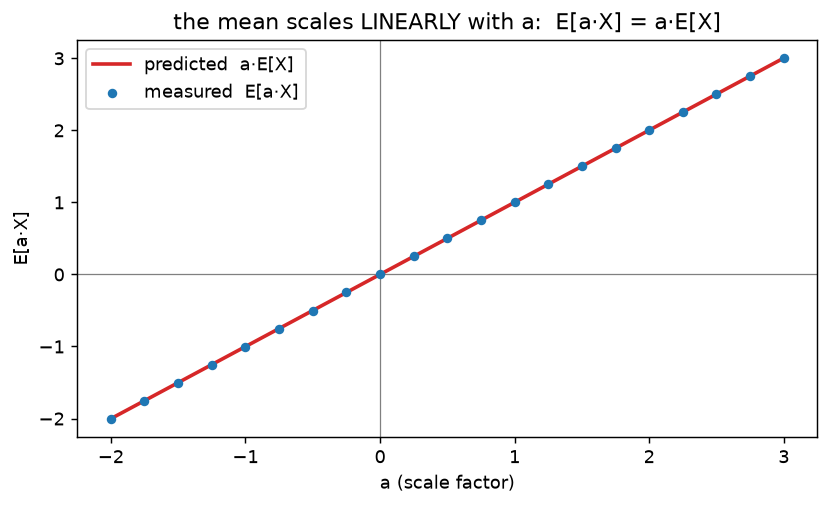
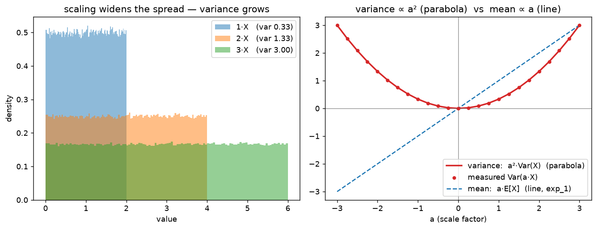
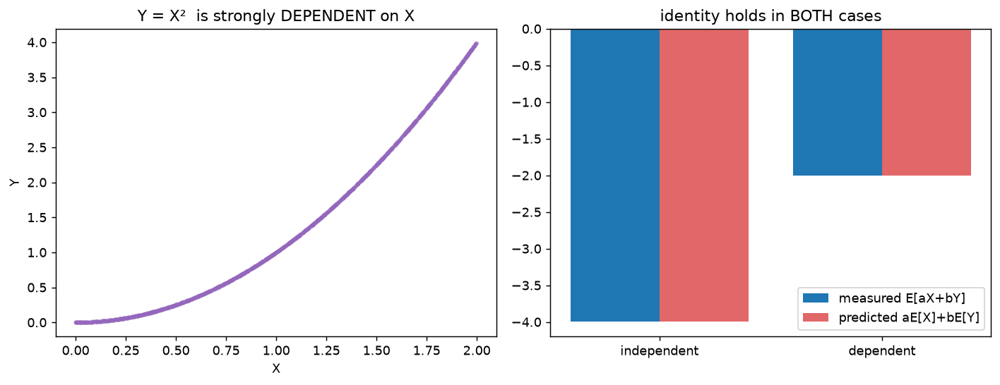

# Section 1 — Mean & variance under linear operations

A **foundations** primer (see [roadmap.md](../../roadmap.md)). Before the three Gaussian facts make
sense, we need the plumbing underneath them: how the **mean** and **variance** of a random variable
behave when you *scale* it, *shift* it, or *add* two together. None of this is Gaussian-specific —
it holds for **any** distribution. Section 2 then specializes to the Gaussian.

This note grows one `exp_*` at a time. Run with `python linear_ops.py`.

---

## exp_1 — the MEAN under scaling and shifting

### What the mean *is*

A **random variable** `X` is a quantity whose value is uncertain — each draw gives a different
number (a dice roll, a pixel's noise, a sample from a bell curve). The **mean** (or **expectation**)
`E[X]` is the *average value over infinitely many draws* — the **balance point** of the
distribution, where the samples center.

In code, "infinitely many draws" becomes "a lot of draws": `X.mean()` over 500k samples ≈ `E[X]`.
We use `X ~ Uniform[0,2]` — a flat distribution between 0 and 2, deliberately **not** a Gaussian —
to make clear these rules aren't a Gaussian-only thing. Its balance point is `1.0`:

```
  E[X]   true 1.0   measured 1.0012
```

### Rule 1 — scaling: `E[a·X] = a·E[X]`

Multiply every draw by `a`, and the average is multiplied by `a` too. Intuitively, stretching the
whole distribution by `a` drags its balance point along by the same factor.

```
  E[a·X]   with a=3:   a·E[X] = 3·1 = 3.0    measured 3.0036
```

### Rule 2 — shifting: `E[X+d] = E[X] + d`

Add a constant `d` to every draw, and the average moves by exactly `d` — the whole distribution
slides over by `d`, balance point included.

```
  E[X+d]   with d=5:   E[X]+d = 1+5 = 6.0    measured 6.0012
```

### Combined — affine: `E[a·X + d] = a·E[X] + d`

Scaling and shifting together just compose:

```
  E[a·X+d]   a·E[X]+d = 3·1+5 = 8.0    measured 8.0036
```

### The takeaway: the mean is *linear*



Sweeping `a` and plotting `E[a·X]` gives a **straight line through the origin** with slope `E[X]`.
That's the whole point: **the mean moves linearly** — scale by `a` → mean `×a`; shift by `d` → mean
`+d`. No surprises.

> ⚠️ **The variance does *not* behave this way.** Scaling by `a` multiplies the variance by `a²`
> (not `a`) — a *parabola*, not a line. That single asymmetry (mean `×a`, variance `×a²`) is the
> reason diffusion's coefficients are **square roots**: to make signal-power + noise-power add to 1,
> you must put `√ᾱ` and `√(1-ᾱ)` on the amplitudes. We measure the `a²` law next.

---

---

## exp_2 — the VARIANCE under scaling and shifting

### What the variance *is*

The **variance** measures **spread** — how far, typically, the samples land from the mean:

```
  Var(X) = E[ (X - E[X])² ]  =  the average SQUARED distance from the mean
```

We square the distances (so `+` and `−` deviations don't cancel, and big deviations count extra),
then average. The **standard deviation** `std = √Var` puts that spread back in the original units.
For `X ~ Uniform[0,2]` the true variance is `(2-0)²/12 = 1/3 ≈ 0.3333`:

```
  Var(X)  true 0.3333   measured 0.3335   std 0.5775
```

### Rule 1 — scaling: `Var(a·X) = a²·Var(X)`

Here's the twist that makes this whole section matter. Scaling by `a` multiplies the variance by
**`a²`, not `a`**. Why: every sample's *distance from the mean* gets scaled by `a`, and variance
**squares** those distances — so the factor comes out squared.

```
  Var(2·X)    a²·Var(X) = 4·0.3333 = 1.3332    measured 1.3340
  Var(3·X)    a²·Var(X) = 9·0.3333 = 2.9997    measured 3.0014
  Var(-2·X)   a²·Var(X) = 4·0.3333 = 1.3332    measured 1.3340   ← same as +2: the sign is gone
```

Because `a²` is always positive, `Var(-2·X) = Var(2·X)`: the **std scales by `|a|`** (spread has no
direction).

### Rule 2 — shifting: `Var(X+d) = Var(X)`

Adding a constant slides *every* sample by the same `d`, so distances-from-the-mean don't change —
the spread is untouched.

```
  Var(X+5)   Var(X) = 0.3333   measured 0.3335
```

### The takeaway: mean and variance react *differently* to the same operation



**Left:** scale X by 1, 2, 3 and the histogram box visibly **widens** (and flattens) — the spread
grows. **Right:** plotting each statistic against the knob `a`, the **variance is a parabola** (`a²`)
while the **mean is a line** (`a`).

|                | scale by `a`        | shift by `d`       |
|----------------|---------------------|--------------------|
| **mean**       | `×a`   (linear)     | `+d`               |
| **variance**   | `×a²`  (quadratic)  | unchanged          |
| **std**        | `×\|a\|`            | unchanged          |

> **This is *the* fact behind diffusion's √.** When you mix signal and noise as `√ᾱ·x0 + √(1-ᾱ)·ε`,
> the variances are `(√ᾱ)²·Var(x0) + (√(1-ᾱ))²·Var(ε) = ᾱ·Var(x0) + (1-ᾱ)·Var(ε)`. The `²` from the
> variance law cancels the `√` on the amplitude, leaving clean weights `ᾱ` and `1-ᾱ` that sum to 1.
> Put `a` and `1-a` on the amplitudes instead and you'd get `a²+(1-a)²`, which sags below 1. (This is
> "fact A" — variance scales by `a²` — the first of the three the closed form leans on.)

---

---

## exp_3 — SUMS: linearity of expectation

So far one variable at a time. Now **add two** (with weights `a`, `b`). The mean splits cleanly:

```
  E[a·X + b·Y]  =  a·E[X] + b·E[Y]
```

The average of a combination is the combination of the averages.

### The remarkable part: dependence doesn't matter

This holds **always** — even when `X` and `Y` are strongly related. We test it two ways: an
**independent** pair, and a **dependent** pair `Y = X²` (Y is completely determined by X):

```
  case                     |  measured E[aX+bY] |  aE[X]+bE[Y]
  -------------------------+--------------------+-------------
  independent (Y~U[0,4])   |      -3.9969       |   -3.9969
  DEPENDENT   (Y = X²)     |      -2.0052       |   -2.0052        (a=2, b=-3)
```



**Left:** `Y = X²` is an obvious curve — X and Y are tightly linked, about as dependent as it gets.
**Right:** measured `E[aX+bY]` equals predicted `aE[X]+bE[Y]` in *both* cases. Averaging is linear
and simply **never looks at how X and Y relate** — so means always split over a sum.

> ⚠️ **This is where mean and variance part ways.** The *variance* of a sum is **not** so forgiving:
> `Var(X+Y) = Var(X) + Var(Y) + 2·Cov(X,Y)`, and that covariance term only vanishes when `X ⟂ Y`.
> So: **means always add; variances only add when independent.** That's exp_4 — and "independent"
> being load-bearing there is exactly "fact B" behind the diffusion closed form.

---

## What's next

**exp_4 — the VARIANCE of a sum + covariance**: `Var(X+Y) = Var(X)+Var(Y)+2Cov(X,Y)`; independent ⇒
the covariance is 0 ⇒ variances **add**. And a *dependent* example where they don't — closing the
loop on why "independent" matters.

---

*Numbers + figures: `python linear_ops.py` (`exp_1_mean`, `exp_2_variance`, `exp_3_linearity`).*
