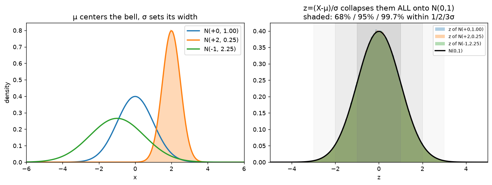
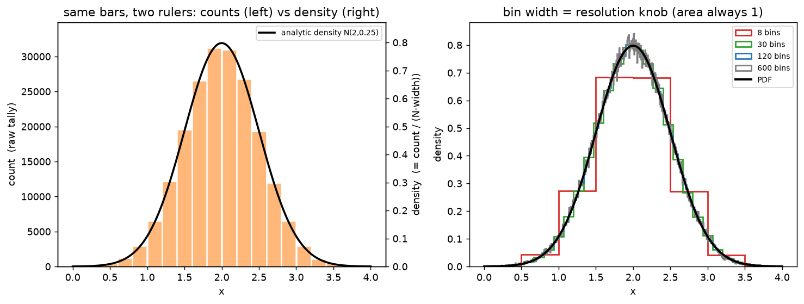
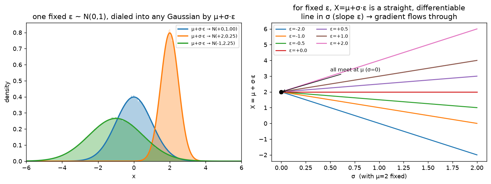

# Section 2 — The Gaussian family

A **foundations** primer (see [roadmap.md](../../roadmap.md)). Section 1 built the mean/variance
algebra that holds for **any** distribution. Now we specialize to the **normal** (Gaussian) and
collect the three payoffs the diffusion algebra runs on. The Section-1 laws still apply — but the
Gaussian adds a gift no other distribution has: **it stays Gaussian** under scaling, shifting, and
(independent) summing. That closure is what makes the forward diffusion step
`x_s = √α·x_{s-1} + √(1-α)·z` collapse to a clean closed form.

This note grows one `exp_*` at a time. Run with `python gaussian_family.py`.

---

## exp_1 — the normal: μ, σ², the bell, N(0,1), and z-scores

### A Gaussian is just two numbers

A **normal** (Gaussian) random variable is the familiar bell curve, and its _entire_ shape is pinned
down by exactly **two numbers** — the same mean and variance from Section 1:

```
  N(μ, σ²):   μ  = the mean     = where the bell is CENTERED
              σ² = the variance = how WIDE the bell is   (σ = std = spread in original units)
```

The **density** (the height of the bell at `x`) is

```
  N(x; μ, σ²) = exp( -½·((x-μ)/σ)² ) / (σ·√(2π))
```

a peak at `μ`, falling off symmetrically, and falling off _faster_ when `σ` is small. There are **no
other parameters**: fix `μ` and `σ` and you've fixed everything — the skew is 0, every higher-order
feature is determined. That two-number completeness is special (a uniform needs its two endpoints, a
general distribution needs infinitely many moments); it's the reason a Gaussian survives the algebra
so cleanly later.

Measuring the samples just recovers `μ` and `σ²` — they _are_ the mean and variance:

```
  distribution     |  μ (mean)          |  σ² (variance)
  -----------------+--------------------+-------------------
  N(+0.0, 1.00)    |  true 0.00 meas 0.00 | true 1.000 meas 1.002   ← N(0,1)
  N(+2.0, 0.25)    |  true 2.00 meas 2.00 | true 0.250 meas 0.249
  N(-1.0, 2.25)    |  true -1.0 meas -1.0 | true 2.250 meas 2.247
```

### The standard normal N(0,1), and the z-score that reaches it

The **standard normal** `N(0,1)` (`μ=0`, `σ=1`) is the _reference_ bell. Every other Gaussian is
just this one **shifted by μ and stretched by σ** — so a single operation, the **z-score**, undoes
the shift-and-stretch and maps _any_ normal back onto it:

```
  z = (X - μ) / σ     →     z ~ N(0,1)      (subtract the center, divide by the spread)
```

This is nothing but Section 1's affine laws run **backwards** — `z = (X-μ)/σ` is an affine
transform `a·X + d` with `a = 1/σ`, `d = -μ/σ`, so we just feed it through the mean and variance
laws.

**Mean → 0.** Pull the constant `1/σ` out first, then handle `X - μ` as one piece:

```
  E[ (X-μ)/σ ] = (1/σ)·E[ X - μ ]         pull the constant 1/σ out of E[·]
               = (1/σ)·( E[X] - μ )        E[X - μ] = E[X] - μ   (shift by -μ, exp_1 of Sec 1)
               = (1/σ)·( μ - μ )           E[X] = μ
               = 0
```

The middle step is worth naming on its own: **`E[X - μ] = 0`** — the expected _deviation_ from the
mean is always zero (the `+` and `−` deviations balance at the balance point). That's exactly why
variance can't just average `X - μ` (it'd be 0) and has to **square** it: `Var(X) = E[(X-μ)²]`.

**Variance → 1.** Same factor-out, but the constant comes out **squared** and the shift drops:

```
  Var[ (X-μ)/σ ] = (1/σ²)·Var[ X - μ ]     constant pulls out SQUARED  (Var(aZ)=a²Var(Z), exp_2)
                 = (1/σ²)·Var[ X ]          subtracting the constant μ doesn't change spread
                 = (1/σ²)·σ²                Var(X) = σ²
                 = 1
```

Same scale `1/σ` came out of the mean **linearly** but out of the variance **squared** (`1/σ²`), and
that `²` is what cancels the `σ²`. Same `a`, two different powers — the Section-1 asymmetry doing
real work. Standardizing three _different_ Gaussians all lands on mean 0, variance 1:

```
  from          |  mean(z) |  var(z)
  --------------+----------+--------
  N(+0.0,1.00)  |  -0.003  |  1.002
  N(+2.0,0.25)  |  -0.000  |  0.998
  N(-1.0,2.25)  |  +0.001  |  0.999
```

And because a standardized normal is _always_ the same bell, it has a fixed, memorizable mass
profile — the **68–95–99.7 empirical rule**:

```
  within 1σ:  measured 68.21%   (theory 68.27%)
  within 2σ:  measured 95.46%   (theory 95.45%)
  within 3σ:  measured 99.72%   (theory 99.73%)
```

### The picture: many bells, one standard normal



**Left:** three Gaussians — `μ` slides the peak left/right, `σ` sets the width (small `σ` → tall and
narrow, large `σ` → short and wide). **Right:** z-score each one and the three histograms fall
_exactly_ on top of one another under the single `N(0,1)` curve; the shaded bands are the 68 / 95 /
99.7% within 1 / 2 / 3σ. **One reference bell, and everything else is an affine of it** — which is
precisely the door into the next three experiments.

### Reading the y-axis: "density" is a height, not a probability

The vertical axis is **probability density**, which is _not_ probability. For a continuous variable
the probability of landing at _exactly_ `x = 2.0` is zero (infinitely many reals to hit). What's
meaningful is the probability of landing in an **interval**, and that's an **area**:

```
  P(a ≤ X ≤ b) = area under the curve from a to b  ≈  density(x) · width
```

So density is the thing you **multiply by a width** to get a probability. The **total area under
any of these curves is exactly 1** (the variable lands _somewhere_). Two objects share the panel,
both in density units so they're comparable:

- **The smooth curves** are the analytic formula on a grid — `_normal_pdf(x, μ, σ)`, i.e.
  `exp(-½((x-μ)/σ)²)/(σ·√(2π))`. At the peak (`x=μ`) the `exp` is 1, so the height is just
  `1/(σ·√(2π))`. For `N(0,1)` that's `1/√(2π) ≈ 0.399` — the blue curve tops out at ~0.4.
- **The filled histogram** is _measured_ from the 500k samples with `density=True`, which normalizes
  each bar so the total area is 1:  `bar height = count_in_bin / (total · bin_width)`. Dividing by
  the bin width is what turns raw counts into density — and why the bars sit right under the curve.

**Why the narrow orange bell is _taller_ (~0.8) than the blue one (~0.4):** all three enclose area 1,
so a bell squeezed into a narrow base must go higher to compensate. `N(2, 0.25)` has `σ=0.5` →
`1/(0.5·√(2π)) ≈ 0.798`; the wide `N(-1, 2.25)` (`σ=1.5`) is the shortest (~0.266). **Narrow ⇒ tall,
wide ⇒ short.** A density value _can_ exceed 1 (a very narrow bell peaks well above 1) — that's fine,
because it's a height. Only the **area** is capped at 1.

> **Why this framing matters for diffusion.** "Every Gaussian is an affine image of `N(0,1)`" is the
> seed of the **reparameterization trick** (exp_2): if you want a sample from `N(μ,σ²)`, don't sample
> it directly — sample one `ε ~ N(0,1)` and compute `μ + σ·ε`. That single idea separates the
> randomness (a fixed `ε`) from the parameters (`μ, σ`), and it's what lets gradients flow through
> the noise in both VAEs and diffusion.

---

## exp_2 — histogram & density, built by hand

exp_1 drew smooth density **curves** and filled **histograms** and asserted they line up. This
experiment _earns_ that — it builds a histogram from raw sample counts, so `density=True` stops being
a magic matplotlib flag and becomes arithmetic you did yourself.

### A histogram is just "bin the axis and count"

Chop the x-range `[lo, hi]` into `nbins` bins of equal `width`, then drop each sample into its slot:

```
  bin index of a sample x  =  floor( (x - lo) / width )     which slot it lands in
  count_i                  =  how many samples landed in bin i
```

That's the entire operation — no smoothness, no formula, just tallies. In code it's one line of
`floor`, a mask to drop out-of-range samples, and `torch.bincount`. We use `X ~ N(2, 0.25)` (exp_1's
narrow bell), 200k samples, `[0, 4]` into 20 bins of width 0.2.

### Counts → density: divide out N and width

Raw counts are unusable as a curve — they depend on **how many** samples you drew and **how wide**
the bins are. Two divisions fix both:

```
  density_i = count_i / (N · width)
                        │    └── kills the bin-width dependence
                        └─────── kills the sample-count dependence
```

This is _exactly_ what matplotlib's `density=True` computes. And it makes the **area = 1** payoff
fall out immediately — a probability is an area, and the total is 1:

```
  Σ_i density_i · width  =  Σ_i count_i / N  =  N/N  =  1
```

```
  bin center |  count  | count/N | density = count/(N·width)
  -----------+---------+---------+--------------------------
       1.70  |  26478  | 0.1324  |          0.6620
       1.90  |  31165  | 0.1558  |          0.7792   ← peak bin
       2.10  |  30908  | 0.1546  |          0.7728
       2.30  |  26692  | 0.1335  |          0.6673

  Σ density·width = 1.0000   (= Σcount / N = 199986/199986 = 1)
```

**Three independent routes to the same peak height** confirm the formula: hand-rolled
`density[peak] = 0.779`, the analytic PDF `N(1.9; 2, 0.25) = 0.782`, and matplotlib's own
`density=True` (plotted) — all agree. That's why exp_1 could put a _measured_ histogram and an
_analytic_ curve on the same axis: the `÷(N·width)` normalization is the bridge between them.

### Bin width is a resolution knob — but the area is always 1

Sweeping `nbins` on the _same_ samples changes only the resolution, never the area:

```
     8 bins (width 0.500):  peak density 0.683   area 1.0000    ← too coarse, peak UNDERSTATED
    30 bins (width 0.133):  peak density 0.792   area 1.0000
   120 bins (width 0.033):  peak density 0.805   area 1.0000
   600 bins (width 0.007):  peak density 0.841   area 1.0000    ← too fine, spiky noise
```

Too **few** bins blur the peak into a flat plateau (the 8-bin case reads 0.68 instead of the true
~0.80); too **many** bins and each holds so few samples that Poisson noise makes the top ragged. The
`1/width` in the normalization is what keeps the **area locked at 1** through all of it — a narrower
bin holds fewer counts but gets divided by a smaller width, and the two cancel.



**Left:** _one_ set of bars read with **two rulers** — the left axis is raw `count` (0–31k), the
right axis is `density` (0–0.8), and they differ by exactly the constant `N·width`. The black PDF
sits on the density ruler and hugs the bar tops: `÷(N·width)` is the _only_ thing standing between a
count histogram and the analytic density. **Right:** the bin-width sweep — coarse red (8 bins) is
blocky and clips the peak, fine gray (600 bins) is noisy, and every one integrates to area 1 under
the same bell.

> **Tie back to exp_1 (and forward to diffusion).** This is why "measured histogram ≈ analytic PDF"
> was allowed to be plotted together at all — and every time we later _check a claim by histogram_
> (does `μ + σ·ε` really give `N(μ,σ²)`? does a sum of Gaussians land on the predicted bell?), this
> `÷(N·width)` normalization is the quiet machinery making the measured bars and the predicted curve
> directly comparable.

---

## exp_3 — reparameterization: `X = μ + σ·ε`

exp_1's z-score **collapsed** any normal onto `N(0,1)`: `z = (X−μ)/σ`. Run that same affine map
**forwards** and you can _build_ any normal out of one standard one — the **reparameterization
trick**:

```
  ε ~ N(0,1)        one fixed, parameter-free source of randomness
  X = μ + σ·ε   →   X ~ N(μ, σ²)      (scale ε by σ, then shift by μ)
```

### The parameters come free from Section 1

No new machinery — the mean and variance drop straight out of the affine laws (`μ+σε` is `a·ε+d`
with `a=σ`, `d=μ`, on a mean-0/var-1 `ε`):

```
  E[μ + σ·ε] = μ + σ·E[ε] = μ + σ·0 = μ            (shift +μ, scale ×σ)
  Var(μ + σ·ε) = σ²·Var(ε) = σ²·1 = σ²             (variance scales by σ² — the ×a² law)
```

and the shape stays Gaussian (exp_4 proves the closure), so `X` is _exactly_ `N(μ,σ²)`. Generating
the same trio from exp_1 out of **one** `ε` confirms it:

```
  target        |  mean → μ            |  var → σ²
  --------------+----------------------+---------------------
  N(+0.0,1.00)  |  pred 0.00 meas 0.00 | pred 1.000 meas 1.000
  N(+2.0,0.25)  |  pred 2.00 meas 2.00 | pred 0.250 meas 0.250
  N(-1.0,2.25)  |  pred -1.0 meas -1.0 | pred 2.250 meas 2.251
```

Every one of those is the **same `ε`**, just relocated and rescaled — the first few draws map in
lockstep across all three targets:

```
       ε    |  0 + 1·ε  |  2 + 0.5·ε |  -1 + 1.5·ε
  ----------+-----------+------------+------------
    -1.126  |  -1.126   |   +1.437   |   -2.689
    -0.251  |  -0.251   |   +1.875   |   -1.376
    +0.849  |  +0.849   |   +2.424   |   +0.273
```

### Why this tiny identity is a cornerstone

It moves the **randomness outside the parameters**. "Sample from `N(μ,σ²)`" is a black box you can't
differentiate w.r.t. `μ` or `σ` — the randomness is tangled up inside. But once `ε` is drawn,
`X = μ + σ·ε` is a plain _deterministic_ function of `(μ,σ)`, so gradients flow straight through:

```
  dX/dμ = 1        dX/dσ = ε
```

This is the **pathwise derivative**, and it's what lets you _backprop through a sampling step_ and
train `μ, σ` (or a whole network that outputs them) — the trick behind VAEs and diffusion.



**Left:** one fixed `ε ~ N(0,1)` becomes any target bell via `μ+σ·ε`, each histogram landing on its
`N(μ,σ²)` curve. **Right:** the pathwise view — fix a handful of `ε` values and plot `X = μ + σ·ε`
against `σ` (with `μ=2`). Each is a **straight line** through `(σ=0, X=μ)` with **slope `ε`** —
deterministic and differentiable, in contrast to the non-differentiable "just sample it" black box.

> **This _is_ the diffusion forward sample.** `x_t = √ᾱ·x_0 + √(1-ᾱ)·ε` is exactly `μ + σ·ε` with
> `μ = √ᾱ·x_0` and `σ = √(1-ᾱ)`. Reparameterization is _why_ we can write the noised image as a
> differentiable function of `x_0` and `ε` — and (next section) why the whole forward chain collapses
> to one closed-form Gaussian jump.

---

_Numbers + figures: `python gaussian_family.py` (`exp_1_normal`, `exp_2_histogram_density`,
`exp_3_reparameterization`)._
