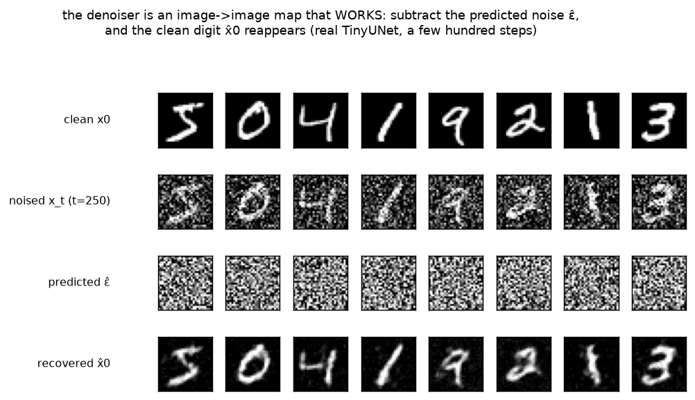

# Denoiser · exp_1 — the whole game

The training_target box settled *what* the net learns: predict the noise, `loss = MSE(ε̂, ε)`. It left
the net itself as a black box called `net(x_t, t)`. This child opens that box. Top-down: before any
"why is it shaped like that", **see the denoiser work** — run it with `python denoiser.py`
(`exp_1_whole_game`).

---

## The denoiser, in one sentence

```-
  the denoiser is a plain IMAGE-TO-IMAGE map:  (x_t, t) -> ε̂,  same 28x28 in and out.
  the only two non-obvious ingredients are SKIP CONNECTIONS and TIME CONDITIONING.
```

That's the whole shape of it. Same spatial size in and out (a per-pixel noise map), plus one scalar
`t` telling it *how noisy* the input is. Everything else — convs, pooling, normalization — is standard
image-net machinery. The two parts that are *specific to a denoiser* are the skips and the `t` input,
and those are the boxes we open next.

---

## It's an image-to-image map — the shape flow

The real model here is the parent's `TinyUNet`, **verbatim** — opening it *is* this box's job. Feed it
a batch and hook every stage; the measured shapes trace a down-then-up path (an autoencoder-shaped
"U"):

```-
  in  (B,1,28,28)  ->  out (B,1,28,28)          same spatial size    (894,401 params)

    stem  (B, 32, 28,28)  ┐ DOWN: avg-pool 28 -> 14 -> 7, channels grow 32 -> 64 -> 128
    down1 (B, 32, 28,28)  │
    down2 (B, 64, 14,14)  │        (halve resolution, double channels — the ConvNet trade)
    down3 (B,128,  7, 7)  ┘
    mid   (B,128,  7, 7)     bottleneck: 7x7 receptive field spans the WHOLE digit
    up2   (B, 64, 14,14)  ┐ UP: interpolate 7 -> 14 -> 28, CONCAT the same-res down-skip, conv
    up1   (B, 32, 28,28)  ┘
    out   (B, 1, 28,28)     bare ε̂ — NO activation (ε is unbounded ~N(0,1), squashing it is wrong)
```

Two things to file away now (each gets its own box): the **concat** on the up path is a *skip
connection* — the down side's feature map is stapled back on at the matching resolution (exp_2), and
the **down/up** shape is what lets a small conv net see the whole 28x28 digit at the 7x7 bottleneck
without a giant kernel (exp_3). The output conv has **no activation** — same reason the target box's
denoiser did: `ε` is unbounded, so a `tanh`/`sigmoid` would clip a target that legitimately runs past
±1.

---

## Untrained → it recovers nothing

Given a noise estimate `ε̂`, you can undo the forward closed form to get the implied clean image —
exactly the algebra the sampler uses:

```-
  x̂0 = (x_t − √(1−ᾱ_t)·ε̂) / √ᾱ_t
```

At init the weights are tiny, so `ε̂ ≈ 0` and `x̂0 ≈ x_t/√ᾱ_t` — just the rescaled noisy input.
Recovering the digit at `t = 250` scores:

```-
  UNTRAINED   recover MSE(x̂0, x0) = 0.6030      (high = garbage; ε̂ is ~noise, not the noise)
```

The point of reading this *before* training is the same move as the target box's "untrained ≈ 1": it
fixes the baseline, so the drop after training is meaningful and not just a nice-looking picture.

---

## Trained briefly → it denoises

Train the real U-Net for a few hundred steps (4000 images, batch 128, 300 steps — ~10s on CPU) and the
recovery flips:

```-
  step   0: train loss 1.13
  step 100: train loss 0.11
  step 299: train loss 0.05
  recover MSE(x̂0, x0):  0.6030 -> 0.0571      the net now DENOISES
```



Read the figure top to bottom, one column per digit: **clean `x0`** → **noised `x_t`** (heavy static at
`t=250`) → **predicted `ε̂`** (looks like pure noise — because that *is* what it's estimating) →
**recovered `x̂0`** (the digit is back). That last row is the whole game: an image-to-image net that,
asked only for the noise, hands you back a clean digit when you subtract it. The `ε̂` row looking like
featureless noise is the *good* outcome, not a failure — a perfect denoiser's output is exactly the
noise field that was added, which has no digit structure left in it.

---

## The map (what we open next)

| next | the question |
|---|---|
| **exp_2** | **why skips** — ablate the concat skips; down/up alone loses spatial detail → blurry `x̂0` |
| exp_3 | **why down/up** — receptive field: pooling lets a small net see the whole digit cheaply |
| exp_4 | **why `t` is an input** — same `x_t` means different things at different levels; drop `t` → worse |
| exp_5 | **how `t` enters** — sinusoidal embedding → MLP → added into every block; why sinusoidal |
| exp_6 | **the block** — residual GroupNorm→SiLU→conv: why the modern default over BatchNorm/ReLU |

Next: **exp_2 — why skips** — take out the skip connections and watch the recovered digit smear, then
see the skips carry the fine strokes across the U.

---

*Numbers + figure: `python denoiser.py` (`exp_1_whole_game`).*
