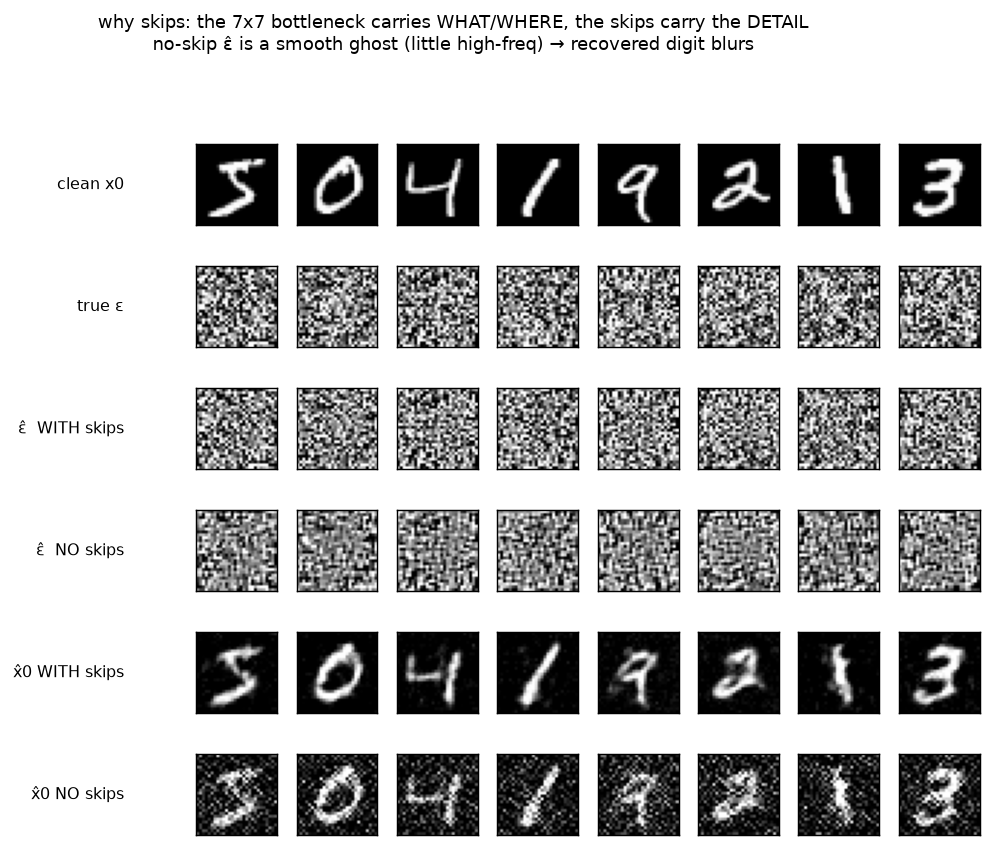

# Denoiser · exp_2 — why skip connections

exp_1 showed the denoiser is an image→image net whose up path starts from a **7×7 bottleneck** (the
28×28 input pooled down 4×). This box asks the obvious follow-up: *7×7 is far too coarse to name every
pixel of a 28×28 noise map — so how does `ε̂` come out pixel-sharp?* The answer is the two `cat` lines,
the **skip connections**. Run it with `python denoiser.py` (`exp_2_why_skips`).

---

## The puzzle, and the mechanic

```-
  down:  28x28  --pool-->  14x14  --pool-->  7x7   (the funnel: spatial detail is thrown away)
  up:     7x7  --interp-->  14x14 --interp-->  28x28
                              ▲                  ▲
                              └── cat down2 ─────┴── cat down1   ← the SKIP highways
```

Interpolating `7→14→28` invents no new detail — it just upsamples a blurry map. The fix is in the
`forward`: at each up step the same-resolution feature map from the **down** side is concatenated back
on before the conv:

```-
  u = up2( cat[ interp(mid), h2 ] )     # h2 is the 14x14 down feature map
  u = up1( cat[ interp(u),   h1 ] )     # h1 is the 28x28 down feature map
```

`h1`/`h2` still carry the full-resolution pixel structure, so the decoder gets the fine grain routed
**around** the funnel instead of through it. The `use_skips=False` flag feeds **zeros** in place of
`h1`/`h2` — same net, skips cut — so we can measure exactly what they buy.

---

## The experiment: train with vs without, from the same init

Two nets, identical starting weights, same data, same 300 steps — the *only* difference is whether the
skips are live during training and eval:

```-
  final train loss     WITH skips 0.056   |   NO skips 0.458      (8x worse without)
  recover MSE(x̂0,x0)   WITH skips 0.056   |   NO skips 0.245      (t=250 held-fixed batch)
  high-freq energy ε̂   true ε 0.870  |  skips 0.865  |  no skips 0.462
```

Two things to read off:

- **The no-skip net can't even fit the training set well** (loss plateaus ~8× higher). This is the
  honest version of the claim — it's not that we *withheld* a runtime crutch; a no-skip net *trained to
  its best* still can't reach the detail, because the 7×7 core is an information bottleneck for pixel
  structure.
- **High-frequency energy is the smoking gun.** `_hf(e)` measures the variance left after a 3×3 blur —
  i.e. how much *fine grain* an image has. Real `ε` scores 0.870; the skip net matches it (0.865); the
  no-skip net collapses to 0.462. Its `ε̂` is a smooth, low-frequency **ghost** — right general
  brightness, no pixel texture.

---

## See it



Scan the rows: **true ε** and **ε̂ WITH skips** have the same salt-and-pepper grain; **ε̂ NO skips** is
visibly smeared. Subtract each prediction and the consequence shows in the bottom two rows — **x̂0 WITH
skips** is a crisp digit, **x̂0 NO skips** is blurry and noisy. The `ε̂` texture *is* the recovered
detail: lose the grain in the noise estimate and you lose the sharp strokes in the digit.

---

## The one-liner

> **A U-Net is an autoencoder plus detail highways.** The deep down/up path decides *what* the digit is
> and *where* it sits (global, coarse); the skip connections hand the decoder the pixel-level detail the
> bottleneck had to drop. For a denoiser — whose target `ε` is *pure high-frequency* — the skips aren't
> a nicety, they carry the whole target.

Next: **exp_3 — why down/up at all** — if the bottleneck is what forces us to add skips, why pool down
to 7×7 in the first place? Because it's how a small conv net gets a **receptive field** big enough to
see the whole digit. That's the next box.

---

*Numbers + figure: `python denoiser.py` (`exp_2_why_skips`).*
