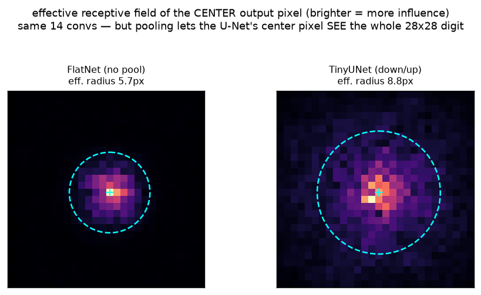

# Denoiser · exp_3 — why down/up at all

exp_2 showed the **7×7 bottleneck** is what forces us to add skip connections. That invites the obvious
push-back: *if the bottleneck is the problem, why pool down to 7×7 in the first place — why not just
stack convs at full 28×28 and skip the whole funnel?* The answer is the **receptive field**: pooling is
how a *small* conv net gets big enough sight to see the whole digit, cheaply. Run it with
`python denoiser.py` (`exp_3_why_down_up`).

---

## The puzzle

A plain 3×3 conv sees only its 8 neighbours. But to predict the noise on a stroke **consistently**, the
net has to know the *global* digit — is this little arc part of a `3` or an `8`? Local pixels alone can't
say. So a denoiser needs a **receptive field** big enough to cover all 28×28. Two ways to grow it:

```-
  stack convs at full res :  each 3x3 adds 1 pixel of reach per side  -> need ~14 layers to cross 28
  pool down               :  each pool DOUBLES a later conv's reach    -> 3 pools => 7x7 mid sees it all
```

Both *can* reach across the image on paper — but they are not equal in practice, and that gap is the
whole point of this box.

---

## The experiment: same conv count, pool vs no-pool

We compare the real **TinyUNet** (down/up, 3 pools) against a **FlatNet** built to be its fair twin —
the *same* 14 convs (stem + 6 `_Block`s + out), same channels, but **no pooling**: every block runs at
full 28×28. Same conv count means the same *theoretical* receptive field. Then we measure the
**effective** receptive field of the **center output pixel**: push a random image through, backprop from
`out[center]`, and read `|∂out_center / ∂input|` — how much each input pixel actually influences it.
It's an *architecture* property, so no training is needed; we just average over a few random inits (the
standard ERF recipe).

```-
  effective radius (RMS spread)      FlatNet  5.7 px   |   TinyUNet  8.8 px
  coverage (frac of pixels >1% max)  FlatNet 30.0%     |   TinyUNet 99.9%
```

The **coverage** line is the headline: with the *same 14 convs*, the flat net's influence stays a tight
central blob touching ~30% of the image, while the U-Net's reaches **essentially every pixel** (99.9%).

Why the divergence, given equal conv count? Because the **effective** receptive field of a plain conv
stack grows only like **√depth**, not linearly — influence random-walks outward and dilutes, so 14
full-res layers still leave the corners nearly disconnected from the center. Pooling sidesteps that: a
conv at 7×7 takes strides of 4 original pixels, so a handful of deep convs vault across the whole digit.

---

## See it



Brighter = more influence on the center output pixel; the cyan dashed circle is the effective radius.
**FlatNet** is a small hot core that fades to black well before the edges — the center pixel is blind to
the far side of the digit. **TinyUNet** has structured influence spread all the way into the corners: its
center pixel genuinely *sees* the whole 28×28.

---

## And it's cheap

Reach isn't the only win. A 3×3 conv at resolution R×R with C channels costs ~`R²·C²·9` MACs, so a conv
at **7×7 costs `(7/28)² = 1/16`** the FLOPs of one at 28×28. Pooling lets the network do its *deepest,
widest-reaching* processing at the **cheapest** resolution — big receptive field **and** a small bill.
That's why every diffusion U-Net puts most of its blocks at the low-res end.

---

## The one-liner

> **Down/up is how a small conv net buys global sight cheaply.** A flat full-res stack has the same conv
> count but its effective reach grows only ~√depth, so the center pixel never sees the far side of the
> digit; pooling doubles reach per step, so the 7×7 mid block has the whole digit in view — at 1/16 the
> FLOPs. The bottleneck (exp_2's skip motivation) is the *price* of this reach, not a mistake.

Next: **exp_4 — why t is an input.** With the architecture settled (down/up for reach, skips for detail),
the remaining non-obvious ingredient is *time conditioning*: the same `x_t` means different things at
different noise levels, so the net must be told `t`.

---

*Numbers + figure: `python denoiser.py` (`exp_3_why_down_up`).*
