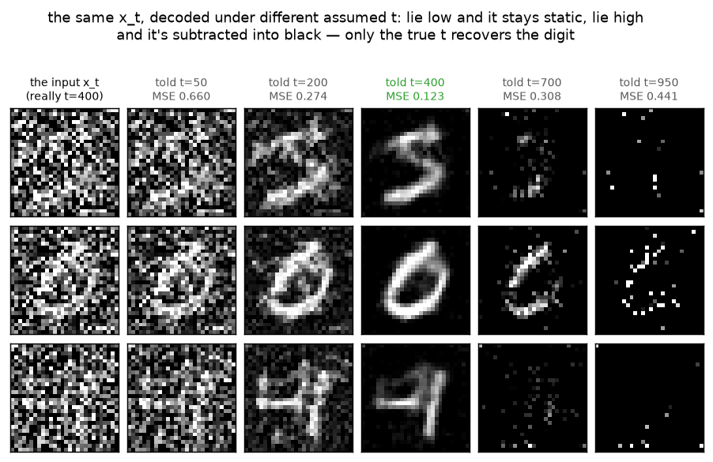
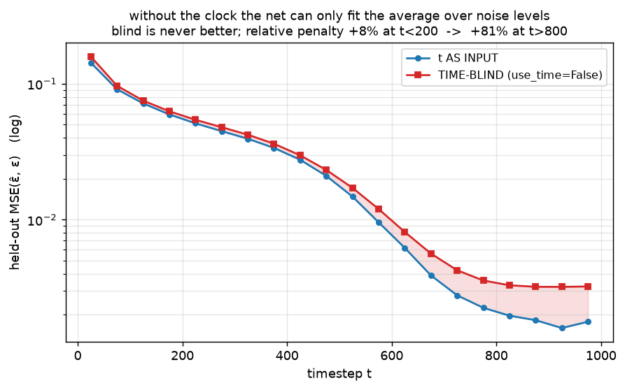
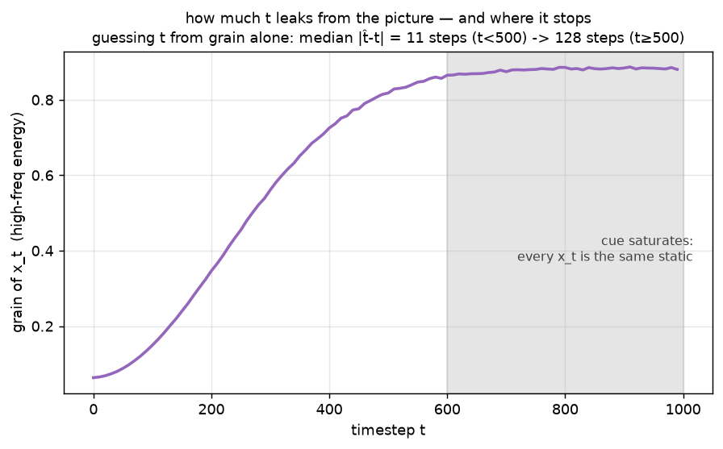

# Denoiser · exp_4 — why t is an input

The architecture is settled: **down/up** for reach (exp_3), **skips** for detail (exp_2). One
non-obvious ingredient is left — the denoiser is called as `net(x_t, t)`, not `net(x_t)`. Why does the
net need a clock at all? Run it with `python denoiser.py` (`exp_4_why_t_input`).

---

## The puzzle: the picture doesn't say how much noise is in it

The net is asked one question: *which part of this picture is the noise?* But `x_t` was built as
`√ᾱ_t·x0 + √(1−ᾱ_t)·ε`, and the **mix** depends on `t`:

```-
  t      √ᾱ_t (signal)   √(1-ᾱ_t) (noise)   noise share of the variance
   50       0.985            0.173                  3.0%
  250       0.722            0.692                 47.9%
  500       0.279            0.960                 92.2%
  750       0.057            0.998                 99.7%
  950       0.010            1.000                100.0%
```

Same picture, wildly different amounts to subtract. And because the schedule is **variance-preserving**
(`Var(x_t) ≈ 1` at every `t` — the reason for the `√` coefficients, back in the forward-process box),
the overall scale of `x_t` gives nothing away either. `t` is the missing side of the equation.

**See it.** Take one `x_t` that really came from `t=400`, feed it to the *trained* net, and lie about
`t`. The same input produces five different answers, and only the truth recovers the digit:



```-
  told t=  50:  recover MSE(x̂0,x0) = 0.662      (barely subtracts -> still static)
  told t= 200:  recover MSE = 0.274
  told t= 400:  recover MSE = 0.123   <- the truth
  told t= 700:  recover MSE = 0.308
  told t= 950:  recover MSE = 0.441      (subtracts nearly everything -> black with sparks)
```

The output is a function of `t` as much as of `x_t`. That is the ambiguity a time-blind net has to eat.

---

## What a blind net is forced to do (the derivation)

MSE has one minimizer, the conditional mean. So the best possible answer for each net is:

```-
  t-aware  optimum :  ε̂*(x_t, t) = E[ε | x_t, t]
  t-blind  optimum :  ε̂*(x_t)    = E[ε | x_t]  =  E_t[ E[ε | x_t, t] | x_t ]
```

The blind optimum is the **average of the right answers** over every `t` that could have produced this
picture. Decomposing its loss (law of total variance, conditioning on `t`):

```-
  E‖ε − E[ε|x_t]‖²  =  E‖ε − E[ε|x_t,t]‖²   +   E‖E[ε|x_t,t] − E[ε|x_t]‖²
   \___ blind ___/      \__ t-aware floor _/      \___ ≥ 0: how much the answer SWINGS with t ___/
```

So the blind net's loss is the aware net's loss **plus** a non-negative term. It can never be smaller,
and the penalty is exactly the spread of the correct answer across `t` at a fixed picture.

**Measured** — two nets, identical init, data and steps, one trained with `use_time=False`:



```-
   t        t AS INPUT    TIME-BLIND     blind is worse by
   25         0.1433        0.1589         +10.9%
  175         0.0589        0.0628          +6.6%
  475         0.0207        0.0232         +12.0%
  775         0.0020        0.0036         +74.1%
  975         0.0016        0.0032        +104.2%

  t<200   0.0910 | 0.0984    (+8.2%)
  t>800   0.0016 | 0.0032  (+103.3%)
```

The blind curve sits above the aware one *everywhere* — as the derivation says it must — and the gap
**flares open at large `t`**, where the loss roughly doubles.

---

## The honest caveat: t partly leaks from the picture

The *overall* gap is only ~10%. Why so small, if the net is flying blind? Because `t` **leaks**: as the
digit dissolves, the **grain** (high-frequency energy) of `x_t` climbs, so a blind net can estimate the
clock for itself. Guessing `t` from that single cue alone — nearest point on the calibration curve
`h(t) = mean high-freq energy of x_t` — already gets:



```-
  median |t̂ − t|    t<500:  11 steps    |    t>=500:  128 steps
  h(t):  0.063  --rises steeply-->  0.818 by t=500  --crawls-->  0.880 at t=1000
```

The cue is sharp early and **saturates past t≈600**: once the image is essentially static, every noise
level looks the same. So a time-blind net

1. **burns capacity** re-deriving what one scalar would have told it for free, and
2. is left **genuinely blind exactly where the cue dies** — hence `+103%` at `t>800` versus `+8%` at
   `t<200`.

That large-`t` region is not a corner case: it is where **every sampling trajectory starts**, with a
thousand steps for the error to compound.

---

## The one-liner

> **`t` disambiguates the question.** The same `x_t` is plausible at many noise levels; without `t` the
> MSE-optimal answer is the *average over levels*, which by the law of total variance costs exactly the
> spread of the true answer across `t`. The picture leaks `t` well enough at small `t` to hide most of
> the damage — but the cue saturates past `t≈600`, so the blind net doubles its loss precisely where
> sampling begins.

Next: **exp_5 — how t enters.** Given that the net must be told `t`, the design question is the shape of
that channel: sinusoidal embedding → small MLP → **added into every block**, rather than one integer
concatenated at the input.

---

*Numbers + figures: `python denoiser.py` (`exp_4_why_t_input`). Exact digits drift a little run to run
(GPU nondeterminism); the pattern — blind never better, ~2x worse at large `t` — is stable.*
