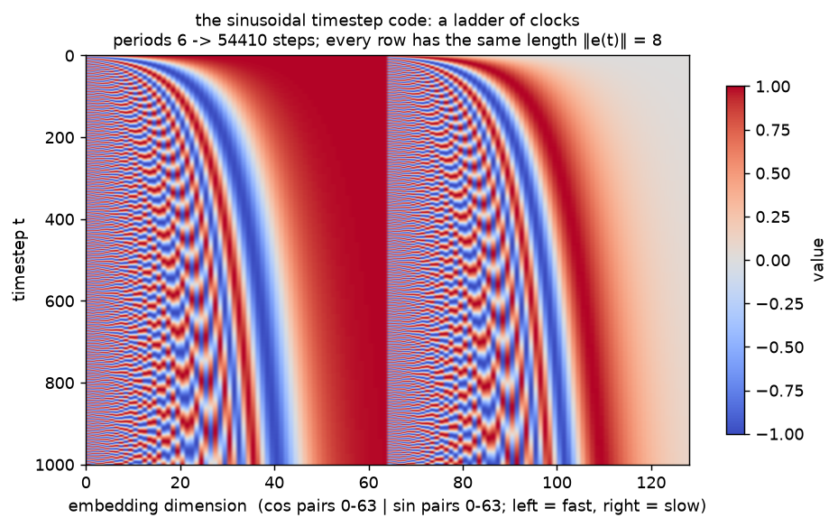
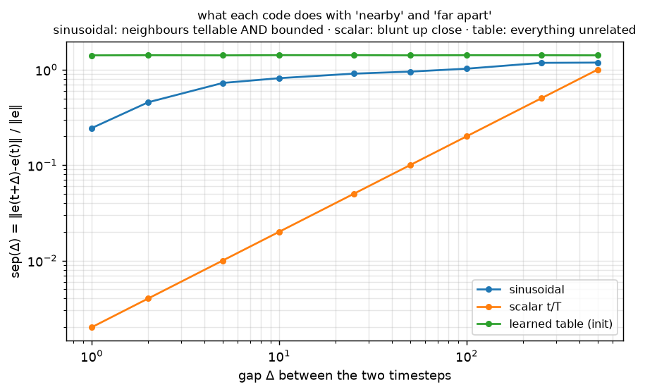
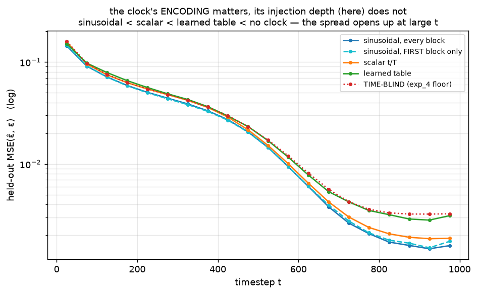

# Denoiser · exp_5 — how t enters

exp_4 settled *that* the net must be told `t`. This box is the design question: **what shape should that
channel have?** The real net does

```-
  t (an integer)  --sinusoidal-->  (B,128)  --small MLP-->  temb  --ADDED into every block-->
```

Three steps, two of which look arbitrary until you measure them: **why sinusoids**, and **why inject
everywhere**. Run it with `python denoiser.py` (`exp_5_how_t_enters`).

---

## What the code is: a ladder of clocks

`timestep_embedding` is 64 cos/sin pairs at geometrically spaced frequencies
`ω_k = 10000^(−k/64)` — periods spanning four orders of magnitude:

```-
  pair k        0      16      32      48      63
  period      6.3    62.8   628.3    6283   54410   steps
```

Fast pairs resolve **neighbouring** `t`; slow pairs say where we are in the run **overall**. Read `t`
at every scale at once, in one 128-vector:



## Why sinusoids: two properties, derived

Write `e(t) = [cos(ω_k t) ; sin(ω_k t)]`, `k = 1..K`. Both facts come straight out of
`cos(a)cos(b) + sin(a)sin(b) = cos(a−b)`:

```-
  ‖e(t)‖²    = Σ_k [cos²(ω_k t) + sin²(ω_k t)]                     = K        for EVERY t
  e(t)·e(t') = Σ_k [cos(ω_k t)cos(ω_k t') + sin(ω_k t)sin(ω_k t')] = Σ_k cos(ω_k·(t−t'))
```

So the code has **constant length** (`‖e(t)‖ = √64 = 8` — no timestep arrives louder than another) and
an inner product that depends **only on the gap** `t−t'`, not on where in the run you are. A
shift-invariant ruler: no preferred origin, no dead zone. Measured at gap 10, the dot product is
`42.820` with a standard deviation of `3e−05` across all `t` — flat, exactly as the algebra says.

---

## Compared to the two obvious alternatives

Define a scale-free measure of how a code separates two levels `Δ` steps apart:

```-
  sep(Δ) = mean_t ‖e(t+Δ) − e(t)‖ / mean_t ‖e‖
```



```-
   Δ                  1       2       5      10      25      50     100     250     500
  sinusoidal      0.244   0.455   0.725   0.814   0.908   0.953   1.023   1.177   1.185
  scalar t/T      0.002   0.004   0.010   0.020   0.050   0.100   0.200   0.501   1.001
  learned table   1.411   1.416   1.411   1.418   1.417   1.412   1.416   1.415   1.412
```

- **sinusoidal** — neighbours are already `0.24` apart (tellable) while the curve *saturates* around 1
  (far is far, but not unboundedly far). Resolution **and** boundedness, at every scale.
- **scalar `t/T`** — `0.002` at `Δ=1`, **122× blunter** up close. It is also **rank-1**: every `t` is the
  same direction at a different length, so the net must resolve the noise level by magnitude alone,
  through a nonlinearity, at a scale (`t/T ≤ 1`) far below its own activations.
- **learned `nn.Embedding` table** — `≈1.41` at *every* `Δ`: all 1000 rows mutually orthogonal. No notion
  of "nearby `t`" exists, so nothing learned at `t` transfers to `t±1`; each row is fit alone.

---

## Does it matter? Train each clock

Same U-Net body, same init, same data, same 1000 steps — only the clock differs. The `use_time=False`
net from exp_4 is included as the floor (no clock at all):



```-
  variant                        train loss    held-out loss at t>800
  sinusoidal, every block          0.0282           0.0016   (1.00x)
  sinusoidal, FIRST block only     0.0282           0.0017   (1.06x)
  scalar t/T                       0.0307           0.0019   (1.21x)
  learned table                    0.0312           0.0030   (1.89x)
  TIME-BLIND (exp_4 floor)         0.0314           0.0033   (2.05x)
```

The ordering is the geometry, read back out as loss — and it opens up at large `t`, exactly where exp_4
showed the picture stops leaking `t`. The striking one is the **learned table**: 128k extra free
parameters buy almost nothing over being *blind* (`1.89x` vs `2.05x`). It moved only **1.1%** from its
random init — each row saw ~128 gradients and rows never help each other. Sinusoids hand the net that
structure for free, before step one.

---

## Where it enters: an honest null result

`inject="all"` vs `inject="first"` land **on top of each other** (`1.00x` vs `1.06x`, within run-to-run
noise). With 6 blocks at 28×28 the net can simply carry the clock forward in its activations, so at this
scale injecting once is free. Injecting everywhere is still the standard, for reasons this net is too
small to show:

- each block's **GroupNorm re-centers** its input, eroding a constant that was added only once;
- at real depth and resolution, a **transported** clock costs channels in *every* block it crosses;
- it becomes decisive when the time signal **modulates** normalization rather than being added — FiLM /
  AdaLN, which is how **DiT** conditions (a later subtopic).

---

## The one-liner

> **The clock's encoding is doing real work; its injection depth (at this size) is not.** Sinusoids give
> a constant-length, shift-invariant, multi-scale code where neighbouring timesteps are close but
> distinguishable — so the net generalizes across `t` for free. A raw scalar is 122× blunter up close and
> rank-1; a free embedding table starts fully orthogonal and, at this budget, is barely better than
> having no clock at all.

Next: **exp_6 — the block.** The last unopened piece: why `GroupNorm → SiLU → conv` twice with a
residual is the modern default, and what BatchNorm / ReLU / a plain conv stack cost instead.

---

*Numbers + figures: `python denoiser.py` (`exp_5_how_t_enters`). The code-geometry numbers are exact;
the training numbers drift slightly run to run (GPU nondeterminism), the ordering does not.*
