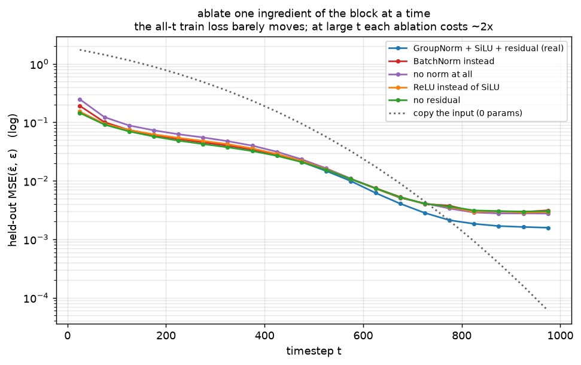
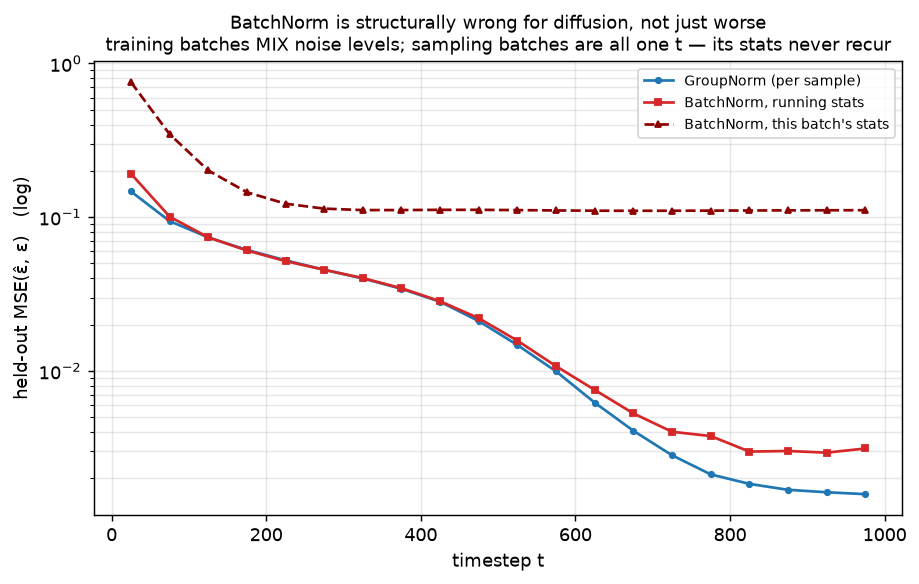

# Denoiser · exp_6 — the block

Every box is open except the unit the whole net is built from. `_Block` is:

```-
  h = conv1(SiLU(GroupNorm(x)))      norm:       keep activations at a usable scale
  h = h + temb_proj(temb)            the clock:  exp_5, added per channel
  h = conv2(SiLU(GroupNorm(h)))      activation: smooth, signed, non-saturating
  return h + skip(x)                 residual:   a free pass-through path
```

Three defaults to justify — the **norm**, the **activation**, the **residual**. Ablate exactly one at a
time, keep everything else fixed. Run it with `python denoiser.py` (`exp_6_the_block`).

---

## The ablations



```-
  variant                              train loss    held-out loss at t>800
  GroupNorm + SiLU + residual (real)     0.0292          0.0017   (1.00x)
  BatchNorm instead                      0.0333          0.0030   (1.79x)
  no norm at all                         0.0429          0.0033   (1.94x)
  ReLU instead of SiLU                   0.0307          0.0030   (1.80x)
  no residual                            0.0289          0.0030   (1.81x)
```

Read the two columns against each other. On **train loss** the story is muted — `no residual` even ties
the real block, and ReLU is 5% behind. At **large `t`** every single ablation costs about **2x**. The
aggregate number hides it because large-`t` losses are tiny in absolute terms and the average is
dominated by small `t`. Which raises the obvious question: why is large `t` where the block's design
shows up at all?

---

## Why the gaps live at large t

As `ᾱ_t → 0`, `x_t → ε`. So at large `t` the best possible answer is `ε̂ = x_t` — **nearly the identity
map**. How cheaply an architecture can express a pass-through is exactly what a residual highway
decides, and how faithfully it preserves scale is what the norm and activation decide. That is why the
variants are indistinguishable at `t=200` and 2x apart at `t=900`.

The zero-parameter rule "copy the input" makes the point, and it is humbling:

```-
  t=  25   copy-the-input  1.73875   |   the real block 0.14711
  t= 475   copy-the-input  0.09497   |   the real block 0.02099
  t= 775   copy-the-input  0.00208   |   the real block 0.00212
  t= 975   copy-the-input  0.00006   |   the real block 0.00158
```

**Past t≈775 our trained net is worse than copying its input.** Not a bug in the block — a consequence of
uniform-`t` training: every `t` gets equal weight in the loss, but the achievable loss out there is
~`1e-4`, so those timesteps contribute almost no gradient and the region stays underfit. Fixing that is
what loss-weighting schemes (min-SNR and friends) are for — a later subtopic. It does not hurt samples
much *here* because the first few reverse steps from pure noise are forgiving, but it is the honest
reading of that flat tail in the figure.

---

## Why not BatchNorm — it's structurally wrong, not just worse

BatchNorm's statistics are shared **across the batch**. In diffusion, a training batch **mixes noise
levels** (`t` is random per example) while a sampling batch is **all one `t`**. So the statistics the net
normalized under during training never recur when you use it. Both of BN's modes fail:



```-
   t         GroupNorm    BN, running stats    BN, this batch's stats
   25         0.1471          0.1917                 0.7558
  225         0.0523          0.0518                 0.1223
  475         0.0210          0.0220                 0.1116
  725         0.0028          0.0040                 0.1101
  975         0.0016          0.0031                 0.1110
```

- **running stats** (eval mode): a single average over *all* `t`, so it is wrong at every `t` — 1.8x at
  large `t`.
- **this batch's stats** (train mode, uniform-`t` batches as sampling produces): **66x** — the statistics
  of an all-one-`t` batch are nothing the net ever saw. Flat ~0.11 across the whole schedule.

**GroupNorm sidesteps both.** It normalizes each *sample* over channel groups, so a forward pass never
depends on what else is in the batch — batch size 1 behaves exactly like batch size 128, and mixed-`t`
training matches uniform-`t` sampling. There is nothing left to get wrong. (`no norm at all` is the worst
variant overall — `0.0429` train — so the norm itself is earning its place; the argument is only about
*which* norm.)

---

## SiLU over ReLU

`SiLU(x) = x·σ(x)` is smooth and lets small negatives through instead of hard-zeroing them. The target
here is **unbounded and signed** (`ε ~ N(0,1)`), and the loss is a smooth regression, so the derivative
discontinuity and dead half-plane of ReLU cost real accuracy: `1.80x` at large `t`, `+5%` on train loss,
for identical parameter count. GELU behaves the same way; the modern default is "some smooth gated
activation", and which one you pick barely matters.

---

## What the residual buys here

Measured at **init**, no training — the fraction of the gradient that survives the trip from the last
block back to the stem, averaged over 6 random nets:

```-
  with residual  0.098    |    without  0.047     (2.1x)
```

A 2x edge, not a rescue: at 6 blocks nothing vanishes either way. The classic
deep-net-optimization argument for residuals needs *real* depth — dozens of blocks, which is what
production U-Nets have. At this size the residual earns its keep on **expressivity** instead: the
pass-through path is what makes `ε̂ ≈ x_t` cheap, which is precisely the large-`t` gap above.

---

## The one-liner

> **The block is three cheap decisions that all pay off in the same place.** GroupNorm because
> normalization statistics must not depend on the batch (a diffusion batch mixes noise levels; a sampling
> batch does not) — BatchNorm loses 1.8x with running stats and 66x with batch stats. SiLU because the
> target is smooth, signed and unbounded. The residual because at large `t` the right answer is nearly a
> pass-through. Each is worth ~2x at large `t` and nearly invisible in the all-`t` average.

---

That closes the **denoiser**: an image→image net with **down/up** for cheap global sight (exp_3),
**skips** for pixel detail (exp_2), **told `t`** because the noise level is otherwise ambiguous (exp_4),
via a **multi-scale sinusoidal code** (exp_5), built from **residual GroupNorm/SiLU blocks** (exp_6).
Back to the parent `ddpm.py`, where the remaining box is **sampling** (the reverse process).

---

*Numbers + figures: `python denoiser.py` (`exp_6_the_block`). Training numbers drift slightly run to run
(GPU nondeterminism); the orderings and the ~2x large-`t` pattern are stable.*
