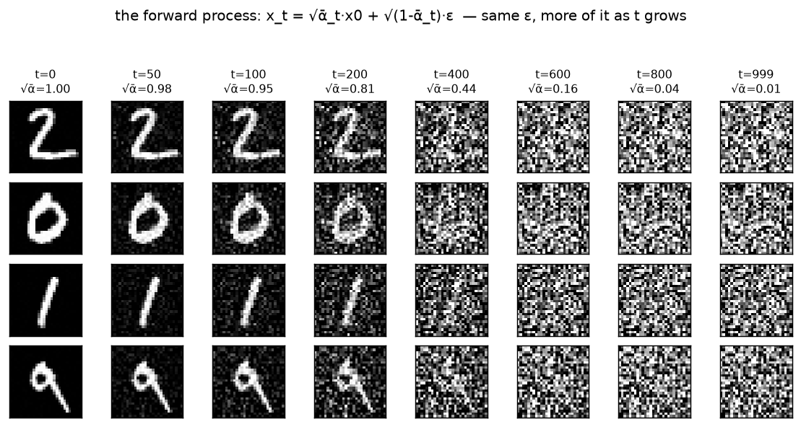

# Forward process · exp_1 — the whole game (watch a digit dissolve)

Digging into the first box of the ddpm whole game: **how a clean digit becomes the noise the U-Net
learns to predict.** It's a big enough topic to get its own folder — so we run the *same* move here,
fractally: **see the whole thing work first, then break it apart.** This page is the whole game.
Run it with `python forward_process.py` (`exp_1_dissolve`).

> Top-down, one level down. The parent track led with "train a model, sample digits." This dig-in
> leads with "watch a digit dissolve," then each later `exp_*` opens one box of *this* picture.

---

## The one equation

The entire forward process is a single closed form — noise a digit `x0` to **any** level `t` in one
jump:

```
  x_t = √ᾱ_t · x0  +  √(1-ᾱ_t) · ε        ε ~ N(0, I)
```

That's it. `x0` is the digit, `ε` is fresh Gaussian static, and `ᾱ_t` (`alpha_bar`) is a **dial**
that sets the mix: `t=0` → all signal (`ᾱ=1`), `t=T` → all noise (`ᾱ≈0`). We don't derive anything
yet — we just *run* it and watch.

---

## The payoff — a digit melting into static

Four held-out digits, noised across growing `t` with the **same ε per row** (so the only thing
changing left→right is *how much* of it we mix in):



Read it left to right: at `t=0` the digit is clean (`√ᾱ=1.00`); by `t=200` it's grainy but legible
(`√ᾱ=0.81`); by `t=400` it's mostly gone (`√ᾱ=0.44`); by `t=999` it's indistinguishable static
(`√ᾱ=0.01`). Same `ε` the whole row — the digit just fades under it as the dial turns.

That fade **is** the forward process. The network we trained in the parent track learns to undo one
step of it.

---

## The map (what we open next)

Three things happened in that grid; each gets its own box:

| next | opens | the question |
|---|---|---|
| **exp_2** | the **schedule** | what `ᾱ_t` actually is (`β→α→ᾱ`), and why it collapses so fast |
| exp_3 | the **√** / closed form | is the one-jump really the same as noising step-by-step? why `√`? |
| exp_4 | the **endpoint** | why is the last column pure `N(0,I)` regardless of the digit? |
| exp_5 | the **schedule shape** | the cosine schedule — declare the `ᾱ` curve, back-solve `β` |
| exp_6 | **linear vs cosine** | which keeps signal alive longer? (a second dissolve makes it visible) |
| exp_7 | the **SNR** | `ᾱ/(1-ᾱ)` = the difficulty at each `t`; the axis modern schedules use |

The training **target** (predict `ε`) and batch assembly aren't here — they're the next box up, the
parent's exp_3 "training target" dig-in. This folder stays about the forward process itself.

Next: **exp_2 — the schedule.** The dial `ᾱ_t` is a *cumulative product* of per-step survival
factors; see how tiny per-step nibbles compound into that fast collapse.

---

*Figure: `python forward_process.py` (`exp_1_dissolve`).*
