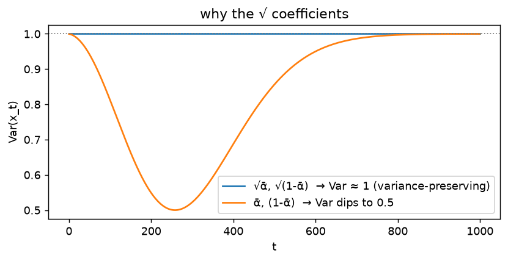

# Forward process · exp_3 — the √ / closed form

Third box. exp_1 dissolved a digit and exp_2 read the schedule — **both used the one-line jump**
`x_t = √ᾱ·x0 + √(1-ᾱ)·ε` without justifying it. This page pays that debt: (A) the one-jump really
*is* the slow step-by-step noising, and (B) that's *why* the coefficients are square roots. Run it
with `python forward_process.py` (`exp_3_closed_form`).

---

## The two forms

```
  step-by-step (the "real" process):  x_s = √α_s · x_{s-1} + √(1-α_s) · z_s     T times, fresh z each
  one jump      (what we actually use): x_t = √ᾱ_t · x0    + √(1-ᾱ_t) · ε        one ε, straight to t
```

If these agree we never have to run the T-step loop — we can make a training example at any noise
level in one line. They can't match *sample-by-sample* (each draws its own random noise), but they
match **in distribution**.

---

## (A) one-jump == step-by-step

Noise a fixed `x0 = 2.0` to level `t`, 40k times, **two ways** — `forward_iterative` (the T-step
loop) and `forward_closed_form` (the single jump) — and read off each one's empirical mean/std.
The two procedures should match each other, and both should match the analytic `√ᾱ·x0` / `√(1-ᾱ)`:

```
   t |  iter mean  iter std | closed mean closed std |   √ᾱ·x0   √(1-ᾱ)
 -----+----------------------+------------------------+-----------------
  100 |   +1.8919   0.3240   |    +1.8947   0.3239    |  +1.8922   0.3238
  500 |   +0.5554   0.9574   |    +0.5541   0.9639    |  +0.5578   0.9603
  999 |   +0.0179   1.0069   |    +0.0157   0.9996    |  +0.0127   1.0000
```

All three columns agree at every `t`. The loop and the jump land in the **same distribution**, and
it's exactly the `√ᾱ·x0` / `√(1-ᾱ)` the derivation predicts — so we skip the loop. That one-liner is
exactly what exp_1's dissolve drew and what the parent's train loop uses.

**Where the `√ᾱ·x0` and `√(1-ᾱ)` come from** — read them straight off the closed form. `x0` is a
fixed constant and `ε ~ N(0,1)` (so `E[ε]=0`, `Var(ε)=1`); mean and variance are then just the two
rules "shift/scale a constant" and "scaling by `c` multiplies variance by `c²`":

```
  x_t = √ᾱ·x0 + √(1-ᾱ)·ε ,   ε ~ N(0,1)

  MEAN:  E[x_t] = E[ √ᾱ·x0 + √(1-ᾱ)·ε ]
               = √ᾱ·x0 + √(1-ᾱ)·E[ε]        (linearity; √ᾱ·x0 is constant)
               = √ᾱ·x0 + √(1-ᾱ)·0
               = √ᾱ·x0                        ← the "√ᾱ·x0" column

  VAR:   Var(x_t) = Var[ √ᾱ·x0 + √(1-ᾱ)·ε ]
                  = Var[ √(1-ᾱ)·ε ]           (adding the constant √ᾱ·x0 shifts, doesn't spread)
                  = (√(1-ᾱ))²·Var[ε]          (scaling by c → ×c² on variance)
                  = (1-ᾱ)·1 = 1-ᾱ
  STD:   √Var(x_t) = √(1-ᾱ)                    ← the "√(1-ᾱ)" column
```

So the closed form is `x_t ~ N(√ᾱ·x0, 1-ᾱ)`: the coefficient in front of `x0` **is** the mean, and
the coefficient in front of `ε` **is** the std. (The `√α_s`/`√(1-α_s)` of a single step are the same
statement for one hop; the derivation below is what lets us fold `T` hops into this one.)

**Why they collapse into one jump** — compose two steps, leaning on three facts:

```
DERIVATION — the forward closed form  x_t = √ᾱ·x0 + √(1−ᾱ)·ε

  Single step:  x_s = √α_s·x_{s−1} + √(1−α_s)·z_s,   z_s ~ N(0,I) iid.
  Three facts:
     (A) scaling by c scales VARIANCE by c²;
     (B) independent Gaussians added → their variances add;
     (C) a sum of Gaussians is Gaussian.
  Compose two steps:
      x_1 = √α₁·x0 + √(1−α₁)·ε₁
      x_2 = √α₂·x_1 + √(1−α₂)·ε₂
          = √α₂·[√α₁·x0 + √(1−α₁)·ε₁] + √(1−α₂)·ε₂
          = √(α₁α₂)·x0 + [ √α₂·√(1−α₁)·ε₁ + √(1−α₂)·ε₂ ]
  The bracket is two independent zero-mean Gaussians; by A+B its variance is
      α₂(1−α₁) + (1−α₂)  =  1 − α₁α₂,
  and by C it is one fresh noise √(1−α₁α₂)·ε.  With ᾱ₂ = α₁α₂:
      x_2 = √ᾱ₂·x0 + √(1−ᾱ₂)·ε.
  By induction over t (each step folds one more α in):
      x_t = √ᾱ·x0 + √(1−ᾱ)·ε,   ᾱ = ∏_{s≤t} α_s.        [QED]
```

The T steps fold into one because each step just multiplies one more `α` into `ᾱ`.

---

## (B) why the coefficients are √ — variance preservation

Take unit-variance data `x0 ~ N(0,1)` and measure `Var(x_t)` across `t`:

```
   t |    ᾱ      1-ᾱ   | Var(x_t)
 -----+----------------+---------
    0 |  0.9999  0.0001 |  1.0122
  250 |  0.5214  0.4786 |  1.0152
  500 |  0.0778  0.9222 |  0.9958
  750 |  0.0033  0.9967 |  1.0024
  999 |  0.0000  1.0000 |  0.9994
```

`Var(x_t)` is pinned at **≈ 1 for every `t`**. The reason (`x0 ⊥ ε`, `Var(x0)=1`):

```
Why the coefficients are square roots — VARIANCE PRESERVATION (Var(x0)=1, x0 ⟂ ε):
      Var(x_t) = (√ᾱ)²·Var(x_0) + (√(1−ᾱ))²·Var(ε)
               =    ᾱ   ·   1      +    (1−ᾱ)   ·   1
               =    ᾱ + (1 − ᾱ)
               =    1                        ← for EVERY t
signal power ᾱ + noise power (1−ᾱ) always sum to 1, so x_t neither blows up nor
fades — it just trades signal for noise.
```

That's the whole point of the square roots: it's the **squares** that must sum to 1 (signal power
`ᾱ` + noise power `1-ᾱ`), so the **amplitudes** have to be `√ᾱ` and `√(1-ᾱ)`. Pick `ᾱ` and `1-ᾱ`
directly instead and the variance would be `ᾱ²+(1-ᾱ)²` — still 1 at the two ends, but **sagging to
0.5 in the middle** (at `ᾱ=0.5`), so `x_t`'s scale would wobble across `t`:

```
   t |   ᾱ    | √-coeffs Var | (ᾱ,1-ᾱ) Var  = ᾱ²+(1-ᾱ)²
 -----+--------+--------------+--------------------------
    0 | 0.9999 |    1.00      |    1.00
  250 | 0.5214 |    1.01      |    0.50   ← sags
  500 | 0.0778 |    1.00      |    0.86
  999 | 0.0000 |    1.01      |    1.01
```

The same two columns over the whole schedule — the √ choice flat at 1, the naive choice caving in:



The blue line is dead flat at `1`. The orange one bottoms out at exactly `0.5` around `t≈250` —
precisely where `ᾱ ≈ 0.5`, so `ᾱ²+(1-ᾱ)² = 0.25+0.25`. It only recovers to `1` at the ends because
one term dominates there. So `x_t` under the naive coefficients would *shrink* mid-schedule and the
network would see inconsistent input scales across `t`; the √ is what removes that wobble.

With the √, the squares are exactly `ᾱ` and `1-ᾱ`, which sum to 1 at **every** `t` — no wobble;
`x_t` just **trades signal for noise** as `t` climbs. (This is called a *variance-preserving*
process; it's also why `x_T` sits at a clean unit-variance `N(0,I)` — the next box.)

---

## What's next

Next: **exp_4 — the endpoint.** We've seen the *mean* is `√ᾱ·x0`; as `ᾱ → 0` that signal term
vanishes, so `x_T` becomes pure `N(0,I)` *regardless of `x0`* — the universal starting point that
lets generation begin from static.

---

*Numbers: `python forward_process.py` (`exp_3_closed_form`).*
