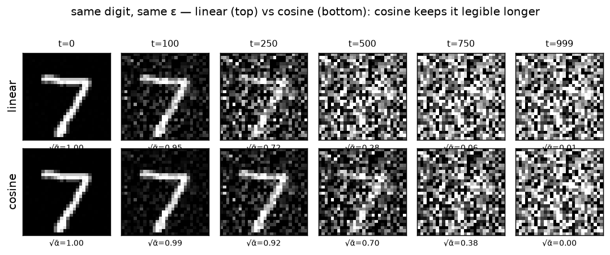

# Forward process · exp_6 — linear vs cosine

Sixth box. exp_5 built the cosine schedule; this one puts it **beside** the linear schedule and
shows why the shape matters — first as a number (wasted steps), then as a picture (a second
dissolve). Run it with `python forward_process.py` (`exp_6_linear_vs_cosine`).

---

## The two `ᾱ` curves

`ᾱ_t` = fraction of the original signal still present at step `t`:

```
   t |  linear ᾱ    √ᾱ  |  cosine ᾱ    √ᾱ
 -----+-----------------+----------------
    0 |  0.99990  0.9999 |  0.99996  1.0000
  100 |  0.89514  0.9461 |  0.97158  0.9857
  200 |  0.65635  0.8102 |  0.89776  0.9475
  300 |  0.39401  0.6277 |  0.78563  0.8864
  400 |  0.19357  0.4400 |  0.64599  0.8037
  500 |  0.07780  0.2789 |  0.49229  0.7016
  600 |  0.02557  0.1599 |  0.33933  0.5825
  700 |  0.00687  0.0829 |  0.20187  0.4493
  800 |  0.00151  0.0388 |  0.09314  0.3052
  900 |  0.00027  0.0164 |  0.02362  0.1537
  999 |  0.00004  0.0064 |  0.00000  0.0000
```

Linear plunges: by `t=500` it's at `ᾱ ≈ 0.08` (signal `√ᾱ ≈ 0.28`), essentially gone. Cosine at the
same `t` is still `ᾱ ≈ 0.49` (`√ᾱ ≈ 0.70`) — the digit is clearly there. Cosine keeps signal alive
through the whole middle of the schedule.

---

## Measure it: wasted steps

Call a step **"nearly pure noise"** when `ᾱ < 0.01` (signal `√ᾱ < 0.1`) — there's almost nothing
left to remove, so denoising there teaches the network little:

```
  linear: crosses ᾱ<0.01 at t=673  →  327/1000 steps (33%) contribute little
  cosine: crosses ᾱ<0.01 at t=935  →   65/1000 steps ( 6%) contribute little
```

Linear **wastes a third of its steps** on near-identical static, *and* rushes the informative middle
(where signal and noise coexist). Cosine holds signal deep into the schedule, so far more of its
1000 steps land in the useful regime. This is the *Improved DDPM* motivation — and it matters **most
for small images** like MNIST (28×28), which have little redundancy, so linear's fast early
destruction wipes out structure almost immediately.

---

## See it: the second dissolve

Same digit, same `ε` in every cell — the only difference between the rows is the schedule:



- **`t=250`** — linear (`√ᾱ=0.72`) is already grainy; cosine (`√ᾱ=0.92`) is still crisp.
- **`t=500`** — linear (`√ᾱ=0.28`) is mush; cosine (`√ᾱ=0.70`) still clearly shows the `7`.

This is the callback to exp_1's dissolve, now as a comparison: the *whole game* figure returns to
make the schedule-shape argument visible.

---

## What's next

One box left, and it's a reframing rather than new mechanics:

- **exp_7 — SNR**: repackage `ᾱ` as `SNR(t) = ᾱ/(1-ᾱ)` = the per-`t` *difficulty* the model faces
  (high = easy, low = hard), and `log-SNR` — the coordinate modern schedules (EDM, flow matching)
  are actually defined in. The wasted-steps story reappears there as an uneven spread of difficulty.

Next: **exp_7 — SNR.**

---

*Numbers + figure: `python forward_process.py` (`exp_6_linear_vs_cosine`).*
