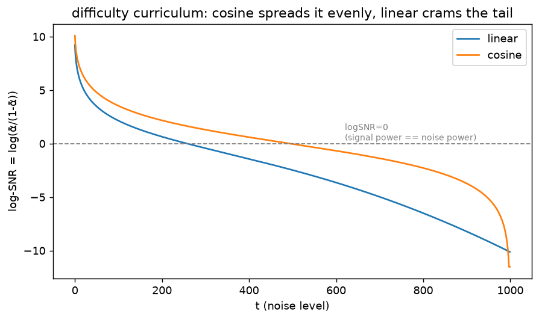

# Forward process · exp_7 — signal-to-noise ratio

Last box. Everything so far tracked `ᾱ` (signal fraction). SNR just repackages it as a **ratio** —
the single number for *how hard denoising is* at each `t` — and `log-SNR` is the coordinate the
modern schedules (EDM, flow matching) are actually written in. Run it with
`python forward_process.py` (`exp_7_snr`).

---

## SNR = ᾱ, repackaged as difficulty

From the closed form `x_t = √ᾱ·x0 + √(1-ᾱ)·ε`, the signal amplitude `√ᾱ` has power `ᾱ` and the noise
amplitude `√(1-ᾱ)` has power `1-ᾱ`. Their ratio is the signal-to-noise ratio:

```
  SNR(t) = signal power / noise power = ᾱ / (1 - ᾱ)
```

- **high SNR** (small `t`) = barely noised = **easy** to denoise
- **low SNR** (big `t`) = mostly noise = **hard**

Since each training step draws a random `t`, the schedule decides how the training budget spreads
across difficulties.

```
   t |   lin SNR  lin logSNR |   cos SNR  cos logSNR
 -----+----------------------+---------------------
    0 | 9997.341       9.21  | 24243.53      10.10
  100 |    8.537       2.14  |    34.181      3.53
  250 |    1.090       0.09  |     5.489      1.70
  500 |    0.084      -2.47  |     0.970     -0.03
  750 |    0.003      -5.71  |     0.167     -1.79
  900 |    0.000      -8.22  |     0.024     -3.72
  999 |    0.000     -10.12  |     0.000    -19.84
```

---

## Two reads

**(1) SNR is just `ᾱ` in disguise** — a monotonic repackaging — but it *names the difficulty*
directly: `t=0` is `SNR ~1e4` (almost clean, trivial), `t=T` is `SNR ~1e-5` (basically noise,
maximally ambiguous).

**(2) log-SNR is the honest axis.** SNR crosses ~9 orders of magnitude, so only in log does the
schedule look like a smooth ramp. The key landmark is `logSNR = 0` ⇔ `SNR = 1` ⇔ **signal power ==
noise power** = the "halfway hard" point. 

`SNR = ᾱ/(1-ᾱ) = 1` means `ᾱ = 1-ᾱ`, i.e. `ᾱ = 0.5`, so
signal power is `0.5` and noise power is `1 - 0.5 = 0.5` — `SNR = 0.5 / (1 - 0.5) = 1`:

```
  linear crosses logSNR=0 at t ≈ 259   → front-loads the easy end, then crams the tail at extreme low SNR
  cosine crosses logSNR=0 at t ≈ 496   → a far more even ramp
```

---

## See it



Cosine's log-SNR is a near-straight, **even ramp** — training difficulty spreads evenly across `t`.
Linear drops fast through the easy (high-SNR) end, then **flatlines deep negative**: a long tail of
redundant, near-identical hard steps. It's the **same wasted-steps story from exp_6**, now in the
coordinate that matters: modern schedules skip choosing `β` at all and place their steps *directly
along log-SNR*.

---

## 🎉 forward_process — complete

That closes the **first box of the ddpm whole game**. The full arc:

| exp | box | takeaway |
|---|---|---|
| 1 | whole game (dissolve) | a digit melts into static via `x_t = √ᾱ·x0 + √(1-ᾱ)·ε` |
| 2 | the schedule | `ᾱ = ∏α` is the dial; tiny per-step nibbles compound |
| 3 | the √ / closed form | one-jump == step-by-step; √ ⇒ variance-preserving |
| 4 | the endpoint | `x_T ~ N(0,I)` regardless of `x0` → why sampling starts from noise |
| 5 | cosine schedule | declare `ᾱ = cos²`, back-solve `β` |
| 6 | linear vs cosine | cosine wastes 6% vs 33% of steps; dissolve makes it visible |
| 7 | SNR | `ᾱ/(1-ᾱ)` = per-`t` difficulty; log-SNR = the modern coordinate |

**Next box up** (back in the parent `ddpm.py`): the **training target** (exp_3) — why the net
predicts `ε`, the `ε`-vs-`x0` weighting, and how a training batch is assembled. That's where the
forward process feeds into learning.

---

*Numbers + figure: `python forward_process.py` (`exp_7_snr`).*
