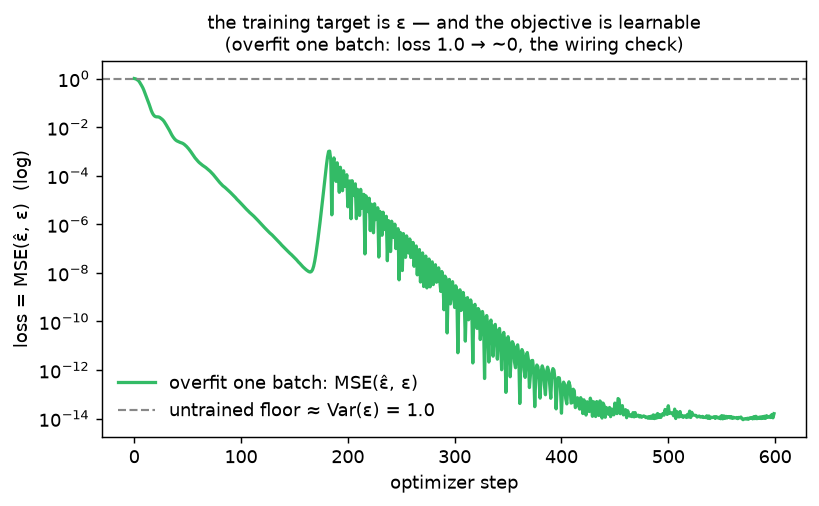

# Training target · exp_1 — the whole game

The parent's train loop was three lines: noise a batch, ask the net for the noise, minimize MSE.
This child opens the **middle line** — *what* does the net output, and why is that the right thing
to regress on? Top-down: before any "why", **see the objective work**. Run it with
`python training_target.py` (`exp_1_whole_game`).

---

## The target, in one sentence

```
  given a noised image x_t and its noise level t,  PREDICT THE NOISE ε that was added.
  ε̂ = net(x_t, t)          loss = MSE(ε̂, ε)          ε ~ N(0, I)
```

That's the entire supervised problem. **No reverse process, no sampling, no custom loss** — it's
plain regression from `(x_t, t)` to a target image `ε`. The label is *known* because *we* added the
noise ourselves when we built `x_t`.

---

## One training batch, assembled

Exactly what the parent's loop does each step (`make_training_pair`):

```
  x0   (B,1,28,28)   clean digits in [-1,1]
  t    (B,)          a RANDOM level per example  →  one batch spans many noise levels
  ε    (B,1,28,28)   fresh N(0,1)  ← this is the LABEL
  x_t  (B,1,28,28) = √ᾱ_t·x0 + √(1-ᾱ_t)·ε        (the forward closed form from exp_2)
```

The net sees only `x_t` and `t`; it never sees `x0` or `ε` directly — it has to *infer* `ε`. Two
plumbing points worth naming now (each gets more later): **per-example `t`** means a single batch
mixes easy and hard levels (balanced gradients), and `ᾱ_t` is reshaped to `(B,1,1,1)` so it
broadcasts over pixels — the classic forgotten-reshape bug.

---

## Wiring check A — untrained ≈ 1.0

```
  untrained output      : mean +0.0000, std 0.0304    ← what the fresh net actually emits
  untrained loss vs ε   = 1.0074
  predict-all-zeros loss= 1.0066     (= E‖ε‖² = Var(ε) ≈ 1)
```

Look at *what the net outputs*, not just its loss: at init the weights are tiny, so the output is
**≈ 0** — centered at zero, spread `~0.03` (≈30× smaller than `ε`'s unit scale). The fresh net *is*
the zero-predictor, and that's *why* its loss matches `predict-all-zeros ≈ 1.0`.

The chain matters, because "loss ≈ 1" and "outputs ≈ 0" are **not** the same statement. For any
constant prediction `c` against `ε ~ N(0,1)`:

```
  loss(c) = E[(c − ε)²] = E[c² − 2cε + ε²]
                        = c² − 2c·E[ε] + E[ε²]              (linearity; c is constant)

  now use  E[ε²] = Var(ε) + (E[ε])²  :

                        = c² − 2c·E[ε] + (E[ε])² + Var(ε)
                        = (c − E[ε])²  +  Var(ε)            (first three terms = a perfect square)
                          └── bias² ──┘   └ irreducible ┘

  with ε ~ N(0,1):  E[ε] = 0,  Var(ε) = 1   →   loss(c) = c² + 1
```

so `c = 0` scores exactly `1` (the floor), `c = 1` (all ones) scores `2`, etc. **Only predicting the
mean of `ε` (which is 0) hits 1** — lots of other guesses score *above* it. The mean/std readout is
the conclusive evidence that the untrained net really is sitting at that `c ≈ 0` minimum, not some
other constant. **Any loss below 1 is genuinely-learned noise structure** (the parent's `0.0235` =
~98% of the variance explained). *Why the floor is exactly `Var(ε)` is exp_2.*

---

## Wiring check B — overfit one batch → 0

Take that one 16-image batch and let a tiny net **memorize** it (same batch every step):

```
  step   0: 1.01e+00
  step 100: 7.21e-06
  step 300: 3.75e-10
  step 599: 1.59e-14      ← 1.0 → ~0
```



The loss falls from the floor to **machine zero**. This is *the* standard "is my training code even
correct?" test: a model with enough capacity **must** be able to fit a single batch. If the target
were miswired — wrong `ε`, the `(B,1,1,1)` reshape missing, an activation squashing the unbounded
output — this collapse *could not happen*. It does, so the pipeline is sound. (The little bump near
step 170 is just Adam's momentum overshooting, then recovering — normal.)

Note the tiny `_TinyDenoiser` here is a stand-in — flatten → MLP → 784, output **bare** (no
activation, since `ε` is unbounded `~N(0,1)`). The real U-Net and *why it's shaped that way* is the
exp_4 box; this box is only about the **target**.

---

## The map (what we open next)

| next | the question |
|---|---|
| **exp_2** | why is the untrained floor **exactly 1**? the predict-nothing baseline |
| exp_3 | the target isn't unique — we could predict `x0` instead; `ε` and `x0` pin each other down |
| exp_4 | **why ε wins**: it's `~N(0,1)` at *every* `t` — a scale-stable target; `MSE_x0` swings, `MSE_ε` doesn't |
| exp_5 | even with `ε`, per-`t` difficulty varies — ties back to the SNR curve (forward_process exp_7) |

Next: **exp_2 — why ≈ 1** — pin down the do-nothing floor as `E‖ε‖² = Var(ε) = 1`, and see that
"below 1" is the only thing that counts as learning.

---

*Numbers + figure: `python training_target.py` (`exp_1_whole_game`).*
