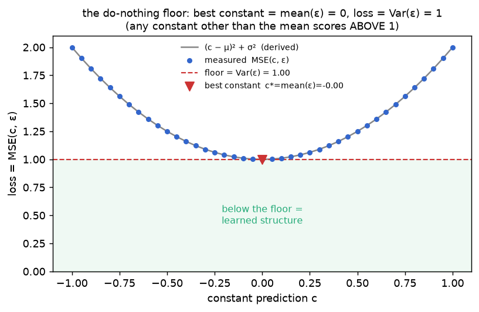

# Training target · exp_2 — why the floor is ≈ 1

exp_1 left one loose end: the untrained net (and the all-zeros predictor) both scored `≈ 1.0`, and we
called it "the floor" without saying why *one*. This box pins it down. Nothing here is about diffusion
— it's the "predict the average" baseline every regression has. Run it with `python training_target.py`
(`exp_2_why_one`).

---

## The floor = Var(target)

The floor is the loss of the best you can do **without looking at the input** — the best single
constant `c` to predict for the target `Y`. Under squared error:

```
  E[(c − Y)²] = E[c² − 2cY + Y²]
              = c² − 2c·E[Y] + E[Y²]           linearity of E
              = c² − 2c·μ + (σ² + μ²)          E[Y²] = Var + mean² = σ² + μ²
              = (c − μ)² + σ²                  complete the square    (μ = E[Y], σ² = Var Y)
```

That last line is a parabola in `c`, minimized at **`c = μ` (the mean)** with minimum value **`σ²`
(the variance)**. So:

> **best constant = the mean of the target; the loss it leaves behind = the variance of the target.**

For the diffusion target `Y = ε ~ N(0, I)`: `μ = 0`, `σ² = 1`, so the floor is **exactly 1**.

---

## Measured — the parabola is real

Sweep the constant `c` and measure `MSE(c, ε)` on a big pile of `ε`; it lands on the derived
`(c−μ)²+σ²` to 4 decimals:

```
    c      MSE(c,ε)   (c-μ)²+σ²
  -1.00    1.9998     1.9998
  -0.20    1.0396     1.0396
  +0.20    1.0395     1.0395
  +1.00    1.9994     1.9994
  best constant c* = -0.00 (= mean ε)   loss = 0.9996 (= var ε = the floor)
```



The minimum sits at `c = 0` (the mean) at height `Var(ε) = 1`. Note **only the mean hits the floor** —
`c = ±1` costs `2`, any other constant is *above* 1. This is why, in exp_1, "outputs ≈ 0" and "loss
≈ 1" are the *same event*: the untrained net had drifted to the one constant (`0`) that minimizes the
loss, and paid exactly the variance for it.

---

## "Below 1" = learned structure

Because the floor is `Var(ε) = 1`, the loss doubles as a **fraction-of-variance-explained** meter:

```
  R² = 1 − loss / Var(ε)          the parent's trained loss 0.0235  →  97.6% of ε's variance explained
```

Any loss **below 1** means the net used the input `(x_t, t)` to do better than guessing the average —
genuinely learned noise structure. At or above 1, it learned nothing.

---

## The one bit that's special to ε

`ε ~ N(0, I)` is unit-variance at **every** `t` — so this floor is a flat `1` across *all* noise
levels. That's a big part of why `ε` is such a convenient target: the loss means the same thing at
`t=1` and `t=999`. If we regressed on `x0` instead, the floor would be `Var(x0)` — a different number,
and (after the schedule scales it) one that *moves with `t`*. That contrast is the real reason we pick
`ε`, and it's what exp_3 → exp_4 build to.

Next: **exp_3 — ε or x0?** — the target isn't unique. Given `(x_t, t)`, the noise `ε` and the clean
image `x0` determine each other exactly; we isolate `ε = (x_t − √ᾱ·x0)/√(1−ᾱ)` and recover it to
`~1e-7`.

---

*Numbers + figure: `python training_target.py` (`exp_2_why_one`).*
