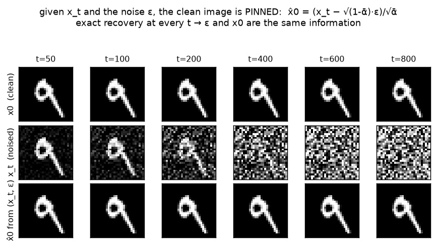

# Training target · exp_3 — ε or x0?

We've been saying "the target is ε" as if it were forced. It isn't. This box shows the target isn't
unique: given `(x_t, t)`, the noise `ε` and the clean image `x0` **determine each other exactly**, so
"predict ε" and "predict x0" are the *same job* written in two coordinate systems. Run it with
`python training_target.py` (`exp_3_eps_or_x0`).

---

## One equation, three quantities

The forward closed form is a single linear equation tying `(x_t, x0, ε)` at a given `t`:

```
  x_t = √ᾱ_t · x0 + √(1-ᾱ_t) · ε
```

Fix any two and the third is pinned. The net only ever sees `(x_t, t)`, so the useful rearrangements
solve for the two candidate targets:

```
  ε  = (x_t − √ᾱ_t · x0) / √(1-ᾱ_t)          the ε-parametrization
  x0 = (x_t − √(1-ᾱ_t) · ε) / √ᾱ_t           the x0-parametrization
```

Each is just algebra on the closed form. So a network that predicts `ε` can be converted to one that
predicts `x0` (and vice versa) **analytically, with no retraining** — you already have `x_t` and `t`.

---

## Measured — the interconversion is exact

Take a real batch, build `x_t`, then recover each target from the other:

```
  ε  from (x_t, x0):  max|ε̂ − ε|   = 1.07e-06
  x0 from (x_t, ε) :  max|x̂0 − x0| = 1.64e-05
```

Machine-zero (float32) — the two targets carry the **same information**. Nothing is lost or gained by
choosing one over the other; it's a choice of *parametrization*.

---

## See it — ε rebuilds the whole image

Reconstruct the clean digit from `x_t` and the **true** `ε` at each `t` (`x̂0 = (x_t − √(1-ᾱ)·ε)/√ᾱ`):



The bottom row (recovered `x̂0`) matches the top row (clean `x0`) at **every** `t` — including `t=800`,
where the middle row `x_t` is visually pure static. Knowing the noise `ε` that was mixed in is exactly
as good as knowing the image: subtract it off, undo the scaling, and the digit is back.

**Caveat worth carrying forward:** recovery is exact here only because `ε` is the *true* noise. With a
network's `ε̂`, the `1/√ᾱ` factor at high `t` (where `√ᾱ → 0`) *amplifies* any error in `ε̂` — which is
why one-shot `x̂0` from a real net is mush at high `t`, and why sampling is iterative. That's a
**sampling** concern (exp_5 of the parent), not a target one; it doesn't change that ε and x0 are
interchangeable *targets*.

---

## So why ε?

If they're interchangeable, the choice must come down to something *other* than information — how
**easy each is to learn** and how **well-conditioned the loss** is across `t`. That's the whole point
of the next box, and it's where exp_2's aside pays off: `ε` has variance `1` at every `t` (flat floor),
while `x0`'s effective target scale swings with the schedule.

Next: **exp_4 — why ε wins** — `ε ~ N(0,1)` is a scale-stable target at every `t`; measured,
`MSE_ε = SNR(t)·MSE_x0`, so `MSE_x0` swings wildly across `t` while `MSE_ε` stays flat. That's the
reason DDPM regresses on ε.

---

*Numbers + figure: `python training_target.py` (`exp_3_eps_or_x0`).*
