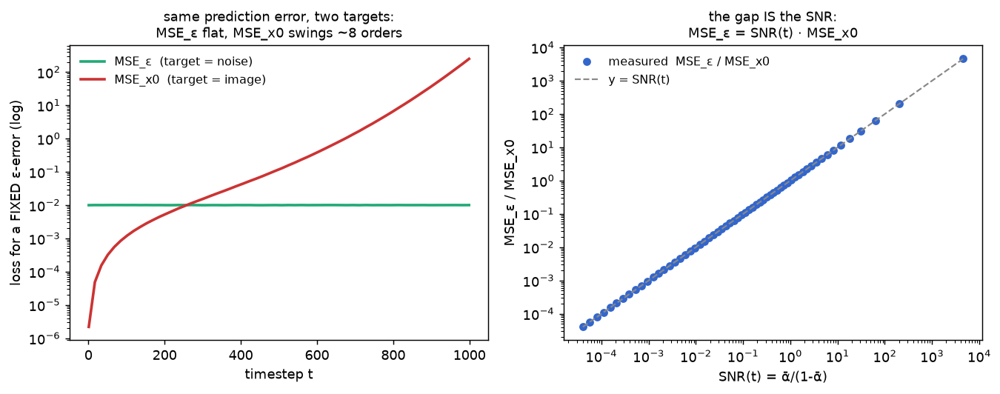

# Training target · exp_4 — why ε wins

exp_3 showed ε and x0 are interchangeable *targets*. So why does DDPM regress on **ε**? Because they
are not the same *objective*: the loss you minimize differs by a factor of `SNR(t)`, and that factor
makes ε the scale-stable, well-conditioned choice. This is the payoff of the whole box. Run it with
`python training_target.py` (`exp_4_why_eps`).

---

## One error, two losses, off by SNR(t)

Take the exp_3 rearrangement `x0(ε) = (x_t − √(1-ᾱ)·ε)/√ᾱ` and perturb the prediction `ε → ε̂ = ε + δ`,
with `x_t` and `t` held fixed. Plug `ε̂` into the same formula and subtract the truth:

```
  x̂0     = x0(ε̂) = (x_t − √(1-ᾱ)·(ε + δ)) / √ᾱ         predicted x0 uses ε̂
  x0      = x0(ε)  = (x_t − √(1-ᾱ)· ε     ) / √ᾱ         true x0 uses ε

  x̂0 − x0 = [ (x_t − √(1-ᾱ)(ε+δ)) − (x_t − √(1-ᾱ)ε) ] / √ᾱ     subtract; x_t cancels
           = [ −√(1-ᾱ)·δ ] / √ᾱ                                 only the δ term survives
           = −(√(1-ᾱ)/√ᾱ) · δ                                   linear in the error δ
```

Now turn those per-element *errors* into the *losses*. MSE is just the mean of the squared error
over all pixels/examples. `MSE_ε` is by definition the mean of `(ε̂ − ε)² = δ²`, and `MSE_x0` the mean
of `(x̂0 − x0)²`. Squaring the line above, the coefficient `(√(1-ᾱ)/√ᾱ)` is a **constant at fixed `t`**,
so it pulls straight out of the average:

```
  MSE_ε  = mean[ (ε̂ − ε)² ]  = mean[ δ² ]

  MSE_x0 = mean[ (x̂0 − x0)² ] = mean[ (√(1-ᾱ)/√ᾱ)² · δ² ]        square the mapping
         = (1-ᾱ)/ᾱ · mean[ δ² ]                                  constant (given t) leaves the mean
         = (1-ᾱ)/ᾱ · MSE_ε  =  MSE_ε / SNR(t)                    SNR(t) = ᾱ/(1-ᾱ)  (forward_process exp_7)

  ⇔  MSE_ε = SNR(t) · MSE_x0
```

The **same** prediction error costs `SNR(t)×` more when scored as an ε-error than as an x0-error — and
`SNR(t)` sweeps ~8 orders of magnitude across `t`.

---

## Measured — MSE_ε flat, MSE_x0 explodes

Inject the **same** fixed-scale error (`std 0.1`, so `MSE_ε ≈ 0.01`) at every `t`, and score it in both
targets:

```
    t     MSE_ε    MSE_x0      ratio      SNR(t)
     1   0.0100      0.0000    4545.67     4545.67
   203   0.0100      0.0054       1.84        1.84
   406   0.0100      0.0442       0.23        0.23
   609   0.0100      0.4273       0.02        0.02
   999   0.0100    248.3988       0.00        0.00

  MSE_ε: flat at ~0.010.   MSE_x0: swings 2.2e-06 → 2.5e+02  (10^8 ×).
  ratio == SNR(t) to max rel-err 2.4e-07.
```



Left: the two objectives across `t` — `MSE_ε` is a flat line, `MSE_x0` climbs 8 orders. Right: the
ratio lands exactly on `y = SNR(t)` across 8 decades. The algebra is not approximate; it's an identity.

---

## Why that makes ε the target

**ε is a fixed-scale target.** `ε ~ N(0, I)` at *every* `t`, so the network's output always aims at the
same unit-Gaussian scale, and **plain (unweighted) MSE puts every noise level on equal footing**. That
is DDPM's "simple" loss:

```
  L_simple = E_{t, x0, ε}  ‖ ε̂(x_t, t) − ε ‖²        no per-t weighting
```

**x0 with plain MSE would be badly weighted.** Since `MSE_x0 = MSE_ε / SNR`, minimizing unweighted
`MSE_x0` is the same as minimizing `MSE_ε` *weighted by `1/SNR`* — it multiplies the high-`t` terms
(where `SNR → 0`) by a huge factor and the low-`t` terms by ~0. The gradient would be dominated by a
handful of high-noise steps chasing a near-unrecoverable image, and the informative low-noise steps
would barely register. (Equivalently, unweighted `MSE_ε` = `SNR`-weighted `MSE_x0` — it quietly
**down**weights the easy high-SNR terms relative to the true ELBO, which is exactly the reweighting Ho
et al. found gives better samples.)

So the choice isn't about information (exp_3 — they tie) — it's about **conditioning**: ε gives a
fixed O(1) target and a loss that's balanced across `t`.

---

## One caveat (→ exp_5)

"MSE_ε is flat" here means the *target scale* is fixed and we held the injected error constant. It does
**not** mean a *trained* net achieves the same loss at every `t` — some noise levels are intrinsically
harder to denoise than others. That per-`t` difficulty (and why the training curve is front-loaded) is
the last box.

Next: **exp_5 — per-t difficulty** — measure a trained net's ε-loss as a function of `t`: near the
irreducible floor at low `t` (ε buried under signal), near-trivial at high `t` (`x_t ≈ ε`) — the SNR
curriculum from forward_process exp_7, seen from the loss side.

---

*Numbers + figure: `python training_target.py` (`exp_4_why_eps`).*
