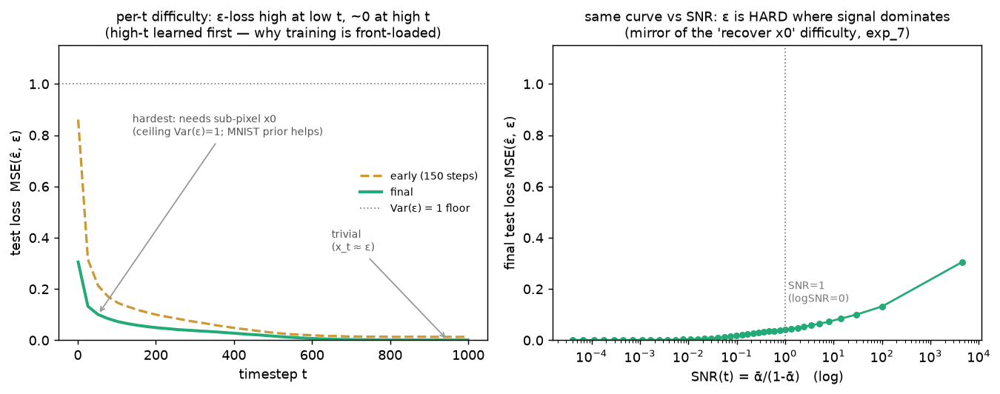

# Training target · exp_5 — per-t difficulty

We picked ε and saw its loss is well-scaled across `t` (exp_4). Last piece: a *trained* net does **not**
score the same loss at every `t` — some noise levels are intrinsically harder to predict ε at, and that
shape is why the training curve is front-loaded. Run it with `python training_target.py`
(`exp_5_per_t_difficulty`). It trains a compact denoiser (the parent's `TinyUNet`, borrowed just to read
loss off — the U-Net itself is the parent's next box) for a few epochs.

---

## The two ends

From `x_t = √ᾱ·x0 + √(1-ᾱ)·ε`:

- **High `t` (low SNR):** `√ᾱ → 0`, `√(1-ᾱ) → 1`, so `x_t ≈ ε`. Predicting ε is nearly copying the
  input — **trivial**, loss → ~0.
- **Low `t` (high SNR):** ε enters `x_t` only through the tiny `√(1-ᾱ)·ε` term, and to recover it the net
  must estimate `x0` to **sub-pixel** precision: `ε = (x_t − √ᾱ·x0)/√(1-ᾱ)`, so any x0 error is
  amplified by `1/√(1-ᾱ) → ∞`. **Hardest** region. Its ceiling is `Var(ε) = 1` (what you'd get if x0
  were unpredictable); on structured data the net leans on the image prior and beats that — but it's
  still the top of the curve and the slowest to fall.

So per-`t` ε-loss **decreases with `t`** — the exact mirror of the "recover x0" difficulty in
forward_process exp_7 (high SNR = signal easy to see = noise hard to isolate). It's the same trade-off
as exp_4's `MSE_ε = SNR·MSE_x0`: **ε is hard exactly where x0 is easy.**

---

## Measured — early vs final

Snapshot the per-`t` test loss after 150 steps (half-baked) and at the end:

```
    t      SNR(t)     early     final
     1     4545.67    0.861     0.305      ← hardest; slow to improve
   205        1.80    0.099     0.049
   410        0.22    0.046     0.026
   615        0.02    0.019     0.006
   999        0.00    0.014     0.001      ← trivial (x_t ≈ ε)
```



**Left:** loss is high at low `t`, ~0 at high `t`. Crucially, the *early* curve is **already near-zero
at high `t`** while still ~0.86 at low `t` — the easy high-noise half is learned almost immediately; the
low-`t` (high-SNR) end is what training grinds on. **Right:** the same final loss against `SNR(t)` — flat
and near-zero until `SNR ≈ 1` (logSNR = 0), then climbing as signal starts to dominate.

---

## Why the training curve is front-loaded

The average loss the parent printed is the mean of this curve over `t`. Since the whole high-`t` half
collapses to ~0 within the first few hundred steps, the **average drops steeply early**; what's left is
the hard high-SNR end, which improves slowly — so the curve **plateaus on that end**. The front-loaded
shape isn't the optimizer stalling; it's easy timesteps banking fast and hard ones dragging.

(This is also the motivation, later, for **loss weighting / non-uniform `t` sampling** — spend more of
the training budget on the hard, sample-quality-critical `t` instead of re-learning the trivial ones.
DDPM's `L_simple` samples `t` uniformly and eats the imbalance; the improved schedules don't.)

---

## Box complete

The training target, end to end:

| box | the point |
|---|---|
| exp_1 | the target is **ε**, loss = `MSE(ε̂, ε)` — plain regression; overfit-one-batch wiring check |
| exp_2 | the untrained floor is `Var(target) = 1` — best constant = the mean |
| exp_3 | ε and x0 are **interchangeable** targets (the closed form ties them; recover to ~1e-6) |
| exp_4 | but ε is the **scale-stable objective**: `MSE_ε = SNR·MSE_x0`, so plain MSE on ε is balanced |
| exp_5 | per-`t` difficulty follows **SNR** — hard at low `t`, trivial at high `t` — front-loading training |

Next box up is the parent's **exp_4 — the denoiser**: why the model is a U-Net (down/up + skips) and
why the timestep `t` must be one of its inputs.

---

*Numbers + figure: `python training_target.py` (`exp_5_per_t_difficulty`).*
