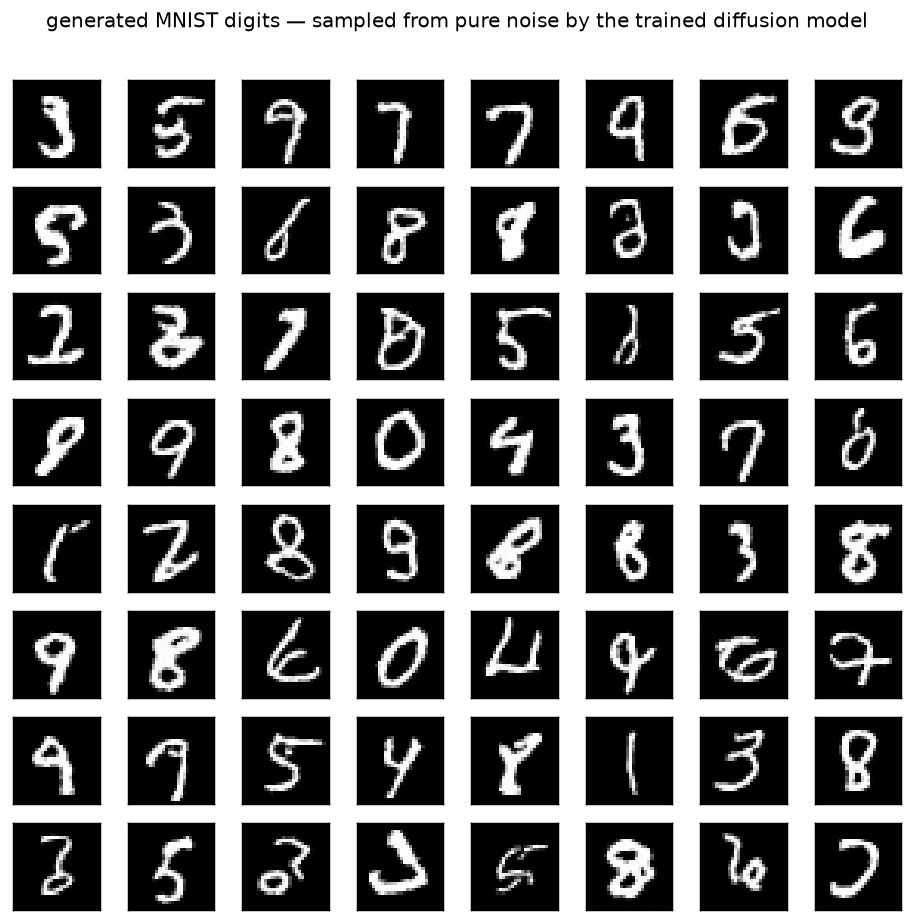

# Diffusion · exp 1 — the whole game

Top-down: before we derive anything, let's **train a diffusion model and watch it invent MNIST digits
from pure noise**. By the end of this page you have a working generator and a rough mental map of how
it works. *Why* each part is shaped the way it is — that's exp_2 onward, each opening one box of *this
exact pipeline*. Run it with `python ../ddpm.py` (`exp_1_whole_game`).

---

## The pipeline in one breath

Three ideas, that's the whole thing:

```
  forward   add noise on a schedule:   x_t = √ᾱ_t · x0 + √(1-ᾱ_t) · ε        (x0 -> gradually static)
  model     train a net to predict the noise:   ε̂ = TinyUNet(x_t, t)          (loss = MSE(ε̂, ε))
  reverse   start at pure noise, subtract a little predicted noise each step  (noise -> a new digit)
```

- **forward** — pick a random image `x0` and a random timestep `t`, and mix in Gaussian noise `ε` in
  the exact proportion the schedule says (`ᾱ_t` = how much original signal survives to step `t`).
  Big `t` → mostly noise. This is *cheap and closed-form*; no network involved (exp_2).
- **model** — a small U-Net that sees the noisy image `x_t` **and** the timestep `t`, and predicts
  the noise `ε` that was added. That's the only thing we train (exp_3 = why predict ε; exp_4 = the
  U-Net).
- **reverse** — to *generate*, start from `x_T` = pure `N(0,1)` noise and walk backward: at each step
  the model says "here's the noise I think is in this," we remove a bit of it, and after `T` steps a
  clean digit is left (exp_5 = why this must be iterative).

---

## The model in one breath

```python
class TinyUNet(nn.Module):          # predicts ε from (x_t, t)
    # time:  sinusoidal(t) -> MLP -> temb       (tells the net HOW noisy the input is)
    # down:  stem 1->32 (28) -> block ->14 -> block ->7   (channels grow as space shrinks)
    # mid:   block at 7x7
    # up:    7 ->14 ->28, each concatenating the matching down-map (skip connections)
    # out:   -> 1 channel = the predicted noise image, same shape as the input
```

Rough narration, no rigor yet: it's the CNN downsample pyramid from the `new/cnn/` track (28→14→7,
channels up), made **symmetric** — a matching up-path that returns to 28×28 — with **skip
connections** so fine detail isn't lost, and the **timestep `t` injected into every block** so the
net knows how much noise to expect. Built from residual blocks + GroupNorm (the standard diffusion
minimum; the *why* is exp_4). **894,401 params.**

---

## Watch it learn

Train on all 60k MNIST images. Each step: noise a batch at random timesteps, ask the net for the
noise, minimize `MSE(ε̂, ε)`:

```
epoch  1: train loss 0.0848
epoch  4: train loss 0.0301
epoch  8: train loss 0.0267
epoch 12: train loss 0.0253
epoch 18: train loss 0.0240
epoch 24: train loss 0.0235
```

The loss is the mean squared error between predicted and true noise. A net that predicted *nothing*
(all zeros) would score ≈ `Var(ε) = 1.0` (unit Gaussian noise); **0.0235 means it explains ~98% of
the noise's variance** — it has genuinely learned what noise looks like at every level. (That "≈ 1.0
untrained" is a wiring check we make precise in exp_3.) We sample from an **EMA** copy of the weights
— a running average that gives noticeably crisper digits than the raw weights.

---

## The payoff — digits from static

Start from 64 tensors of pure Gaussian noise, run the reverse process, and:



Every one of these was **invented** — sampled from noise, not copied from the dataset. They're clearly
`3`s, `5`s, `9`s, `0`s, `8`s… with the odd malformed one. From `MSE(ε̂, ε)` and a pile of static, a
generative model. That's diffusion.

---

## The map (what we open next)

| next | opens | the question |
|---|---|---|
| exp_2 | the **forward** process | how exactly do we add noise? `x_t = √ᾱ·x0 + √(1-ᾱ)·ε`, the schedule, why `√` |
| exp_3 | the **training target** | why predict the noise `ε` (not the image)? why `MSE`? |
| exp_4 | the **denoiser** (U-Net) | why down/up + skips, and why the timestep `t` must be an input |
| exp_5 | **sampling** | why generation is iterative — one-shot from noise is mush |

Next: **exp_2 — the forward process**: watch a single digit dissolve into noise across `t`, and see
why the coefficients are square roots (variance-preserving).

---

*Numbers + figure: `python ../ddpm.py` (`exp_1_whole_game`).*
