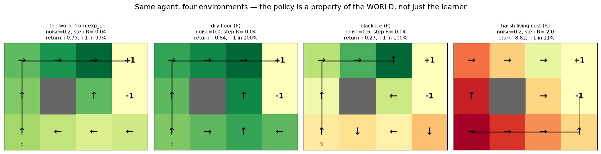

# environment (dig-in) · exp 1 — the whole game: the environment IS the problem

The parent walkthrough built an **agent** — 44 numbers, ε-greedy behaviour, one update line — and
watched it solve a gridworld. This dig-in opens the other half of that picture, the half we waved at
as "the world": whatever sits behind `reset()` and `step(a)`.

It carries more weight than it looks. The agent has no goals, no notion of a wall, no opinion about
danger. **All of that lives in the environment**, which makes the environment not scenery but the
problem statement:

> an MDP is the tuple `(S, A, P, R, γ)`, and it defines what "good behaviour" even *means*.
> Change one entry and the correct policy changes with it — while the agent's code doesn't move at all.

Top-down, so let's *see* that before naming anything. Take the parent's `q_learning()` **verbatim** and
run it on four worlds that differ only in `P` (how slippery the floor is) and `R` (what a step costs).
Run it with `python ../environment.py` (`exp_1_whole_game`), ~3 s.

---

## Four worlds, one agent

```-
    world                     noise  step R   route from S                 return   win %   steps
    the world from exp_1        0.2   -0.04   20 10 00 01 02 03            +0.748    98.8     6.7
    dry floor (P)               0.0   -0.04   20 10 00 01 02 03            +0.840   100.0     5.0
    black ice (P)               0.6   -0.04   20 10 00 01 02  ⊣wall        +0.271   100.0    19.2
    harsh living cost (R)       0.2    -2.0   20 21 22 23 13               -8.820    11.4     5.0
```



Arrows = the learned greedy policy, colour = `max_a Q[s,a]`, grey line = the route the table *means*
to walk from `S`. Four panels, one agent, four different ideas of "correct".

---

## Reading them, one dial at a time

**`noise=0.2, R=-0.04` — the baseline.** Up the left column, then right along the top: 5 moves, and of
the two 5-move routes it's the one that stays farthest from the `-1`. `+0.75`, wins 98.8%, 6.7 steps
(more than 5 because slips have to be undone).

**`noise=0.0` — the plan doesn't move; its *value* does.** Turn the slip off and you get the **same
route, start to finish**. What changes is what that route is worth: **5.0 steps instead of 6.7, 100%
instead of 98.8%, `+0.84` instead of `+0.75`**. Useful thing to have felt early: *a dial can change the
value without changing the policy.* (In fact the entire optimal policy is identical between these two
worlds — but proving that needs the exact values from exp_3. From learned tables you can only trust the
route, because the off-route cells are the near-ties the parent's exp_1 flagged.)

**`noise=0.6` — now `P` rewrites the policy.** Aiming barely works: the return collapses to `+0.27` and
it takes **19.2 steps to cross 5 cells**. Yet it still reaches `+1` in 100% of episodes — it has
stopped trying to make progress and started **avoiding drift**. The route table even reads
`⊣wall`: the policy deliberately aims into a wall. Look at cell `(1,2)`, directly left of the trap:

```-
      ↑ up     -0.233
      → right  -0.413
      ↓ down   -0.292
      ← left   +0.148   <- greedy
```

`left` aims straight into the wall at `(1,1)`, making **no progress by design**. But the two ways a
`left` aim can slip are *up* and *down* — so the trap is literally unreachable this step. Aiming `up`
(toward the goal row) slips *right* into the `-1` 30% of the time. When the floor is that unreliable,
not-drifting beats advancing. Bumping a wall costs `-0.04` and buys safety, and the agent found that on
its own.

**`R=-2.0` — the shocker: it dives into the `-1` on purpose.** The trap is 4 moves from the start and
the goal is 5, so when a step costs `-2.0` the **nearest exit wins**, whatever sign it has. Return
`-8.82`. The 11% of episodes that still end on `+1` aren't a change of heart: a slip carries it into the
top row, where `+1` becomes the nearest exit (notice the top row still points at it). This is the
agent being **correct** — you wrote "existing is worse than the worst possible outcome" into `R`, and
it believed you. Every discussion of reward hacking and misspecification later in the track is this
panel with more compute behind it.

Nobody edited the agent. All four behaviours were written in the environment.

---

## The boxes we just turned (the map for this dig-in)

| next | opens | the question |
|---|---|---|
| exp_2 | the **formal object** | `(S, A, P, R, γ)` read straight off this grid; the Markov property, and what has to be *in* a state for it to hold |
| exp_3 | the **black box** | `reset`/`step` vs `P`: the samples *are* the model — estimate `P̂` from experience and watch it converge |
| exp_4 | the **return `G_t`** | episodes and trajectories; `G_t = r_t + γ·r_{t+1} + γ²·r_{t+2} + …`, i.e. what is actually being maximized |
| exp_5 | **γ, the patience dial** | sweep γ and watch the route change; the bound `≤ r_max/(1−γ)`; why an infinite horizon needs discounting |
| exp_6 | **reward design** | the `-0.04` was a *choice*: shaping, and reward hacking in miniature — the seed of RLHF's KL leash |
| exp_7 | **termination vs truncation** | absorbing states, the 200-step cap, and the classic bug of bootstrapping through a time limit |

Next: **exp_2 — the formal object.** We've been turning dials called "noise" and "step cost"; time to
print `P[s][a]` for a real cell, find the `0.8 / 0.1 / 0.1` in it, and state the Markov property that
the whole tabular story rests on.

---

*Numbers + figure: `python ../environment.py` (`exp_1_whole_game`). Agent: the parent's
`walkthroughs/q_learning/q_learning.py`, imported unchanged. Env: `new/rl/envs.py`.*
