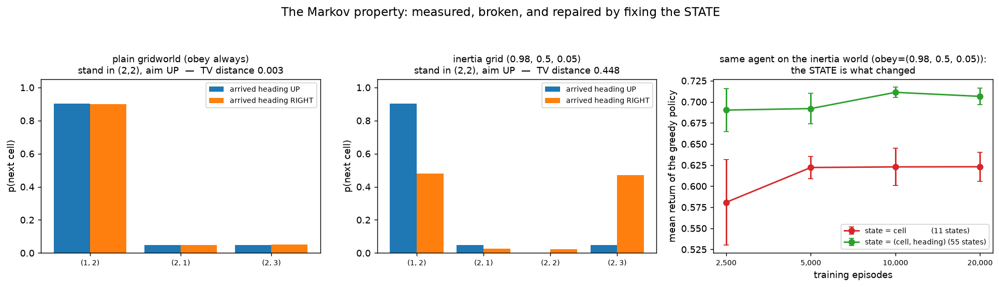

# environment (dig-in) · exp 2 — the formal object, and the assumption inside it

exp_1 turned dials called "how slippery" and "what a step costs" and watched behaviour change. Now
name them. Two bites: **2a** reads the tuple `(S, A, P, R, γ)` straight off this gridworld, and **2b**
opens the assumption hiding inside `P` — the **Markov property** — by measuring it, breaking it, and
repairing it.

Run with `python ../environment.py` (`exp_2a_the_tuple`, `exp_2b_markov`; 2b trains 6 tables, ~20 s).

---

## 2a — `(S, A, P, R, γ)`

**`S`, the state space.** 3×4 cells minus the wall = **11 states**. The agent receives an integer;
`(row, col)` is *our* bookkeeping:

```-
    0  1  2 +1          (the two terminals are states 3 and 6 —
    4  #  5 -1           the grid shows their reward instead)
    7  8  9 10
```

**`A`, the action space.** Four integers. "up/right/down/left" is a name *we* chose; the agent sees
`0,1,2,3` and finds out what they do by trying them. So exp_1's table is exactly `|S|×|A| = 11×4 = 44`
entries — one score per (state, action) pair. That is the entire memory of a tabular agent.

**`P`, the transition model** — `p(s' | s, a)`, one distribution per (s,a) pair. This is where the
80/10/10 lives:

```-
    P[s=7 (2, 0)][a=0 up]:
        prob 0.8 -> s'= 4 (1, 0)   r=-0.04   done=False
        prob 0.1 -> s'= 8 (2, 1)   r=-0.04   done=False
        prob 0.1 -> s'= 7 (2, 0)   r=-0.04   done=False   (slipped into a wall/edge -> stay put)
      expected immediate reward r(s,a) = Σ p·r = -0.040

    P[s=10 (2, 3)][a=0 up]:
        prob 0.8 -> s'= 6 (1, 3)   r=-1.00   done=True    (TERMINAL)
        prob 0.1 -> s'=10 (2, 3)   r=-0.04   done=False   (slipped into a wall/edge -> stay put)
        prob 0.1 -> s'= 9 (2, 2)   r=-0.04   done=False
      expected immediate reward r(s,a) = Σ p·r = -0.808

    all 44 distributions sum to 1: ✅
```

Two details worth noticing. First, `P` is a distribution over **states, not over intentions**: the
slip that would push you off the left edge lands you back in `(2,0)`, so it merges with any other
outcome ending there — that's the `0.1 -> (2,0)`. Second, the second block is exp_1's dangerous cell
seen from the model side: aiming `up` from `(2,3)` has an **expected immediate reward of −0.808**. The
trap isn't a special rule anywhere; it's just arithmetic in `P` and `R`.

**`R`, the reward.** Here it depends on where you *land*, so it's `R(s,a,s')`: `−0.04` for any ordinary
cell, `±1` for the two terminals, which are absorbing and pay `0` forever after (hence value 0 there).
The expected-reward form `r(s,a) = Σ_s' p(s'|s,a)·r` is the line printed above — most textbook Bellman
equations use that one.

**`γ = 0.9`, the discount.** Note *where* it lives: in the **problem**, not the algorithm. It's a
statement about how much a reward one step later is worth to you. exp_5 turns this dial.

### The payoff: `S` and `A` are only labels

If states and actions are just index sets, then **renaming them cannot matter**. Permute all 11 state
ids and all 4 action ids at random, retrain the same agent:

```-
    original labels:  mean return +0.748   reached +1 in 98.8%
    shuffled labels:  mean return +0.747   reached +1 in 98.7%
```

Identical. The agent never used the geometry — it *can't*; it only ever knew "from label 7, action 2
tended to pay". Every bit of structure in this problem lives in `P` and `R`.

That's also the tabular agent's fatal flaw, stated precisely: **nothing is shared between neighbouring
states.** Two adjacent cells that look almost the same are, to this agent, unrelated labels, so it must
visit all 44 pairs itself. Rung 2 (`dqn/`) exists because a network indexed by *features* of a state
generalizes across states, and a table never can.

---

## 2b — the Markov property

The claim packed into the notation `p(s' | s, a)` is that the pair `(s, a)` is **enough**:

```-
    p(s_t+1 | s_t, a_t, s_t-1, a_t-1, ...)  =  p(s_t+1 | s_t, a_t)
```

In our gridworld this is true **by construction** — `GridWorld.step()` reads `self.s` and `a` and
nothing else. There is no history for it to read. *That's what the Markov property looks like as code*,
and it's the reason a table indexed by `(s, a)` can work at all.

### Break it

`InertiaGrid`: same cells, same rewards, but the floor has **inertia** — your action is honoured with
prob `0.98` if it continues the way you're already going, `0.5` for a perpendicular turn, and only
`0.05` for a reversal; otherwise you're carried on. Nothing in that rule reads the cell index. It reads
your **direction of travel**.

Stand in cell `(2,2)`, aim `up` 20,000 times, arriving two different ways:

```-
    plain gridworld (obey always):
      landed in       arrived heading UP  arrived heading RIGHT
      (1, 2)                       0.903                  0.901
      (2, 3)                       0.048                  0.050
      (2, 1)                       0.049                  0.049
      total-variation distance:     0.003

    inertia grid (0.98, 0.5, 0.05):
      landed in       arrived heading UP  arrived heading RIGHT
      (1, 2)                       0.903                  0.479
      (2, 3)                       0.048                  0.472
      (2, 1)                       0.049                  0.025
      total-variation distance:     0.448
```



Top: identical to within sampling noise — the history left no trace, so the cell alone **is** a Markov
state. Bottom: same cell, same action, completely different future. Arrive sideways and half your "up"
requests are overruled, sailing you on to `(2,3)`. `p(s'|s,a)` here isn't merely *unknown*, it isn't
well **defined**: any number you write into a cell-indexed table is an average over histories you can't
see.

### What it costs, and the repair

Train the parent's Q-learning on the inertia world two ways. Same algorithm, same hyperparameters, 3
seeds; the only difference is **what we call a state**:

```-
    episodes trained                              2,500         5,000        10,000        20,000
    state = cell            (11 states)   +0.581±0.051  +0.622±0.013  +0.623±0.022  +0.623±0.017
    state = (cell, heading) (55 states)   +0.690±0.025  +0.692±0.018  +0.711±0.006  +0.706±0.010
```

Two things to read off it:

1. **The cell-only agent plateaus** — `+0.622` at 5,000 episodes, `+0.623` at 20,000. Four times the
   experience buys *nothing*. That's a **ceiling**, not slow learning: the information it needs isn't in
   what it's shown, and no amount of data adds it.
2. **Telling it which way it's travelling is worth `+0.083` return**, and it wins at *every* budget.
   Nothing about the learner changed. We changed the state.

> **Markov is a property of your state representation, not of the world.** If the past matters, your
> state is missing something — put it in.

*Honest note:* a 5× bigger state space normally costs data (nobody stacks 1000 frames), and here it
visibly doesn't — the heading-aware agent is ahead even at 2,500 episodes. Its bootstrap targets are
**consistent**, and on a world this small that beats having fewer entries to fill. Same move as Atari
DQN stacking 4 frames so velocity is in the state; when you *can't* put the missing piece in (poker,
dialogue), you need memory instead, and you're in POMDP territory.

---

Next: **exp_3 — the black box.** We could print `P` above only because we *wrote* this env; an agent
never gets it. Next we watch experience stand in for the model — estimate `P̂` from samples alone and
see it converge to the table above.

---

*Numbers + figure: `python ../environment.py` (`exp_2a_the_tuple`, `exp_2b_markov`). Envs: shared
`new/rl/envs.py` plus `InertiaGrid`, defined in this walkthrough because it exists only to break a
rule.*
