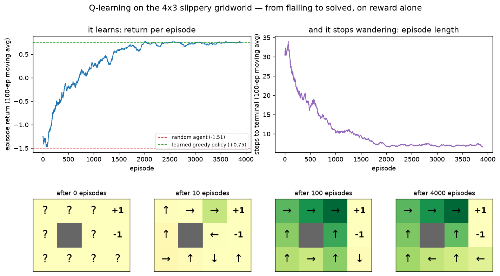

# RL · q_learning exp 1 — the whole game

Top-down: before a single Bellman equation, let's **drop an agent that knows nothing into a slippery
gridworld and watch it learn to cross it** — from reward alone, with no map, no model, and nobody ever
telling it what a good move looks like. By the end of this page you have a working agent and the
vocabulary for the whole track. *Why* each piece is shaped this way is exp_2 onward, each opening one
box of *this exact agent*. Run it with `python ../q_learning.py` (`exp_1_whole_game`).

---

## The world

```-
   .  .  . +1        S = start (2,0),  +1 / -1 = terminal,  # = wall
   .  #  . -1        every move costs -0.04
   S  .  .  .        SLIPPERY: 80% you go where you aimed,
                     10% each you veer to a perpendicular direction
```

Russell & Norvig's 4x3 gridworld. Two things make it worth using: the short route to `+1` runs
**straight past the `-1` trap** (and a 10% slip there is fatal), and the `-0.04` per-step cost means
dawdling isn't free either. So the right behaviour is a genuine trade-off, not "walk toward the goal".

The agent is told **none** of that. It gets exactly two functions — `reset()` and `step(a)` — and a
scalar reward. It can't see the slip probabilities, the wall, or where the goal is. That restriction
*is* reinforcement learning; everything hard about the field follows from it.

---

## The agent in one breath

Three ideas, that's the whole thing:

```-
  the table    Q[s, a]  = "how good is action a in state s?"    11 states x 4 actions = 44 numbers, all 0
  act          ε-greedy: usually argmax_a Q[s,a], sometimes a random action
  learn        Q[s,a] += α · ( r + γ·max_a' Q[s',a'] − Q[s,a] )     after EVERY step
```

- **the table** — one score per (state, action) pair. "Score" = how much total reward I expect if I
  take this action here and then keep acting well. Starts all-zero: the agent has no opinions
  (exp_3 = what these numbers *mean*, and what their exact values are).
- **act** — take the best-scoring action *most* of the time, but with probability `ε` do something
  random. Without that, the agent locks onto the first route that half-worked and never discovers the
  better one — you can't learn about an action you never take (exp_5).
- **learn** — after every single step you have a tuple `(s, a, r, s')`. Nudge the score you just used
  a fraction `α` toward `r + γ·max_a' Q[s',a']`: *the reward I actually got, plus the discounted best
  I could do from where I landed*. That target is the one line with real content in it, and exp_4
  takes it apart.

`ε` anneals `1.0 → 0.05` over the first half of training: explore hard while the table is garbage,
then mostly exploit. Six lines of code total, and no neural network anywhere — the point of starting
tabular is that there is nowhere for a bug or a misunderstanding to hide.

---

## Watch it learn

The zero-knowledge baseline first — a uniformly random agent, so we know what "no learning" scores:

```-
  BEFORE — uniformly random:   mean return -1.513   reached +1 in 37.7%   32.7 steps/episode
```

It stumbles into the trap nearly two-thirds of the time and wanders 33 steps doing it. Now 4000
episodes of Q-learning (α=0.1), reported in blocks of 500:

```-
    episodes     0-500    ε=1.00   mean return -0.858    24.9 steps
    episodes   500-1000   ε=0.76   mean return -0.014    15.1 steps
    episodes  1000-1500   ε=0.53   mean return +0.367    10.3 steps
    episodes  1500-2000   ε=0.29   mean return +0.630     8.2 steps
    episodes  2000-2500   ε=0.05   mean return +0.726     6.9 steps
    episodes  3500-4000   ε=0.05   mean return +0.751     7.0 steps

  AFTER — acting greedily on the learned table:
    mean return +0.745   reached +1 in 98.5%   6.6 steps/episode
```

**Return `-1.51 → +0.75`; wins `38% → 99%`; episode length `33 → 6.6` steps.** Note the two curves
are telling one story from two angles: it finds the goal *and* stops wandering, because the `-0.04`
step cost makes the long way genuinely worse. (The 1.5% of episodes it still loses aren't mistakes —
the floor is slippery, and sometimes you get unlucky next to the trap. A perfect agent loses those
too.)

---

## The payoff — read the policy straight off the table



The bottom strip is the interesting half. Arrows = `argmax_a Q[s,a]` (`?` = all four actions still
score identically, i.e. nothing learned in that cell yet), colour = `max_a Q[s,a]`:

- **after 0** — all `?`. Forty-four zeros.
- **after 10** — only the cell *next to* the goal has any value. Reward is a single number at the end;
  it has to **flow backward** one cell per visit, which is exactly what `max_a' Q[s',a']` does.
- **after 100** — the top row is already right, and the green gradient shows value spread back from
  `+1` toward the start.
- **after 4000** — settled. Printed out:

```-
   policy:                value (max_a Q[s,a]):
    →  →  → +1             +0.61  +0.79  +0.96     +1
    ↑  #  ↑ -1             +0.50      #  +0.59     -1
    ↑  ←  ↑  ←             +0.39  +0.27  +0.22  +0.15
```

Follow it from `S`: **up** the left column, then **right** along the top row to `+1` — deliberately
the long way round, hugging the far side from the trap. Values increase smoothly toward the goal, so
"go where the value is higher" is a route.

**The one cell worth staring at** is `(2,3)`, directly below the `-1`:

```-
      ↑ up     -0.721
      → right  -0.008
      ↓ down   +0.052
      ← left   +0.154   <- greedy
```

"Up" points straight at the goal column and is by far the **worst** action here, because a 10% slip
lands you in the trap. The agent's answer is to walk **left — away from the goal**. Nobody encoded
the trap, nobody wrote a rule about safety margins; it lost enough episodes there to find out. That's
the thing to hold onto: the behaviour is a *consequence* of scores learned from experience.

---

## Honest caveat: a score is only as good as the visits behind it

```-
   times the agent stood in each cell while learning:
      7414   6713   5599     +1
      8443      #   1873     -1
      8169   2883   1607    602
```

Wildly uneven — the route gets thousands of visits, the far corner 602. And at `(2,1)` all four
actions score within **0.07** of each other: a near-tie that sampling noise decides, so the arrow
printed there may simply be wrong. It costs nothing today (the agent never goes there), but it's a
real crack, and two later boxes are about it: **exp_3** measures exactly how far these numbers are
from the true values, and **exp_5** is about getting the coverage that would fix them.

---

## The map (what we open next)

| next | opens | the question |
|---|---|---|
| exp_2 | the **environment** | what an MDP is: `(S,A,P,R,γ)`, the return `G_t`, and what `γ` actually buys |
| exp_3 | the **value functions** | what `Q[s,a]` converges to — Bellman, and the exact answer by DP |
| exp_4 | the **target** | where `r + γ·max Q` comes from: full returns (MC) vs bootstrapping (TD) |
| exp_5 | **exploration** | the `ε` knob, stripped to one state and k arms (`children/exploration/`) |
| exp_6 | **off- vs on-policy** | swap `max Q[s']` for `Q[s',a']` → SARSA, and the Cliff-Walking split |

Next: **exp_2 — the environment**. We've been calling it "the world"; now define it properly as an
MDP, and make `γ` earn its place by sweeping it and watching the optimal route change.

---

*Numbers + figure: `python ../q_learning.py` (`exp_1_whole_game`), ~2 s. Env: `new/rl/envs.py`.*
